# 🏰 LukeVanilla 아키텍처 문서

> LukeVanilla 프로젝트의 전체 구조를 이해하기 위한 가이드 문서입니다.

## 📋 목차
1. [프로젝트 개요](#프로젝트-개요)
2. [서버 아키텍처](#서버-아키텍처)
3. [서버 타입별 시스템 분기](#서버-타입별-시스템-분기)
4. [시스템 카테고리](#시스템-카테고리)
5. [명령어 목록](#명령어-목록)
6. [데이터 흐름](#데이터-흐름)
7. [외부 의존성](#외부-의존성)
8. [플러그인 메시지 통신](#플러그인-메시지-통신)

---

## 프로젝트 개요

LukeVanilla는 Minecraft 서버를 위한 종합 플러그인으로, Velocity 프록시 기반의 멀티 서버 환경에서 동작합니다. Discord 봇 연동, 경제 시스템, 토지 관리, 상인 시스템 등 다양한 기능을 제공합니다.

### 기술 스택
- **언어**: Kotlin
- **빌드 도구**: Gradle (Kotlin DSL)
- **서버 플랫폼**: Paper/Spigot API
- **프록시**: Velocity
- **데이터베이스**: MySQL/MariaDB
- **외부 연동**: Discord (JDA), OpenAI API

---

## 서버 아키텍처


<details>
<summary>📊 다이어그램 소스 코드 (AI 참조용)</summary>

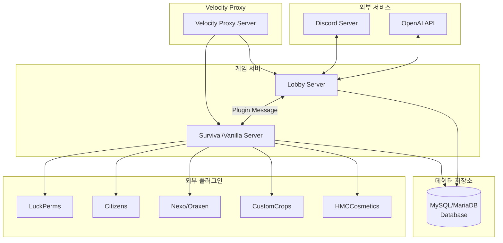

</details>

---

## 서버 타입별 시스템 분기

### 🎮 Lobby 서버 전용 시스템
| 시스템 | 설명 |
|--------|------|
| Discord 봇 (전체 기능) | 채팅 연동, 역할 관리, 서버 상태 |
| AdminAssistant AI | OpenAI 기반 관리자 도우미 |
| SupportSystem | 플레이어 지원 티켓 시스템 |
| 빼빼로 기프티콘 | 시즌 이벤트 기프티콘 |
| 서버 연결 관리 | 멀티 서버 연결 상태 관리 |
| 눈싸움 미니게임 | 로비 전용 미니게임 |

### 🌍 Vanilla/Survival 서버 전용 시스템
| 시스템 | 설명 |
|--------|------|
| SafeZone | 안전 구역 관리 |
| WardrobeLocation | 옷장 위치 시스템 |
| PrivateLand (MyLand) | 개인 토지 시스템 |
| FarmVillage | 농장 마을 시스템 |
| AdvancedLandClaiming | 고급 토지 청구 시스템 |
| FishMerchant | 물고기 상인 |
| BookSystem | 책 시스템 |
| FleaMarket | 벼룩시장 |
| VillageMerchant | 마을 상인 |

### 🔄 공통 시스템
| 시스템 | 설명 |
|--------|------|
| Discord 봇 (기본) | 기본 Discord 연동 |
| Economy | 경제 시스템 |
| PlayTime | 플레이타임 추적 |
| Roulette | 룰렛 시스템 |
| Warning | 경고 시스템 |
| ChatSystem | 채팅 시스템 |
| ItemSystem | 아이템 시스템 |

---

## 시스템 카테고리

### 🎮 Discord 시스템
Discord 봇 연동 및 관련 기능을 담당합니다.

| 시스템 | 파일 경로 | 설명 |
|--------|-----------|------|
| DiscordBot | [Discord/DiscordBot.kt](src/main/kotlin/com/lukehemmin/lukeVanilla/System/Discord/README.md) | Discord 봇 코어 |
| DiscordAuth | [Discord/DiscordAuth.kt](src/main/kotlin/com/lukehemmin/lukeVanilla/System/Discord/README.md) | Discord 인증 시스템 |
| DiscordRoleManager | [Discord/DiscordRoleManager.kt](src/main/kotlin/com/lukehemmin/lukeVanilla/System/Discord/README.md) | Discord 역할 관리 |
| SupportSystem | [Discord/SupportSystem.kt](src/main/kotlin/com/lukehemmin/lukeVanilla/System/Discord/README.md) | 플레이어 지원 티켓 |
| AIassistant | [Discord/AIassistant/](src/main/kotlin/com/lukehemmin/lukeVanilla/System/Discord/AIassistant/README.md) | AI 관리자 도우미 |
| ServerStatusListener | [Discord/ServerStatusListener.kt](src/main/kotlin/com/lukehemmin/lukeVanilla/System/Discord/README.md) | 서버 상태 모니터링 |
| DynamicVoiceChannelManager | [Discord/DynamicVoiceChannelManager.kt](src/main/kotlin/com/lukehemmin/lukeVanilla/System/Discord/README.md) | 동적 음성 채널 관리 |


<details>
<summary>📊 다이어그램 소스 코드 (AI 참조용)</summary>

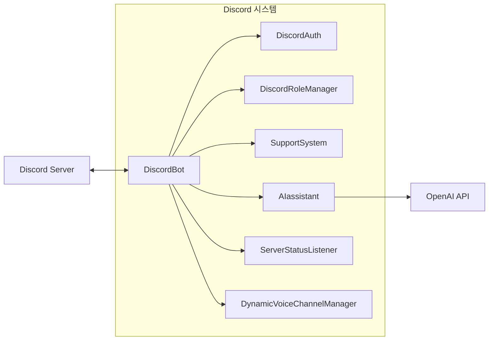

</details>

---

### 🏞️ 토지(Land) 시스템
플레이어 토지 소유 및 보호 기능을 제공합니다.

| 시스템 | 파일 경로 | 설명 |
|--------|-----------|------|
| MyLand | [MyLand/](src/main/kotlin/com/lukehemmin/lukeVanilla/System/MyLand/README.md) | 개인 토지 시스템 |
| AdvancedLandClaiming | [AdvancedLandClaiming/](src/main/kotlin/com/lukehemmin/lukeVanilla/System/AdvancedLandClaiming/README.md) | 고급 토지 청구 |
| FarmVillage | [관련 문서](Docs/Develop_Docs/LandSystems/FarmVillage/README.md) | 농장 마을 시스템 |


<details>
<summary>📊 다이어그램 소스 코드 (AI 참조용)</summary>

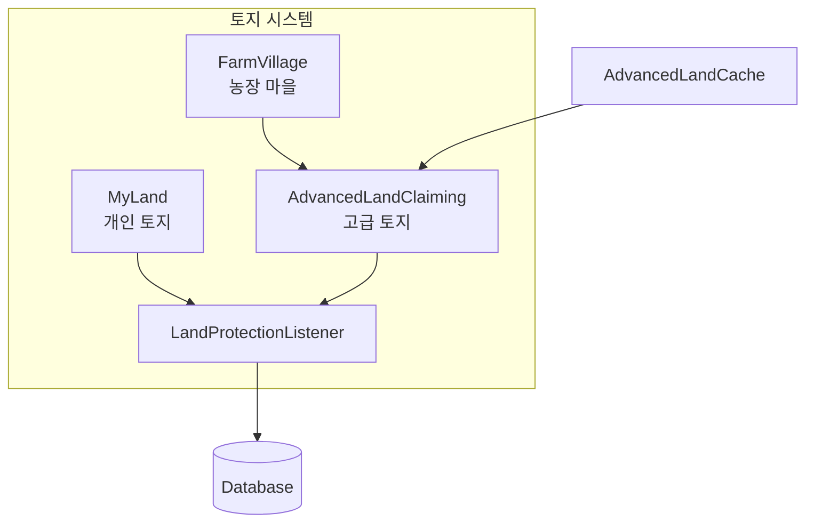

</details>

#### 토지 시스템 상세 구조

| 컴포넌트 | 역할 |
|----------|------|
| LandManager | 토지 CRUD 작업 관리 |
| LandData | 토지 데이터 모델 |
| LandProtectionListener | 토지 보호 이벤트 처리 |
| LandPermissions | 토지 권한 관리 |
| AdvancedLandCache | 토지 데이터 캐싱 |

---

### 💰 경제(Economy) 시스템
서버 내 경제 활동을 관리합니다.

| 시스템 | 파일 경로 | 설명 |
|--------|-----------|------|
| Economy | [Economy/](src/main/kotlin/com/lukehemmin/lukeVanilla/System/Economy/README.md) | 기본 경제 시스템 |
| FleaMarket | [FleaMarket/](src/main/kotlin/com/lukehemmin/lukeVanilla/System/FleaMarket/README.md) | 벼룩시장 거래 시스템 |


<details>
<summary>📊 다이어그램 소스 코드 (AI 참조용)</summary>

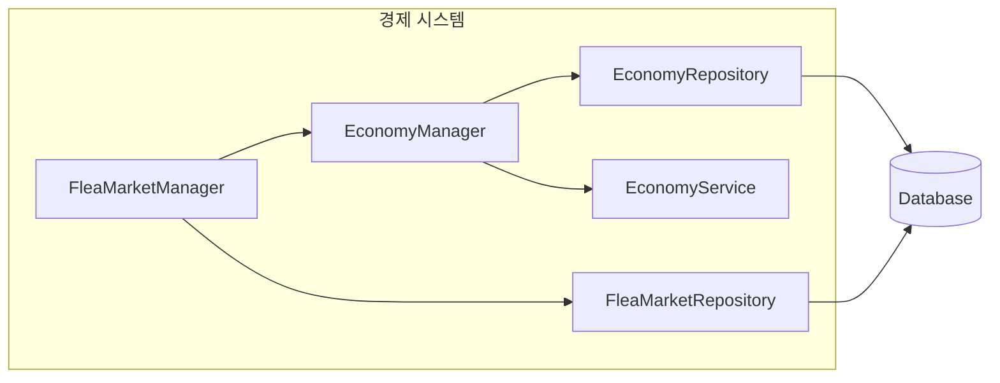

</details>

#### 경제 시스템 구성요소

| 컴포넌트 | 역할 |
|----------|------|
| EconomyManager | 경제 시스템 총괄 |
| EconomyService | 거래 로직 처리 |
| EconomyRepository | 경제 데이터 DB 접근 |
| MoneyCommand | 돈 관련 명령어 |
| TransactionType | 거래 유형 정의 |

---

### 🏪 상인(Merchant) 시스템
NPC 상인 및 거래 기능을 제공합니다.

| 시스템 | 파일 경로 | 설명 |
|--------|-----------|------|
| FishMerchant | [FishMerchant/](src/main/kotlin/com/lukehemmin/lukeVanilla/System/FishMerchant/README.md) | 물고기 상인 |
| VillageMerchant | [VillageMerchant/](src/main/kotlin/com/lukehemmin/lukeVanilla/System/VillageMerchant/README.md) | 마을 상인 |


<details>
<summary>📊 다이어그램 소스 코드 (AI 참조용)</summary>

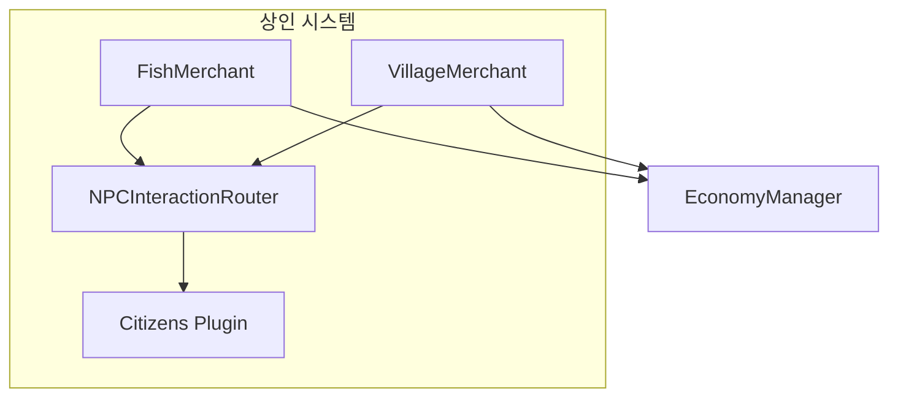

</details>

---

### 🎁 아이템(Items) 시스템
커스텀 아이템 및 시즌 아이템을 관리합니다.

| 시스템 | 파일 경로 | 설명 |
|--------|-----------|------|
| ItemSeasonSystem | [Items/ItemSeasonSystem/](src/main/kotlin/com/lukehemmin/lukeVanilla/System/Items/ItemSeasonSystem/README.md) | 시즌 아이템 시스템 |
| CustomItemSystem | [Items/CustomItemSystem/](src/main/kotlin/com/lukehemmin/lukeVanilla/System/Items/CustomItemSystem/README.md) | 커스텀 아이템 시스템 |
| StatsSystem | [Items/StatsSystem/](src/main/kotlin/com/lukehemmin/lukeVanilla/System/Items/StatsSystem/README.md) | 아이템 스탯 시스템 |

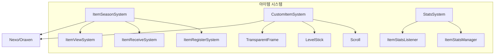

<details>
<summary>📊 다이어그램 소스 코드 (AI 참조용)</summary>

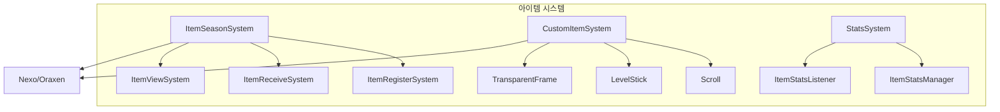

</details>

#### 아이템 시스템 세부 구성

| 컴포넌트 | 역할 |
|----------|------|
| SeasonItemSystem | 시즌 아이템 총괄 |
| ItemRegisterSystem | 아이템 등록 |
| ItemReceiveSystem | 아이템 수령 |
| ItemScrollTransformSystem | 두루마리 변환 |
| Scroll | 커스텀 두루마리 아이템 |
| LevelStick | 레벨 스틱 아이템 |
| RandomScrollRoulette | 랜덤 두루마리 룰렛 |

---

### 🛠️ 유틸리티 시스템
기타 지원 시스템들입니다.

| 시스템 | 파일 경로 | 설명 |
|--------|-----------|------|
| BookSystem | [BookSystem/](src/main/kotlin/com/lukehemmin/lukeVanilla/System/BookSystem/README.md) | 책 작성/열람 시스템 |
| Roulette | [Roulette/](src/main/kotlin/com/lukehemmin/lukeVanilla/System/Roulette/README.md) | 룰렛 미니게임 |
| WarningSystem | [Discord/](src/main/kotlin/com/lukehemmin/lukeVanilla/System/Discord/README.md) | 경고 시스템 |
| PlayTime | [관련 파일](src/main/kotlin/com/lukehemmin/lukeVanilla/System/README.md) | 플레이타임 추적 |
| ChatSystem | [관련 파일](src/main/kotlin/com/lukehemmin/lukeVanilla/System/README.md) | 채팅 시스템 |
| Database | [Database/](src/main/kotlin/com/lukehemmin/lukeVanilla/System/Database/README.md) | 데이터베이스 관리 |
| MultiServer | [MultiServer/](src/main/kotlin/com/lukehemmin/lukeVanilla/System/MultiServer/README.md) | 멀티서버 통신 |
| NPC | [NPC/](src/main/kotlin/com/lukehemmin/lukeVanilla/System/NPC/README.md) | NPC 상호작용 |
| Debug | [Debug/](src/main/kotlin/com/lukehemmin/lukeVanilla/System/Debug/README.md) | 디버그 관리 |

---

## 명령어 목록

### 💰 경제 명령어
| 명령어 | 권한 | 설명 |
|--------|------|------|
| `/money` | 기본 | 자신의 잔액 확인 |
| `/money <player>` | 기본 | 다른 플레이어 잔액 확인 |
| `/money pay <player> <amount>` | 기본 | 돈 송금 |
| `/money give <player> <amount>` | 관리자 | 돈 지급 |
| `/money take <player> <amount>` | 관리자 | 돈 차감 |
| `/money set <player> <amount>` | 관리자 | 잔액 설정 |

### 🏞️ 토지 명령어
| 명령어 | 권한 | 설명 |
|--------|------|------|
| `/land claim` | 기본 | 토지 청구 |
| `/land unclaim` | 기본 | 토지 포기 |
| `/land info` | 기본 | 토지 정보 확인 |
| `/land trust <player>` | 기본 | 플레이어 신뢰 추가 |
| `/land untrust <player>` | 기본 | 플레이어 신뢰 제거 |
| `/land list` | 기본 | 소유 토지 목록 |

### 🏪 상인 명령어
| 명령어 | 권한 | 설명 |
|--------|------|------|
| `/fishmerchant` | 기본 | 물고기 상인 GUI 열기 |
| `/villagemerchant` | 관리자 | 마을 상인 관리 |

### 🎁 아이템 명령어
| 명령어 | 권한 | 설명 |
|--------|------|------|
| `/seasonitem` | 기본 | 시즌 아이템 관리 |
| `/itemstats` | 기본 | 아이템 스탯 확인 |
| `/nextseasonitem` | 관리자 | 다음 시즌 아이템 GUI |

### 🛒 벼룩시장 명령어
| 명령어 | 권한 | 설명 |
|--------|------|------|
| `/fleamarket` | 기본 | 벼룩시장 GUI 열기 |
| `/fleamarket sell <price>` | 기본 | 손에 든 아이템 판매 등록 |
| `/fleamarket cancel` | 기본 | 판매 취소 |

### 📚 책 명령어
| 명령어 | 권한 | 설명 |
|--------|------|------|
| `/book` | 기본 | 책 시스템 사용 |
| `/book create` | 기본 | 새 책 생성 |
| `/book view <id>` | 기본 | 책 열람 |

### 🎰 룰렛 명령어
| 명령어 | 권한 | 설명 |
|--------|------|------|
| `/roulette` | 기본 | 룰렛 GUI 열기 |

### 🎮 Discord 연동 명령어
| 명령어 | 권한 | 설명 |
|--------|------|------|
| `/discord` | 기본 | Discord 연동 |
| `/인증` | 기본 | Discord 계정 인증 |

### 🔧 관리자 명령어
| 명령어 | 권한 | 설명 |
|--------|------|------|
| `/lukevanilla reload` | 관리자 | 플러그인 리로드 |
| `/warning <player> <reason>` | 관리자 | 경고 부여 |
| `/itemrestore` | 관리자 | 아이템 복구 |
| `/craftallow` | 관리자 | 제작 허용 관리 |
| `/blocklocation` | 관리자 | 블록 위치 확인 |

### 🏠 로비 전용 명령어
| 명령어 | 권한 | 설명 |
|--------|------|------|
| `/snow` | 기본 | 눈싸움 미니게임 |
| `/serverconnection` | 기본 | 서버 연결 |

---

## 데이터 흐름

### 플레이어 인증 흐름
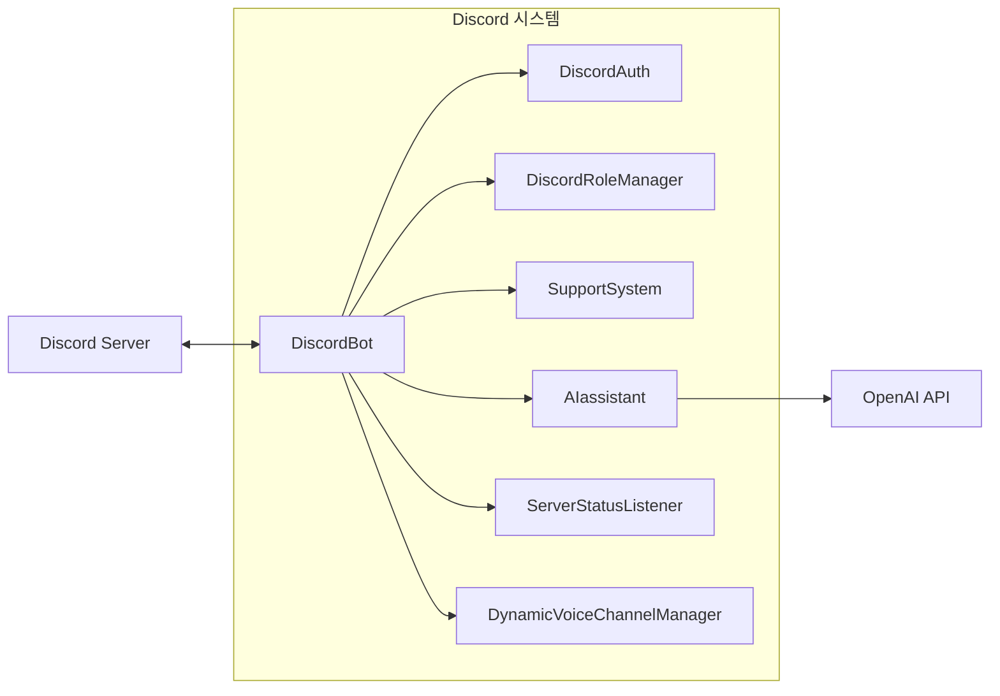

<details>
<summary>📊 다이어그램 소스 코드 (AI 참조용)</summary>

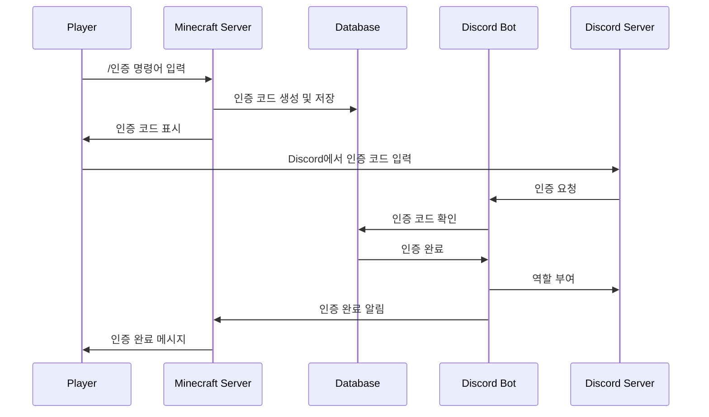

</details>

### 경제 거래 흐름
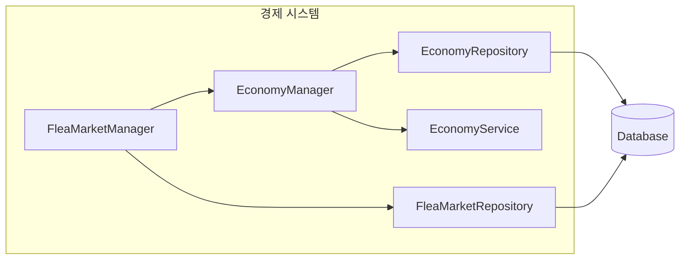

<details>
<summary>📊 다이어그램 소스 코드 (AI 참조용)</summary>

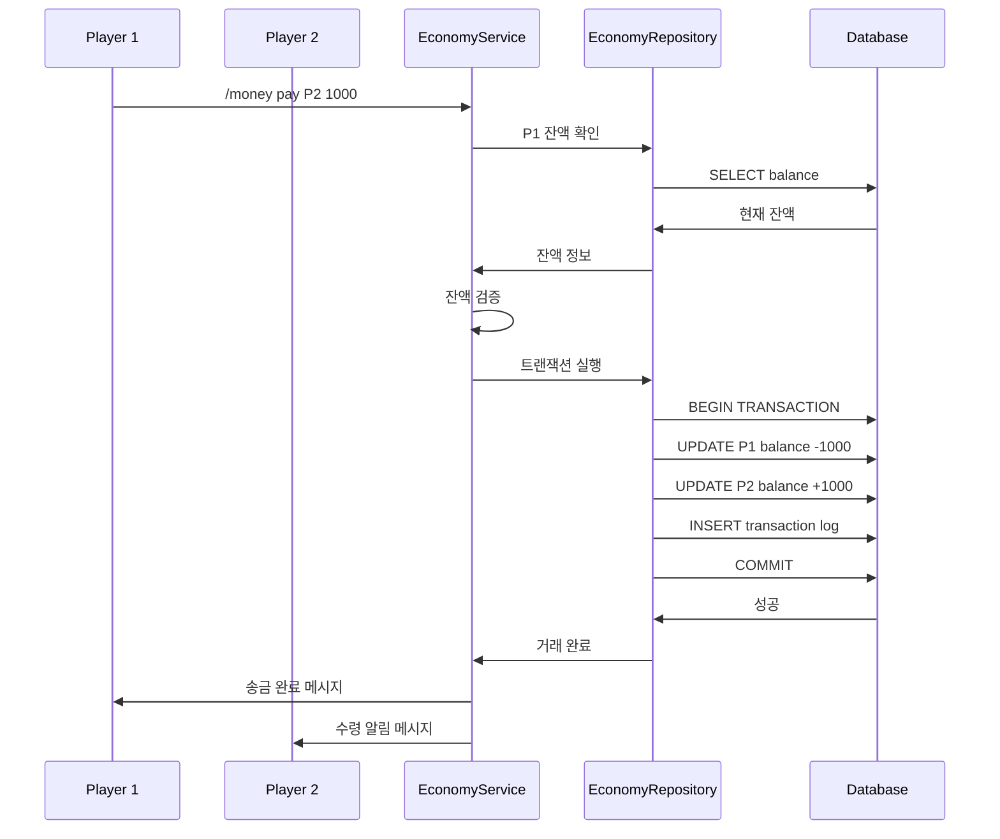

</details>

### 토지 보호 흐름
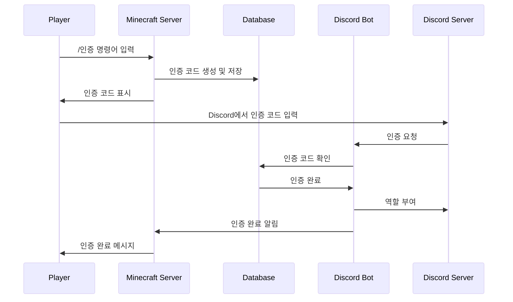

<details>
<summary>📊 다이어그램 소스 코드 (AI 참조용)</summary>

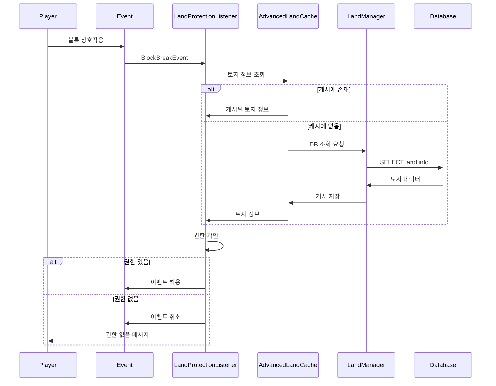

</details>

---

## 외부 의존성

### 📦 필수 플러그인
| 플러그인 | 용도 | 연동 시스템 |
|----------|------|-------------|
| **HMCCosmetics** | 코스메틱 아이템 | WardrobeLocationSystem |
| **CustomCrops** | 커스텀 작물 | FarmVillage, 농업 시스템 |

### 📦 선택 플러그인
| 플러그인 | 용도 | 연동 시스템 |
|----------|------|-------------|
| **Nexo/Oraxen** | 커스텀 아이템 | ItemSeasonSystem, CustomItemSystem |
| **Citizens** | NPC 생성 | FishMerchant, VillageMerchant |
| **LuckPerms** | 권한 관리 | DiscordRoleManager, 권한 시스템 |

### 🌐 외부 API
| API | 용도 | 연동 시스템 |
|-----|------|-------------|
| **Discord API (JDA)** | Discord 봇 | DiscordBot, SupportSystem |
| **OpenAI API** | AI 어시스턴트 | AdminAssistant |

---

## 플러그인 메시지 통신

### 통신 채널
| 채널 | 방향 | 설명 |
|------|------|------|
| `lukevanilla:serverstatus_request` | Lobby → Vanilla | 서버 상태 요청 |
| `lukevanilla:serverstatus_response` | Vanilla → Lobby | 서버 상태 응답 |

### 메시지 구조
```kotlin
// 서버 상태 요청
data class ServerStatusRequest(
    val requestId: String,
    val requestTime: Long
)

// 서버 상태 응답
data class ServerStatusResponse(
    val requestId: String,
    val serverName: String,
    val playerCount: Int,
    val maxPlayers: Int,
    val tps: Double,
    val uptime: Long
)
```

---

## 📁 프로젝트 구조

```
LukeVanilla/
├── src/main/kotlin/com/lukehemmin/lukeVanilla/
│   ├── Main.kt                          # 플러그인 진입점
│   ├── Lobby/                           # 로비 전용 시스템
│   │   ├── SnowMinigame.kt
│   │   └── SnowGameCommand.kt
│   └── System/                          # 핵심 시스템
│       ├── AdvancedLandClaiming/        # 고급 토지 시스템
│       ├── BookSystem/                  # 책 시스템
│       ├── ColorUtill/                  # 색상 유틸리티
│       ├── Command/                     # 일반 명령어
│       ├── Database/                    # 데이터베이스
│       ├── Debug/                       # 디버그
│       ├── Discord/                     # Discord 연동
│       │   └── AIassistant/            # AI 어시스턴트
│       ├── Economy/                     # 경제 시스템
│       ├── FishMerchant/               # 물고기 상인
│       ├── FleaMarket/                 # 벼룩시장
│       ├── Items/                      # 아이템 시스템
│       │   ├── CustomItemSystem/       # 커스텀 아이템
│       │   ├── ItemSeasonSystem/       # 시즌 아이템
│       │   └── StatsSystem/            # 스탯 시스템
│       ├── MultiServer/                # 멀티서버 통신
│       ├── MyLand/                     # 개인 토지
│       ├── NPC/                        # NPC 관리
│       ├── NexoPermissionSystem/       # Nexo 권한
│       ├── Roulette/                   # 룰렛
│       ├── Utils/                      # 유틸리티
│       └── VillageMerchant/            # 마을 상인
├── Docs/                               # 문서
│   ├── API_WIKI/                       # API 문서
│   └── Develop_Docs/                   # 개발 문서
├── sql/                                # SQL 스크립트
├── build.gradle.kts                    # 빌드 설정
└── ARCHITECTURE.md                     # 본 문서
```

---

## 🔗 관련 문서

- [README.md](README.md) - 프로젝트 소개
- [CLAUDE.md](Docs/CLAUDE.md) - AI 개발 가이드
- [AGENTS.md](Docs/AGENTS.md) - 에이전트 설정
- [INTEGRATION_GUIDE.md](Docs/INTEGRATION_GUIDE.md) - 통합 가이드
- [토지 시스템 문서](Docs/Develop_Docs/LandSystems/README.md)
- [경제 시스템 계획](Docs/Develop_Docs/Economy/MoneySystem_Plan.md)
- [벼룩시장 계획](Docs/Develop_Docs/FleaMarket/FleaMarketSystem_Plan.md)

---

> 📝 이 문서는 LukeVanilla 프로젝트의 구조를 이해하기 위한 참조 문서입니다.
> 최종 업데이트: 2024