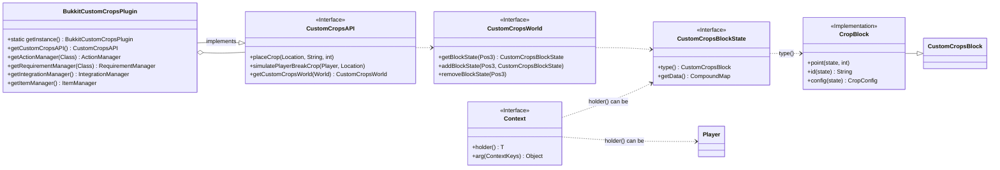

# Custom-Crops API 문서

## 목차
1. [빠른 참조 (Quick Reference)](#빠른-참조-quick-reference)
2. [개요](#개요)
3. [핵심 API 클래스 관계도](#핵심-api-클래스-관계도)
4. [설정 및 초기화](#설정-및-초기화)
5. [핵심 API 인터페이스 및 클래스](#핵심-api-인터페이스-및-클래스)
6. [주요 데이터 구조](#주요-데이터-구조)
7. [주요 사용 예제](#주요-사용-예제)
8. [복합 시나리오 예제](#복합-시나리오-예제)
9. [이벤트 시스템](#이벤트-시스템)
10. [고급 기능](#고급-기능)
    1. [커스텀 액션 등록](#커스텀-액션-등록)
    2. [커스텀 요구사항 등록](#커스텀-요구사항-등록)
11. [심화 주제](#심화-주제)
    1. [데이터 직접 조작](#데이터-직접-조작)
    2. [작물 설정 접근](#작물-설정-접근)
    3. [스레드 안전성 (Thread Safety)](#스레드-안전성-thread-safety)
12. [내장 기능 목록](#내장-기능-목록)
    1. [내장 액션(Actions)](#내장-액션actions)
    2. [내장 요구사항(Requirements)](#내장-요구사항requirements)
13. [플러그인 연동 (Integrations)](#플러그인-연동-integrations)
14. [마치며](#마치며)

## 빠른 참조 (Quick Reference)

**API 인스턴스 얻기:**
```java
CustomCropsAPI api = BukkitCustomCropsAPI.get();
```

**작물 심기:**
```java
api.placeCrop(location, "your_crop_id", 0);
```

**작물 상태(ID, 포인트) 확인:**
```java
CustomCropsWorld<?> world = api.getCustomCropsWorld(location.getWorld());
world.getBlockState(api.adapt(location)).ifPresent(state -> {
    if (state.type() instanceof CropBlock cropBlock) {
        String id = cropBlock.id(state);
        int points = cropBlock.point(state);
    }
});
```

**가장 일반적인 이벤트 리스너:**
```java
public class CropListener implements Listener {
    @EventHandler
    public void onCropBreak(CropBreakEvent event) {
        // 작물 파괴 시 로직
    }
}
```

## 개요

이 문서는 Spigot/Paper 플러그인 개발자가 Custom-Crops 플러그인의 기능을 활용하고 확장하기 위한 공식 API 가이드입니다. 기본적인 작물 제어부터 커스텀 로직 추가, 다른 플러그인과의 연동까지 API의 모든 측면을 다룹니다.

Custom-Crops는 고급 커스텀 작물 관리 플러그인으로, 이 API를 사용하면 다른 플러그인에서 커스텀 작물의 생성, 제거, 상호작용 등을 프로그래밍 방식으로 제어하고, 플러그인의 동작을 확장할 수 있습니다.

### 주요 특징
- **작물 관리**: 코드 상에서 커스텀 작물을 심거나 제거할 수 있습니다.
- **상태 제어**: 작물의 성장 포인트(성장 단계)를 직접 조작할 수 있습니다.
- **월드 데이터 접근**: 플러그인의 커스텀 월드 데이터를 통해 작물 정보를 얻을 수 있습니다.
- **강력한 이벤트 시스템**: 작물과 관련된 다양한 활동을 감지하고 대응할 수 있습니다.
- **확장 가능한 액션/요구사항**: 작물의 행동과 배치/파괴 조건을 위한 커스텀 로직을 직접 만들어 등록할 수 있습니다.

### API 정보
- **저장소**: [MomiRealms Repository](https://repo.momirealms.net/releases/)

## 핵심 API 클래스 관계도

다음 다이어그램은 Custom-Crops API의 핵심 구성 요소와 그 관계를 시각적으로 보여줍니다.



## 설정 및 초기화

### Maven 의존성 추가

`pom.xml`에 다음 저장소와 의존성을 추가하세요.

```xml
<repositories>
    <repository>
        <id>momirealms-repo</id>
        <url>https://repo.momirealms.net/releases/</url>
    </repository>
</repositories>

<dependencies>
    <dependency>
        <groupId>net.momirealms</groupId>
        <artifactId>custom-crops</artifactId>
        <version>LATEST</version> <!-- 실제 버전을 확인하여 입력하세요 -->
        <scope>provided</scope>
    </dependency>
</dependencies>
```

### Gradle 의존성 추가 (Kotlin DSL)

`build.gradle.kts`에 다음 저장소와 의존성을 추가하세요.

```kotlin
repositories {
    maven("https://repo.momirealms.net/releases/")
}

dependencies {
    compileOnly("net.momirealms:custom-crops:LATEST") // 실제 버전을 확인하여 입력하세요
}
```

### plugin.yml 설정

플러그인이 Custom-Crops보다 나중에 로드되도록 `depend` 또는 `softdepend`를 추가합니다.

```yaml
name: YourPlugin
version: 1.0.0
main: your.package.YourPlugin
api-version: 1.17
depend: [Custom-Crops]
```

### API 인스턴스 가져오기

Custom-Crops API는 `BukkitCustomCropsAPI` 클래스의 정적 메소드를 통해 쉽게 얻을 수 있습니다.

```java
import net.momirealms.customcrops.api.BukkitCustomCropsAPI;
import net.momirealms.customcrops.api.CustomCropsAPI;

public class YourPlugin extends JavaPlugin {
    private CustomCropsAPI customCropsAPI;

    @Override
    public void onEnable() {
        if (getServer().getPluginManager().getPlugin("Custom-Crops") == null) {
            getLogger().severe("Custom-Crops 플러그인을 찾을 수 없습니다! 플러그인을 비활성화합니다.");
            getServer().getPluginManager().disablePlugin(this);
            return;
        }

        this.customCropsAPI = BukkitCustomCropsAPI.get();
        getLogger().info("Custom-Crops API 초기화 완료!");
    }
}
```

## 핵심 API 인터페이스 및 클래스

### 1. `BukkitCustomCropsPlugin`
Custom-Crops 플러그인의 메인 인스턴스에 접근하기 위한 클래스입니다. `getInstance()` 정적 메서드를 통해 싱글턴 인스턴스를 얻을 수 있습니다. 이 클래스는 `ActionManager`, `RequirementManager`, `ItemManager`, `IntegrationManager` 등 다양한 관리자 클래스에 접근하는 공식적인 통로를 제공합니다.

```java
BukkitCustomCropsPlugin ccPlugin = BukkitCustomCropsPlugin.getInstance();
ActionManager<Player> actionManager = ccPlugin.getActionManager(Player.class);
```

### 2. `CustomCropsAPI`
API의 메인 진입점입니다. 작물과 관련된 대부분의 주요 작업을 이 인터페이스를 통해 수행합니다.

- `Pos3 adapt(Location location)`: Bukkit의 `Location`을 플러그인 내부에서 사용하는 `Pos3` 객체로 변환합니다.
- `CustomCropsWorld<?> getCustomCropsWorld(World world)`: 특정 Bukkit `World`에 해당하는 `CustomCropsWorld`를 가져옵니다.
- `void addPointToCrop(Location location, int point)`: 특정 위치의 작물에 성장 포인트를 추가합니다.
- `boolean placeCrop(Location location, String id, int point)`: 지정된 위치에 특정 ID와 포인트를 가진 작물을 심습니다.
- `void simulatePlayerBreakCrop(Player player, EquipmentSlot hand, Location location, BreakReason reason)`: 플레이어가 작물을 파괴하는 행동을 시뮬레이션합니다.

### 3. `CustomCropsWorld`
특정 월드에 있는 모든 커스텀 작물 데이터를 관리하는 인터페이스입니다.
- `Optional<CustomCropsBlockState> getBlockState(Pos3 location)`: 특정 위치의 커스텀 작물 상태(`CustomCropsBlockState`)를 가져옵니다.
- `Optional<CustomCropsBlockState> removeBlockState(Pos3 location)`: 특정 위치의 작물을 제거하고, 제거된 작물의 상태를 반환합니다.
- `Optional<CustomCropsBlockState> addBlockState(Pos3 location, CustomCropsBlockState block)`: 특정 위치에 새로운 작물을 추가합니다.

### 4. `ActionManager` 및 `RequirementManager`
플러그인의 액션과 요구사항 시스템을 관리하는 인터페이스입니다. 이를 통해 커스텀 로직을 등록하고 확장할 수 있습니다. (자세한 내용은 [고급 기능](#고급-기능) 섹션 참조)


## 주요 데이터 구조

### 1. `Pos3`
월드 정보를 제외한 정수형 `x, y, z` 블록 좌표를 나타내는 간단한 레코드(Record) 클래스입니다.

### 2. `BreakReason`
작물이 파괴되는 원인을 나타내는 열거형(Enum)입니다.
- `BREAK`: 일반적인 파괴
- `TRAMPLE`: 짓밟힘
- `EXPLODE`: 폭발
- `ACTION`: 특정 행동
- `PHYSICS`: 물리적 변화 (예: 아래 블록 파괴)
- `CUSTOM`: 기타

### 3. `CustomCropsBlockState`
특정 위치에 있는 커스텀 작물의 **모든 상태 정보**를 담고 있는 핵심 객체입니다.
- `type()`: 작물의 종류(`CustomCropsBlock`, 예를 들어 `CropBlock`)를 반환합니다.
- `getData()`: 작물의 구체적인 데이터(ID, 성장 포인트 등)가 저장된 NBT `CompoundMap`을 반환합니다. 개발자는 `CropBlock`과 같은 구체적인 타입으로 캐스팅한 후, 이 맵을 조작하여 작물의 상태를 변경할 수 있습니다.

### 4. `Context<T>`
액션(`Action`)과 요구사항(`Requirement`)이 실행될 때의 **문맥 정보**를 담는 객체입니다.
- `holder()`: 컨텍스트의 주체 객체(예: `Player`, `CustomCropsBlockState`)를 반환합니다.
- `arg(ContextKeys<C> key)`: `ContextKeys`를 키로 사용하여 위치, 플레이어, 이벤트 정보 등 다양한 부가 정보를 가져올 수 있습니다.
- `arg(ContextKeys<C> key, C value)`: 컨텍스트에 새로운 정보를 추가하여 다른 액션이나 요구사항으로 데이터를 전달할 수 있습니다.


## 주요 사용 예제

### 특정 위치에 작물 심기

```java
public void plantCustomCrop(Location location, String cropId) {
    CustomCropsAPI api = BukkitCustomCropsAPI.get();
    
    // "corn" 이라는 ID를 가진 작물을 0 포인트(초기 상태)로 심기
    boolean success = api.placeCrop(location, cropId, 0);
    
    if (success) {
        getLogger().info(cropId + " 작물을 " + location + " 위치에 심었습니다.");
    } else {
        getLogger().warning(cropId + " 작물을 심는 데 실패했습니다. ID가 올바른지 확인하세요.");
    }
}
```

### 작물 성장 단계 올리기

```java
public void growCrop(Location location, int pointsToAdd) {
    CustomCropsAPI api = BukkitCustomCropsAPI.get();
    api.addPointToCrop(location, pointsToAdd);
    getLogger().info(location + " 위치의 작물에 " + pointsToAdd + " 포인트를 추가했습니다.");
}
```

### 플레이어가 작물을 캐는 것처럼 시뮬레이션

```java
public void harvestCrop(Player player, Location cropLocation) {
    CustomCropsAPI api = BukkitCustomCropsAPI.get();
    
    // 플레이어의 주요 손(Main Hand)을 사용하여 작물을 부수는 행동을 시뮬레이션
    api.simulatePlayerBreakCrop(player, EquipmentSlot.HAND, cropLocation, BreakReason.ACTION);
}
```

### 특정 위치의 작물 정보 확인

```java
import net.momirealms.customcrops.api.core.block.CropBlock;
import net.momirealms.customcrops.api.core.world.CustomCropsBlockState;
import net.momirealms.customcrops.api.core.world.CustomCropsWorld;
import net.momirealms.customcrops.api.core.world.Pos3;

public void checkCropInfo(Location location) {
    CustomCropsAPI api = BukkitCustomCropsAPI.get();
    CustomCropsWorld<?> world = api.getCustomCropsWorld(location.getWorld());
    
    if (world == null) return;
    
    Pos3 pos = api.adapt(location);
    world.getBlockState(pos).ifPresent(state -> {
        if (state.type() instanceof CropBlock cropBlock) {
            String cropId = cropBlock.id(state);
            int points = cropBlock.point(state);
            
            // 정보를 알려줄 플레이어를 찾아서 메시지 전송
            // 이 예제에서는 콘솔에 출력
            System.out.println("작물 정보: ID=" + cropId + ", 성장 포인트=" + points);
        }
    });
}
```

## 복합 시나리오 예제

### 시나리오: 특별한 아이템으로 전설 작물 수확 시 보상 지급

- **조건 1**: 플레이어가 `customcrops.legendary.harvest` 권한을 가지고 있어야 함.
- **조건 2**: 'legendary_corn' 작물을 다이아몬드 괭이로 수확해야 함.
- **조건 3**: 작물이 최종 성장 단계여야 함.
- **결과 1**: 50% 확률로 'corn_essence' 아이템 드랍.
- **결과 2**: 서버 전체에 수확 메시지 방송.

```java
public class LegendaryCornHarvestListener implements Listener {

    private final JavaPlugin plugin;

    public LegendaryCornHarvestListener(JavaPlugin plugin) {
        this.plugin = plugin;
    }

    @EventHandler(priority = EventPriority.HIGH)
    public void onLegendaryCornHarvest(CropBreakEvent event) {
        // 1. 이벤트의 기본 조건 확인
        if (event.isCancelled()) return;
        if (!"legendary_corn".equals(event.getCropConfig().id())) return;

        Player player = event.getPlayer();
        if (player == null) return;

        ItemStack itemInHand = player.getInventory().getItemInMainHand();

        // 2. 시나리오 조건 확인
        // 조건 1: 권한 확인
        if (!player.hasPermission("customcrops.legendary.harvest")) return;
        
        // 조건 2: 아이템 확인
        if (itemInHand.getType() != Material.DIAMOND_HOE) return;

        // 조건 3: 최종 성장 단계 확인
        CropConfig config = event.getCropConfig();
        CustomCropsBlockState state = event.getState();
        if (state.type() instanceof CropBlock cropBlock) {
            int currentPoints = cropBlock.point(state);
            if (currentPoints < config.maxPoints()) {
                player.sendMessage("§c아직 완전히 자라지 않았습니다!");
                event.setCancelled(true); // 수확 취소
                return;
            }
        }

        // 3. 결과 실행
        // 결과 1: 50% 확률로 아이템 드랍
        if (Math.random() < 0.5) {
            // ItemManager를 통해 커스텀 아이템 생성 (가정)
            ItemStack essence = BukkitCustomCropsPlugin.getInstance().getItemManager().build(player, "corn_essence");
            if (essence != null) {
                event.getLocation().getWorld().dropItemNaturally(event.getLocation(), essence);
            }
        }

        // 결과 2: 서버 전체에 메시지 방송
        Bukkit.broadcastMessage("§e[소식] §b" + player.getName() + "§e님이 전설의 옥수수를 수확했습니다!");
        
        // 기본 드랍 아이템은 드랍되지 않도록 설정할 수 있습니다.
        // event.setDropItems(false); 
    }
}
```

## 이벤트 시스템

Custom-Crops는 다양한 이벤트를 제공하여 플러그인 동작에 유연하게 대응할 수 있도록 합니다.

### 이벤트 리스너 등록

```java
@Override
public void onEnable() {
    // ... API 초기화 ...
    
    getServer().getPluginManager().registerEvents(new CropListener(this), this);
}
```

### 주요 이벤트
- `CropPlantEvent`: 커스텀 작물이 심겼을 때 발생합니다.
- `CropBreakEvent`: 커스텀 작물이 파괴되었을 때 발생합니다.
- `CropInteractEvent`: 플레이어가 작물과 상호작용할 때 발생합니다.
- `FertilizerUseEvent`: 작물에 비료가 사용되었을 때 발생합니다.
- `CustomCropsReloadEvent`: 플러그인 설정이 리로드될 때 발생합니다.

### 작물 파괴 이벤트 처리 예제

```java
import org.bukkit.entity.Player;
import org.bukkit.event.EventHandler;
import org.bukkit.event.Listener;
import net.momirealms.customcrops.api.event.CropBreakEvent;
import net.momirealms.customcrops.api.core.block.BreakReason;

public class CropListener implements Listener {

    private final JavaPlugin plugin;

    public CropListener(JavaPlugin plugin) {
        this.plugin = plugin;
    }

    @EventHandler
    public void onCropBreak(CropBreakEvent event) {
        Player player = event.getPlayer();
        String cropId = event.getCropID();
        
        if (event.isCancelled()) {
            return;
        }
        
        // 특정 작물(예: "golden_wheat")이 파괴되었을 때 특별한 메시지 보내기
        if ("golden_wheat".equals(cropId) && player != null) {
            player.sendMessage("황금 밀을 수확했습니다! 특별한 보상이 지급됩니다!");
            // 여기에 특별 보상 로직 추가
        }
        
        // 특정 이유(예: 폭발)로 파괴되는 것을 막기
        if (event.getReason() == BreakReason.EXPLODE) {
            event.setCancelled(true);
            plugin.getLogger().info(event.getLocation() + " 위치의 작물이 폭발로부터 보호되었습니다.");
        }
    }
}
```

## 고급 기능

### 커스텀 액션 등록

`ActionManager`를 사용하면 작물 성장, 파괴 등 특정 상황에서 실행될 자신만의 액션을 만들 수 있습니다.

1.  **`Action` 인터페이스 구현**: 실행할 로직을 담은 클래스를 만듭니다.
2.  **`ActionFactory` 구현**: 위에서 만든 `Action`의 인스턴스를 생성하는 팩토리를 만듭니다.
3.  **`ActionManager`에 등록**: 플러그인 활성화 시 `ActionManager`에 팩토리를 등록합니다.

**예제: 작물이 성장할 때 번개를 치는 액션**

```java
// 1. Action 구현
public class LightningAction implements Action<CustomCropsBlockState> {
    
    @Override
    public void trigger(Context<CustomCropsBlockState> context) {
        // 컨텍스트에서 위치 정보 가져오기
        Location loc = context.arg(ContextKeys.LOCATION);
        if (loc != null && loc.getWorld() != null) {
            loc.getWorld().strikeLightning(loc);
        }
    }
}

// 2. ActionFactory 구현
public class LightningActionFactory implements ActionFactory<CustomCropsBlockState> {

    @Override
    public Action<CustomCropsBlockState> create(Object value, BiPredicate<String, String> predicate) {
        // 이 액션은 추가 파라미터가 없으므로 간단히 새 인스턴스 반환
        return new LightningAction();
    }
}

// 3. 플러그인 onEnable에서 등록
@Override
public void onEnable() {
    // ... API 초기화 ...
    
    // BukkitCustomCropsPlugin 인스턴스를 통해 ActionManager에 안전하게 접근
    BukkitCustomCropsPlugin ccPlugin = BukkitCustomCropsPlugin.getInstance();
    ActionManager<CustomCropsBlockState> actionManager = ccPlugin.getActionManager(CustomCropsBlockState.class);
    
    // actionManager가 null이 아닐 경우에만 등록
    if (actionManager != null) {
        actionManager.registerAction(new LightningActionFactory(), "lightning", "strike");
        getLogger().info("Custom 'lightning' action registered!");
    }
}
```
**주의**: 액션은 비동기적으로 호출될 수 있습니다. Bukkit API를 직접 호출하는 경우(예: `world.strikeLightning()`), `BukkitScheduler`를 사용하여 메인 스레드에서 실행하는 것이 안전합니다. [스레드 안전성](#스레드-안전성-thread-safety) 섹션을 반드시 참고하세요.

### 커스텀 요구사항 등록

`RequirementManager`를 사용하면 작물을 심거나, 부수거나, 상호작용하기 위한 자신만의 조건을 만들 수 있습니다.

**예제: 특정 월드에서만 작물을 심을 수 있는 요구사항**

```java
// 1. Requirement 구현
public class WorldRequirement implements Requirement<Player> {

    private final String requiredWorldName;

    public WorldRequirement(String worldName) {
        this.requiredWorldName = worldName;
    }

    @Override
    public boolean isSatisfied(Context<Player> context) {
        // 컨텍스트의 주체인 Player를 가져옴
        Player player = context.holder();
        return player.getWorld().getName().equalsIgnoreCase(requiredWorldName);
    }
}

// 2. RequirementFactory 구현
public class WorldRequirementFactory implements RequirementFactory<Player> {

    @Override
    public Requirement<Player> create(Object value, BiPredicate<String, String> predicate) {
        if (value instanceof String) {
            return new WorldRequirement((String) value);
        }
        return null; // 값이 유효하지 않으면 null 반환
    }
}

// 3. 플러그인 onEnable에서 등록
@Override
public void onEnable() {
    // ...
    BukkitCustomCropsPlugin ccPlugin = BukkitCustomCropsPlugin.getInstance();
    RequirementManager<Player> reqManager = ccPlugin.getRequirementManager(Player.class);

    if (reqManager != null) {
        reqManager.registerRequirement(new WorldRequirementFactory(), "world");
        getLogger().info("Custom 'world' requirement registered!");
    }
}
```
**주의**: 요구사항은 비동기적으로 호출될 수 있습니다. Bukkit API를 직접 호출하는 경우, 메인 스레드에서 실행하도록 동기화 처리를 해야 합니다. [스레드 안전성](#스레드-안전성-thread-safety) 섹션을 반드시 참고하세요.

## 심화 주제

### 데이터 직접 조작
`CustomCropsBlockState`는 작물의 모든 데이터를 NBT 형식으로 가지고 있습니다. `state.type()`을 통해 얻은 `CustomCropsBlock`의 구체적인 구현체(예: `CropBlock`)를 사용하면 이 데이터를 직접 읽고 쓸 수 있습니다. 이것은 API의 로우-레벨(low-level) 접근 방식으로, 내부 동작을 이해하고 세밀한 제어가 필요할 때 유용합니다.

**예제: 작물의 성장 포인트를 100으로 강제 설정하기**
```java
import net.momirealms.customcrops.api.core.block.CropBlock;

public void setCropPoints(Location location, int points) {
    CustomCropsAPI api = BukkitCustomCropsAPI.get();
    CustomCropsWorld<?> world = api.getCustomCropsWorld(location.getWorld());
    if (world == null) return;

    world.getBlockState(api.adapt(location)).ifPresent(state -> {
        // 상태의 타입이 CropBlock인지 확인
        if (state.type() instanceof CropBlock cropBlock) {
            // cropBlock의 메서드를 사용하여 NBT 데이터("point")를 직접 조작
            cropBlock.point(state, points);
            
            // 주의: 이 방법은 내부 데이터만 변경합니다.
            // 블록의 시각적 모습(예: 작물 모델)을 즉시 업데이트하려면
            // cropBlock.restore(location, state); 와 같은 추가 처리가 필요할 수 있습니다.
        }
    });
}
```

### 작물 설정 접근
작물의 설정(config.yml에 정의된 내용)은 `Registries` 클래스를 통해 프로그래밍 방식으로 접근할 수 있습니다. 예를 들어, 작물의 최대 성장 포인트를 알고 싶을 때 사용할 수 있습니다.

**예제: 특정 작물의 최대 성장 포인트 가져오기**
```java
import net.momirealms.customcrops.api.core.Registries;
import net.momirealms.customcrops.api.core.mechanic.crop.CropConfig;

public int getMaxPoints(String cropId) {
    // Registries.CROP 은 모든 작물 설정을 담고 있는 레지스트리입니다.
    // .get() 메서드에 작물 ID를 넘겨 해당 작물의 CropConfig 객체를 가져옵니다.
    CropConfig config = Registries.CROP.get(cropId);
    
    if (config != null) {
        // CropConfig 객체에서 maxPoints() 등 다양한 설정값을 읽을 수 있습니다.
        return config.maxPoints();
    } else {
        return -1; // 해당 ID의 작물이 없음
    }
}
```

### 스레드 안전성 (Thread Safety)
Custom-Crops는 성능 향상을 위해 작물 틱 등 많은 작업을 **비동기(async)**로 처리합니다. 따라서 API를 통해 커스텀 액션, 요구사항, 이벤트를 다룰 때 스레드 안전성에 각별히 유의해야 합니다.

- **비동기 컨텍스트에서 Bukkit API 호출 금지**: 액션, 요구사항, 이벤트 리스너 등이 비동기 스레드에서 실행될 수 있습니다. 이 내부에서 블록을 변경하거나 엔티티를 소환하는 등 대부분의 Bukkit API를 직접 호출하면 서버 전체에 영향을 미치는 심각한 오류(`IllegalPluginAccessException` 등)를 유발할 수 있습니다.
- **메인 스레드로 동기화**: Bukkit API를 호출해야 하는 경우, 반드시 `BukkitScheduler`를 사용하여 작업을 메인 스레드(동기)로 보내야 합니다.

**안전한 비동기 작업 예제**
```java
// 잘못된 예: 비동기 컨텍스트에서 직접 Bukkit API 호출
public void trigger(Context<CustomCropsBlockState> context) {
    Location loc = context.arg(ContextKeys.LOCATION);
    // 이 코드가 비동기 스레드에서 실행되면 서버가 다운될 수 있습니다!
    loc.getWorld().setType(loc, Material.DIAMOND_BLOCK); 
}

// 올바른 예: BukkitScheduler를 사용한 동기화
public void trigger(Context<CustomCropsBlockState> context) {
    Location loc = context.arg(ContextKeys.LOCATION);
    JavaPlugin plugin = /* ... Your Plugin Instance ... */;
    
    plugin.getServer().getScheduler().runTask(plugin, () -> {
        // 이제 메인 스레드이므로 안전하게 Bukkit API 호출 가능
        loc.getWorld().setType(loc, Material.DIAMOND_BLOCK);
    });
}
```

## 내장 기능 목록

개발자의 편의를 위해 Custom-Crops는 다양한 액션과 요구사항을 기본적으로 제공합니다.

### 내장 액션(Actions)

| 액션 타입                | 설명                                                     |
| ------------------------ | -------------------------------------------------------- |
| `command`                | 서버 콘솔 또는 플레이어로서 명령어를 실행합니다.         |
| `random-command`         | 목록에서 무작위 명령어를 실행합니다.                     |
| `command-nearby`         | 주변 플레이어들에게 명령어를 실행시킵니다.               |
| `message-nearby`         | 주변 플레이어들에게 메시지를 보냅니다.                   |
| `actionbar-nearby`       | 주변 플레이어들에게 액션바 메시지를 보냅니다.             |
| `title-nearby`           | 주변 플레이어들에게 타이틀을 보냅니다.                   |
| `broadcast`              | 서버 전체에 메시지를 브로드캐스트합니다.                 |
| `particle`               | 특정 위치에 파티클을 생성합니다.                         |
| `hologram`               | 특정 위치에 홀로그램을 생성합니다. (DecentHolograms 필요) |
| `drop-item`              | 아이템을 드랍합니다.                                     |
| `spawn-entity`           | 엔티티를 소환합니다.                                     |
| `plant`                  | 다른 커스텀 작물을 심습니다.                             |
| `break`                  | 다른 커스텀 작물을 파괴합니다.                           |
| `delay`                  | 지정된 시간(tick)만큼 다음 액션 실행을 지연시킵니다.     |
| `chain`                  | 여러 액션을 순차적으로 실행합니다.                       |
| `conditional`            | 특정 요구사항이 만족될 때만 다른 액션을 실행합니다.      |
| `priority`               | 여러 액션 중 하나를 우선순위에 따라 실행합니다.          |
| `variation`              | 여러 액션 중 하나를 가중치에 따라 무작위로 실행합니다.   |

### 내장 요구사항(Requirements)

| 요구사항 타입            | 설명                                                           |
| ------------------------ | -------------------------------------------------------------- |
| `||` (OR)                | 내부에 정의된 요구사항 중 하나라도 만족하면 통과합니다.        |
| `&&` (AND)               | 내부에 정의된 모든 요구사항을 만족해야 통과합니다.             |
| `impossible`             | 항상 실패합니다.                                               |
| `environment`            | 월드의 환경(normal, nether, the_end)이 일치하는지 확인합니다. |
| `time`                   | 월드의 시간이 지정된 범위 내에 있는지 확인합니다.              |
| `ypos`                   | Y 좌표가 지정된 범위 내에 있는지 확인합니다.                   |
| `biome`                  | 현재 위치의 바이옴이 목록에 포함되는지 확인합니다.             |
| `moon-phase`             | 달의 위상이 일치하는지 확인합니다.                             |
| `world`                  | 월드의 이름이 일치하는지 확인합니다.                           |
| `weather`                | 현재 날씨(clear, rain, thunder)가 일치하는지 확인합니다.       |
| `season`                 | 연동된 계절 플러그인의 현재 계절이 적합한지 확인합니다.        |
| `light`, `temperature`   | 주변의 밝기나 온도가 적합한지 확인합니다.                      |
| `random`                 | 지정된 확률(0.0 ~ 1.0)에 따라 통과 여부를 결정합니다.         |
| `<`, `<=`, `!=`, `==`, `>`, `>=` | PlaceholderAPI를 사용하여 두 값의 크기를 비교합니다.           |
| `regex`                  | PlaceholderAPI 값 또는 문자열이 정규 표현식과 일치하는지 확인합니다. |
| `startsWith`, `endsWith`, `contains` | PlaceholderAPI 값 또는 문자열의 시작/끝/포함 여부를 확인합니다. |
| `in-list`                | PlaceholderAPI 값이 제공된 목록에 포함되는지 확인합니다.       |

## 플러그인 연동 (Integrations)

`IntegrationManager`를 통해 다른 플러그인의 기능을 Custom-Crops와 연동할 수 있습니다.

```java
BukkitCustomCropsPlugin ccPlugin = BukkitCustomCropsPlugin.getInstance();
IntegrationManager integrationManager = ccPlugin.getIntegrationManager();
```

### 연동 방식
1.  연동하려는 기능에 맞는 `Provider` 인터페이스(예: `ItemProvider`, `LevelerProvider`)를 구현합니다.
2.  플러그인 활성화 시, 구현한 `Provider` 인스턴스를 `IntegrationManager`에 등록합니다.

**예제: 커스텀 아이템 플러그인 연동**

```java
// 1. ItemProvider 구현
public class MyItemProvider implements ItemProvider {
    @Override
    public String getID() {
        return "my-items"; // 연동 ID
    }

    @Override
    public ItemStack getItem(String id, Context<?> context) {
        // 내 플러그인의 아이템 생성 로직
        // 예: return MyItemsPlugin.getAPI().getItem(id);
        return null;
    }

    @Override
    public boolean hasItem(String id, Context<?> context) {
        // 내 플러그인에 해당 아이템이 있는지 확인
        return false;
    }
}

// 2. IntegrationManager에 등록
@Override
public void onEnable() {
    // ...
    BukkitCustomCropsPlugin ccPlugin = BukkitCustomCropsPlugin.getInstance();
    IntegrationManager integrationManager = ccPlugin.getIntegrationManager();

    if (integrationManager != null) {
        integrationManager.registerItemProvider(new MyItemProvider());
        getLogger().info("'my-items' ItemProvider registered!");
    }
}
```

이제 작물 설정 파일에서 `drop-item` 액션을 사용할 때, `my-items:super_carrot` 와 같은 형식으로 이 `ItemProvider`를 통해 아이템을 지정할 수 있습니다.

---

## 마치며

이 문서는 Custom-Crops API의 모든 측면을 다루기 위해 작성되었습니다. API를 사용하면 간단한 작물 제어부터 복잡한 커스텀 로직 구현, 다른 플러그인과의 연동까지 무한한 가능성을 열 수 있습니다.

문서에 설명되지 않은 매우 특수한 기능이나 내부 동작 원리에 대한 깊은 이해가 필요하다면, 이 문서와 함께 제공된 API 소스 코드를 직접 참조하는 것이 가장 확실한 방법입니다. 성공적인 개발이 되기를 바랍니다. 