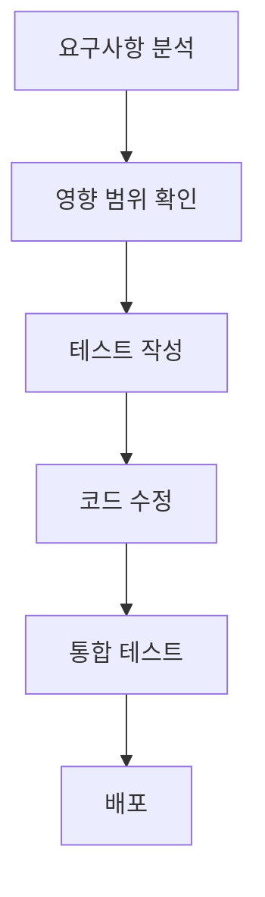

# 토지 시스템 개발 문서

## 📋 개요
LukeVanilla 서버의 토지 관리 시스템에 대한 완전한 개발 문서입니다. 세 가지 주요 시스템(MyLand, FarmVillage, AdvancedLandClaiming)이 통합되어 작동하는 복합적인 땅 관리 솔루션을 제공합니다.

## 🏗️ 시스템 아키텍처

```
                    토지 시스템 전체 구조
                    
┌─────────────────────────────────────────────────────────┐
│                     Main.kt                            │
│               (중앙 통합 관리자)                         │
└─────────────────────┬───────────────────────────────────┘
                      │
        ┌─────────────┼─────────────┐
        │             │             │
        ▼             ▼             ▼
┌─────────────┐ ┌─────────────┐ ┌─────────────┐
│   MyLand    │ │ FarmVillage │ │AdvancedLand │
│   System    │ │   System    │ │Claiming     │
│  (기본토지)  │ │  (농사마을)  │ │ (고급마을)  │
└─────────────┘ └─────────────┘ └─────────────┘
```

## 📚 문서 구조

### 🔹 MyLand 시스템
개인 토지 소유 및 친구 공유 시스템
- **[MyLand/README.md](MyLand/README.md)** - 전체 시스템 개발 문서
- **[MyLand/API_Reference.md](MyLand/API_Reference.md)** - 완전한 API 레퍼런스
- **[MyLand/Configuration_Guide.md](MyLand/Configuration_Guide.md)** - 설정 및 운영 가이드

### 🔹 FarmVillage 시스템  
관리자 운영 농사마을 시스템
- **[FarmVillage/README.md](FarmVillage/README.md)** - 전체 시스템 개발 문서
- **[FarmVillage/Admin_Guide.md](FarmVillage/Admin_Guide.md)** - 관리자 운영 가이드

### 🔹 AdvancedLandClaiming 시스템
플레이어 주도 고급 마을 시스템
- **[AdvancedLandClaiming/README.md](AdvancedLandClaiming/README.md)** - 전체 시스템 개발 문서
- **[AdvancedLandClaiming/Implementation_Guide.md](AdvancedLandClaiming/Implementation_Guide.md)** - 미구현 기능 구현 가이드

### 🔹 통합 문서
- **[System_Integration_Guide.md](System_Integration_Guide.md)** - 시스템 간 통합 및 연동 가이드

## 🚀 빠른 시작

### 1. 시스템 이해하기
각 시스템의 역할과 특징을 파악하세요:

| 시스템 | 용도 | 관리 주체 | 주요 기능 |
|--------|------|-----------|-----------|
| MyLand | 개인 토지 관리 | 플레이어 | 클레이밍, 친구 공유 |
| FarmVillage | 농사마을 운영 | 관리자 | 농업 공동체 |
| AdvancedLandClaiming | 고급 마을 시스템 | 플레이어 | 마을 생성, 권한 관리 |

### 2. 개발 환경 설정
```bash
# 필요한 의존성 확인
- Kotlin 1.8+
- Bukkit/Spigot API
- MySQL 8.0+
- LuckPerms (FarmVillage용)
- PlayTime 시스템 (AdvancedLand용)
```

### 3. 데이터베이스 초기화
```sql
-- DatabaseInitializer.kt에서 자동 생성
-- 수동 실행 시 각 시스템 문서의 스키마 참조
```

## 🛠️ 개발 가이드

### 시스템 수정 시 주의사항
1. **초기화 순서 준수**: PlayTime → AdvancedLand → MyLand → FarmVillage
2. **양방향 연결 설정**: AdvancedLandManager ↔ LandManager
3. **데이터 일관성 유지**: 시스템 간 데이터 동기화
4. **권한 체크 순서**: 관리자 → 소유자 → 마을권한 → 친구권한 → FarmVillage권한

### 코드 수정 워크플로우


## 📊 기능 현황

### ✅ 구현 완료된 기능

#### MyLand
- [x] 기본 클레이밍/언클레이밍
- [x] 친구 시스템 (추가/제거/권한)
- [x] 토지 보호 (블록/상호작용)
- [x] 이력 관리
- [x] 설정 시스템

#### FarmVillage  
- [x] 마을 생성/삭제 (관리자)
- [x] 멤버 관리
- [x] 토지 할당/해제
- [x] LuckPerms 연동
- [x] MyLand 통합 표시

#### AdvancedLandClaiming
- [x] 플레이타임 기반 클레이밍
- [x] 무료/유료 시스템
- [x] 연결된 청크 그룹 관리
- [x] 개인 토지 → 마을 전환
- [x] 마을 권한 시스템
- [x] 50% 환불 시스템
- [x] MyLand 친구 시스템 통합

### ⏳ 구현 예정 기능

#### 높은 우선순위
- [ ] **연결성 체크 수정** (4방향 전용)
- [ ] **명령어 개선** ("땅 요약" → "땅 정보", "땅 비용" 추가)
- [ ] **개인 토지 반환 시스템** (MyLand)

#### 중간 우선순위  
- [ ] **마을 초대 수락/거절 시스템**
- [ ] **좌표 표시 개선**

#### 낮은 우선순위
- [ ] **마을 해체 시스템**
- [ ] **이장 양도 시스템**

## 🔧 문제 해결

### 일반적인 문제들

#### 시스템 간 연동 문제
```kotlin
// Main.kt에서 연결 확인
advancedLandManager.setLandManager(privateLand.getLandManager())
```

#### 친구 권한이 작동하지 않는 경우
1. Main.kt에서 양방향 연결 확인
2. AdvancedLandProtectionListener에서 권한 체크 로직 확인
3. 시스템 초기화 순서 확인

#### 데이터베이스 연결 문제
1. DatabaseInitializer에서 테이블 생성 확인
2. 커넥션 풀 설정 확인
3. 권한 및 네트워크 연결 확인

### 디버깅 도구
```kotlin
// 통합 디버그 명령어
/땅 디버그 <청크좌표>

// 시스템별 디버그
debugManager.log("MyLand", "디버그 메시지")
debugManager.log("FarmVillage", "디버그 메시지")  
debugManager.log("AdvancedLandClaiming", "디버그 메시지")
```

## 🎯 성능 최적화

### 캐싱 전략
- **청크 정보 캐싱**: 자주 조회되는 토지 정보
- **권한 캐싱**: LuckPerms 권한 정보
- **연결성 캐싱**: 연결된 청크 그룹 정보

### 데이터베이스 최적화
- **인덱스 활용**: 좌표 기반 조회 최적화
- **배치 쿼리**: 여러 청크 정보 한 번에 조회
- **커넥션 풀**: HikariCP 설정 최적화

## 📈 확장 계획

### 단기 계획 (1-2개월)
1. 미구현 기능 완성
2. 성능 최적화
3. 사용자 경험 개선

### 중기 계획 (3-6개월)
1. 토지 거래 시스템
2. 마을 연합 시스템  
3. 경제 시스템 통합

### 장기 계획 (6개월+)
1. 웹 대시보드 연동
2. 통계 및 분석 시스템
3. 모바일 앱 연동

## 👥 기여 가이드

### 개발 원칙
1. **안전성 우선**: 기존 기능에 영향을 주지 않는 방향으로 개발
2. **확장성 고려**: 미래 기능 추가를 고려한 설계
3. **성능 최적화**: 대용량 데이터 처리 고려
4. **코드 품질**: 명확한 네이밍과 적절한 주석

### 커밋 메시지 규칙
```
feat: 새로운 기능 추가
fix: 버그 수정
docs: 문서 수정
refactor: 코드 리팩토링
perf: 성능 개선
test: 테스트 추가/수정
```

### 코드 리뷰 체크리스트
- [ ] 기존 시스템과의 호환성
- [ ] 성능 영향도 분석
- [ ] 에러 처리 적절성
- [ ] 로깅 및 디버깅 고려
- [ ] 문서 업데이트 필요성

## 📞 지원 및 문의

### 개발 관련 문의
- 시스템 구조 질문: [System_Integration_Guide.md](System_Integration_Guide.md) 참조
- API 사용법: 각 시스템의 API_Reference 문서 참조
- 설정 문제: Configuration_Guide 문서 참조

### 긴급 문제 발생 시
1. 로그 파일 확인
2. 데이터베이스 상태 점검
3. 시스템 간 연결 상태 확인
4. 필요시 개별 시스템 재시작

## 📝 라이선스 및 저작권
이 시스템은 LukeVanilla 서버 전용으로 개발되었습니다. 상업적 사용이나 재배포 시 사전 허가가 필요합니다.

---

**마지막 업데이트**: 2025-01-12  
**문서 버전**: v1.0  
**호환 시스템**: LukeVanilla v2.0+