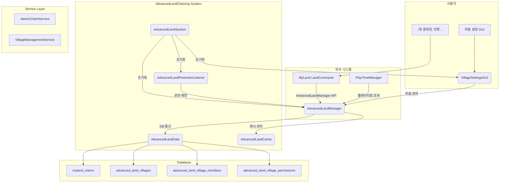

# 🏘️ AdvancedLandClaiming 시스템

> **고급 토지 클레이밍 시스템** - 마을 기능, 자원 기반 클레이밍, 연결된 청크 관리

## 📋 개요

AdvancedLandClaiming 시스템은 기본 MyLand 시스템을 확장하여 **마을 기능**, **자원 기반 클레이밍**, **상세 권한 관리** 등 고급 기능을 제공합니다. 플레이타임 기반의 베테랑/신규 플레이어 구분, 무료 클레이밍 슬롯, 50% 환불 시스템 등 서버 경제와 연동된 기능을 지원합니다.

### 핵심 특징
- 🆓 **무료 클레이밍 슬롯**: 첫 4개 청크 무료
- 💎 **자원 기반 클레이밍**: 철괴/다이아몬드/네더라이트로 추가 클레이밍
- 🏘️ **마을 시스템**: 개인 토지를 마을로 전환, 구성원 관리
- ⏰ **플레이타임 연동**: 베테랑/신규 플레이어 차등 제한
- 💰 **50% 환불 시스템**: 토지 반환 시 자원 일부 환불

## 🏗️ 시스템 아키텍처



## 📁 핵심 컴포넌트

### 🚀 시스템 초기화

| 파일 | 역할 |
|------|------|
| [`AdvancedLandSystem.kt`](./AdvancedLandSystem.kt) | 시스템 **진입점**. 모든 컴포넌트 초기화 및 MyLand 시스템과 통합 처리. |

### 🧠 핵심 로직

| 파일 | 역할 |
|------|------|
| [`AdvancedLandManager.kt`](./AdvancedLandManager.kt) | 시스템의 **핵심**. 클레이밍, 마을 생성/관리, 환불 계산, 권한 관리 등 모든 비즈니스 로직 처리. |
| [`ImprovedAdvancedLandManager.kt`](./ImprovedAdvancedLandManager.kt) | 개선된 매니저 (성능 최적화 버전). |

### 💾 데이터 접근

| 파일 | 역할 |
|------|------|
| [`AdvancedLandData.kt`](./AdvancedLandData.kt) | **데이터베이스 통신** 전담. 클레임, 마을, 권한 정보 CRUD. |

### 📦 캐시 관리

| 파일 | 역할 |
|------|------|
| [`Cache/AdvancedLandCache.kt`](./Cache/AdvancedLandCache.kt) | 인메모리 **캐시 관리**. 빈번한 조회 성능 최적화. |

### 🛡️ 보호 시스템

| 파일 | 역할 |
|------|------|
| [`AdvancedLandProtectionListener.kt`](./AdvancedLandProtectionListener.kt) | **보호 리스너**. 블록 설치/파괴, 상호작용 이벤트 처리. 마을 권한 체크 통합. |

### 🎮 사용자 인터페이스

| 파일 | 역할 |
|------|------|
| [`VillageSettingsGUI.kt`](./VillageSettingsGUI.kt) | 마을 설정 **GUI 시스템**. 멤버 관리, 권한 설정, 마을 해체 등 시각적 인터페이스 제공. |

### 📝 데이터 모델

| 파일 | 역할 |
|------|------|
| [`Models/ClaimInfo.kt`](./Models/ClaimInfo.kt) | `AdvancedClaimInfo`, `ClaimCost`, `ClaimResourceType`, `ChunkCoordinate`, `ConnectedChunks` 정의 |
| [`Models/VillageInfo.kt`](./Models/VillageInfo.kt) | `VillageInfo`, `VillageMember`, `VillageRole`, `VillagePermissionType` 정의 |
| [`AdvancedLandPermissions.kt`](./AdvancedLandPermissions.kt) | 관리자 권한 상수 정의 |

### 🔧 서비스 레이어

| 파일 | 역할 |
|------|------|
| [`Service/AtomicClaimService.kt`](./Service/AtomicClaimService.kt) | **원자적 클레임 서비스**. Race Condition 방지. |
| [`Service/VillageManagementService.kt`](./Service/VillageManagementService.kt) | **마을 관리 서비스**. 마을 관련 비즈니스 로직 분리. |

### 🧪 테스트

| 파일 | 역할 |
|------|------|
| [`Test/PerformanceComparison.kt`](./Test/PerformanceComparison.kt) | 성능 테스트 및 비교 유틸리티. |

## ⌨️ 명령어

> 모든 명령어는 `/땅` (또는 `/land`, `/myland`) 하위에서 작동합니다.

### 개인 토지 클레이밍

| 명령어 | 설명 |
|--------|------|
| `/땅 클레임 [자원타입]` | 현재 청크 클레이밍 (철/다이아/네더라이트) |
| `/땅 반환` | 현재 청크 반환 (50% 환불) |
| `/땅 목록` | 내가 소유한 토지 목록 |
| `/땅 비용` | 클레이밍 비용 정보 |
| `/땅 상태` | 내 토지 정보 요약 |
| `/땅 환불정보` | 현재 토지의 예상 환불 정보 |

### 마을 시스템

| 명령어 | 설명 |
|--------|------|
| `/땅 마을생성 <이름>` | 연결된 개인 토지를 마을로 전환 |
| `/땅 마을초대 <플레이어>` | 마을에 플레이어 초대 (이장/부이장) |
| `/땅 마을추방 <플레이어>` | 마을에서 플레이어 추방 (이장/부이장) |
| `/땅 마을정보` | 현재 마을의 상세 정보 |
| `/땅 마을권한 [목록/플레이어 역할]` | 구성원 역할 관리 (이장만) |
| `/땅 마을반환` | 마을 토지 반환 (이장/부이장) |
| `/땅 마을설정` | 마을 설정 GUI 열기 |
| `/땅 마을클레임 [자원타입]` | 마을 토지 확장 |
| `/땅 마을해체확정` | 마을 해체 확정 |
| `/땅 이장양도 <플레이어>` | 이장직 양도 요청 |

## 🏘️ 마을 역할 시스템

| 역할 | 아이콘 | 권한 |
|------|--------|------|
| **이장 (MAYOR)** | 👑 | 모든 권한 (구성원 관리, 토지 관리, 권한 변경, 마을 해체) |
| **부이장 (DEPUTY_MAYOR)** | 🏅 | 구성원 초대/추방, 토지 반환 (부분적 권한 관리) |
| **구성원 (MEMBER)** | 👤 | 마을 토지 사용 (기본 건설/파괴 권한) |

## 🔐 마을 권한 종류

```kotlin
enum class VillagePermissionType {
    // 구성원 관리
    INVITE_MEMBERS,     // 멤버 초대
    KICK_MEMBERS,       // 멤버 추방
    MANAGE_ROLES,       // 역할 관리
    
    // 토지 관리
    EXPAND_LAND,        // 토지 확장
    REDUCE_LAND,        // 토지 축소
    MANAGE_LAND,        // 토지 종합 관리
    
    // 건설 권한
    BUILD,              // 블록 설치
    BREAK_BLOCKS,       // 블록 파괴
    USE_CONTAINERS,     // 컨테이너 사용
    USE_REDSTONE,       // 레드스톤 조작
    
    // 마을 관리
    MANAGE_PERMISSIONS, // 권한 관리
    DISSOLVE_VILLAGE,   // 마을 해체
    RENAME_VILLAGE      // 마을 이름 변경
}
```

## 💎 클레이밍 비용 체계

| 자원 타입 | 수량 | 환불량 (50%) |
|-----------|------|--------------|
| **무료 슬롯** | 0개 | 0개 |
| **철괴** | 64개 | 32개 |
| **다이아몬드** | 8개 | 4개 |
| **네더라이트 주괴** | 2개 | 1개 |

### 클레이밍 제한

| 플레이어 등급 | 무료 슬롯 | 최대 클레이밍 | 조건 |
|---------------|-----------|---------------|------|
| **신규 플레이어** | 4개 | 9개 | 플레이타임 < 7일 |
| **베테랑 플레이어** | 4개 | 무제한 | 플레이타임 ≥ 7일 |

## 🔐 권한

| 권한 노드 | 설명 |
|-----------|------|
| `advancedland.admin.bypass` | 타인의 토지에서 모든 권한 |
| `advancedland.admin.unclaim` | 타인의 토지 강제 반환 |
| `advancedland.admin.claim` | 관리자 클레임 권한 |

## 💾 데이터베이스 구조

### `myland_claims` 테이블 (확장)
기존 MyLand 테이블에 AdvancedLandClaiming 전용 컬럼 추가:

| 컬럼 | 타입 | 설명 |
|------|------|------|
| `resource_type` | VARCHAR(50) | 클레임에 사용한 자원 타입 (FREE, IRON_INGOT, DIAMOND, NETHERITE_INGOT) |
| `resource_amount` | INT | 소모된 자원 수량 |
| `claim_type` | VARCHAR(50) | 클레임 유형 (PERSONAL, VILLAGE) |
| `village_id` | INT | 마을 ID (마을 토지인 경우) |

### `advanced_land_villages` 테이블
마을 기본 정보를 저장합니다.

| 컬럼 | 타입 | 설명 |
|------|------|------|
| `village_id` | INT (PK, AUTO) | 마을 고유 ID |
| `village_name` | VARCHAR(50) | 마을 이름 (UNIQUE) |
| `mayor_uuid` | VARCHAR(36) | 이장 UUID |
| `mayor_name` | VARCHAR(50) | 이장 이름 |
| `created_at` | BIGINT | 생성 시간 (Unix timestamp) |
| `last_updated` | BIGINT | 마지막 업데이트 시간 |
| `is_active` | BOOLEAN | 활성화 상태 |

### `advanced_land_village_members` 테이블
마을 구성원 정보를 저장합니다.

| 컬럼 | 타입 | 설명 |
|------|------|------|
| `village_id` | INT | 마을 ID (FK) |
| `member_uuid` | VARCHAR(36) | 멤버 UUID |
| `member_name` | VARCHAR(50) | 멤버 이름 |
| `role` | VARCHAR(20) | 역할 (MAYOR, DEPUTY_MAYOR, MEMBER) |
| `joined_at` | BIGINT | 가입 시간 |
| `last_seen` | BIGINT | 마지막 접속 시간 |
| `is_active` | BOOLEAN | 활성화 상태 |

### `advanced_land_village_permissions` 테이블
개별 구성원 권한을 저장합니다.

| 컬럼 | 타입 | 설명 |
|------|------|------|
| `village_id` | INT | 마을 ID (FK) |
| `member_uuid` | VARCHAR(36) | 멤버 UUID |
| `permission_type` | VARCHAR(50) | 권한 종류 |
| `granted_by` | VARCHAR(36) | 권한 부여자 UUID |
| `granted_at` | BIGINT | 권한 부여 시간 |

## 🔗 의존성

### 필수 의존성
- **MyLand 시스템**: 기본 토지 인프라, LandManager와 통합
- **PlayTimeManager**: 플레이타임 기반 베테랑/신규 판별
- **Database**: 영구 데이터 저장

### 제공하는 API
- **LandCommand**: `/땅` 명령어와 통합
- **VillageSettingsGUI**: GUI 기반 마을 관리

## 🛠️ 기술적 특징

### ConcurrentHashMap 기반 캐시
```kotlin
// 동시성 안전한 캐시 구조
private val claimedChunks = ConcurrentHashMap<String, ConcurrentHashMap<Pair<Int, Int>, AdvancedClaimInfo>>()
private val playerClaims = ConcurrentHashMap<UUID, MutableList<AdvancedClaimInfo>>()
```

### 캐시 크기 관리 (OOM 방지)
```kotlin
const val MAX_CLAIMED_CHUNKS_CACHE_SIZE = 10000  // 최대 청크 캐시 수
const val MAX_PLAYER_CLAIMS_CACHE_SIZE = 1000    // 최대 플레이어 캐시 수
const val CACHE_CLEANUP_THRESHOLD = 0.8          // 캐시 정리 임계점 (80%)
```

### 연결된 청크 그룹 시스템
동일 소유자의 인접한 청크들을 그룹으로 관리:

```kotlin
data class ConnectedChunks(
    val chunks: Set<ChunkCoordinate>,
    val ownerUuid: UUID
) {
    fun isConnectedTo(coord: ChunkCoordinate): Boolean {
        return chunks.any { chunk ->
            val dx = Math.abs(chunk.x - coord.x)
            val dz = Math.abs(chunk.z - coord.z)
            (dx == 1 && dz == 0) || (dx == 0 && dz == 1)
        }
    }
}
```

## 🖥️ 마을 설정 GUI

[`VillageSettingsGUI.kt`](./VillageSettingsGUI.kt)에서 제공하는 GUI 페이지:

| 페이지 | 설명 | 접근 권한 |
|--------|------|-----------|
| **MAIN** | 메인 대시보드 | 모든 관리자 |
| **MEMBER_MANAGE** | 멤버 목록 및 관리 | 이장/부이장 |
| **MEMBER_DETAIL** | 개별 멤버 상세 (역할 변경, 추방) | 이장 |
| **VILLAGE_INFO** | 마을 상세 정보 | 모든 관리자 |
| **PERMISSIONS** | 권한 관리 멤버 선택 | 이장/부이장 |
| **MEMBER_PERMISSIONS** | 개별 멤버 권한 토글 | 이장/부이장 |

### GUI 슬롯 배치 (메인 페이지)
```
┌──────────────────────────────────────────────────────┐
│ ██ ██ ██ ██ ██ ██ ██ ██ ██ │  0- 8: 장식
│ ██ 📋 ██ ██ ██ 👥 ██ ██ ██ │ 11: 마을 정보, 15: 멤버 관리
│ ██ ██ ██ ██ ██ ██ ██ ██ ██ │
│ ██ ██ 📊 ██ 🔐 ██ 💥 ██ ██ │ 29: 통계, 31: 권한 관리, 33: 해체
│ ██ ██ ██ ██ ██ ██ ██ ██ ██ │
│ ██ ██ ██ ██ ❌ ██ ██ ██ ██ │ 49: 닫기
└──────────────────────────────────────────────────────┘
```

## 📊 환불 정책

토지 반환 시 소유 기간에 따라 차등 환불:

| 정책 | 환불률 | 조건 |
|------|--------|------|
| `FULL` | 100% | 24시간 내 반환 |
| `HALF` | 50% | 1주일 내 반환 (기본) |
| `QUARTER` | 25% | 장기 사용 후 반환 |
| `NONE` | 0% | 무료 토지 또는 특수 상황 |