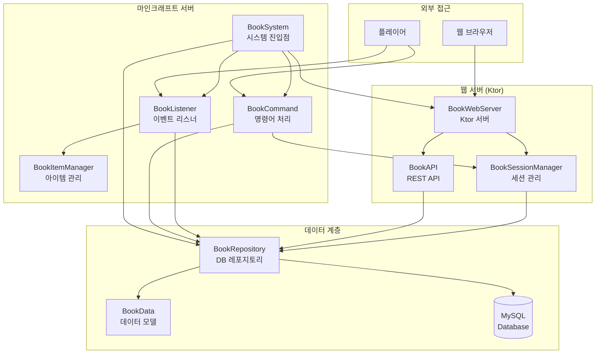
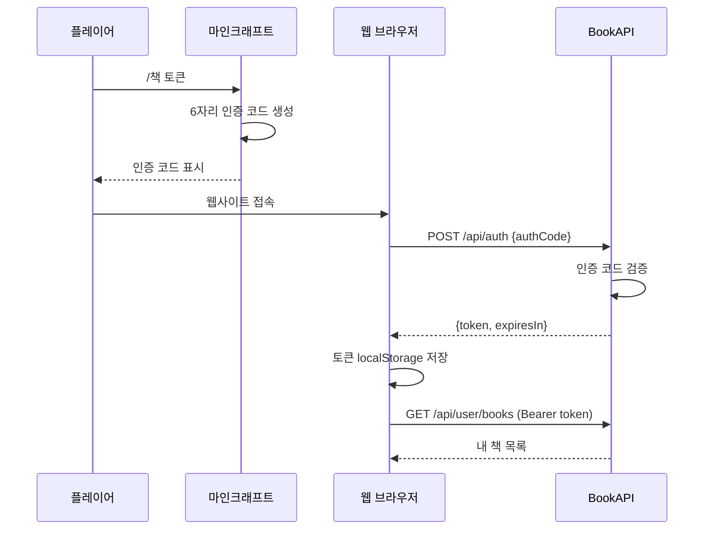

# 📚 BookSystem - 마인크래프트 책 웹 공유 시스템

## 📋 개요

BookSystem은 마인크래프트에서 작성한 책을 웹에서 열람하고 공유할 수 있는 종합 책 관리 시스템입니다. **Ktor 웹 서버**를 내장하여 REST API와 웹 프론트엔드를 제공하며, 플레이어가 인게임에서 작성한 책이 자동으로 데이터베이스에 저장되고 웹에서 열람할 수 있습니다.

### 주요 특징
- 🖊️ **자동 저장**: 책과 깃펜으로 작성한 내용이 자동으로 DB에 저장
- 🌐 **웹 열람**: 내장 Ktor 웹 서버를 통한 웹사이트 제공
- 🔒 **보안 인증**: 6자리 인증 코드 기반의 안전한 웹 인증
- 📖 **공개/비공개**: 책을 선택적으로 공개하여 다른 플레이어와 공유
- 📅 **시즌 분류**: 책을 시즌별로 분류하여 관리
- 🔄 **버전 관리**: 같은 책을 편집하면 업데이트되며 버전이 증가

---

## 🏗️ 시스템 구조


<details>
<summary>📊 다이어그램 소스 코드 (AI 참조용)</summary>



</details>

---

## 📁 핵심 컴포넌트

### [BookSystem.kt](BookSystem.kt)
시스템 전체를 관리하는 메인 클래스입니다.

| 메서드 | 설명 |
|--------|------|
| `enable()` | 시스템 초기화 및 활성화 |
| `disable()` | 시스템 종료 및 정리 |
| `restart()` | 시스템 재시작 |
| `getSystemStatus()` | 시스템 상태 조회 |
| `changeCurrentSeason()` | 현재 시즌 변경 |

### [BookWebServer.kt](BookWebServer.kt)
Ktor 기반의 내장 웹 서버입니다.

| 기능 | 설명 |
|------|------|
| 정적 파일 서빙 | HTML, CSS, JS 프론트엔드 제공 |
| REST API | 책 CRUD 및 인증 API |
| CORS 지원 | 외부 도메인 접근 허용 |
| Bearer 인증 | 토큰 기반 인증 시스템 |

### [BookAPI.kt](BookAPI.kt)
REST API 엔드포인트들을 정의합니다.

| 엔드포인트 | 메서드 | 인증 | 설명 |
|------------|--------|------|------|
| `/api/auth` | POST | ❌ | 인증 코드로 로그인 |
| `/api/books/public` | GET | ❌ | 공개 책 목록 조회 |
| `/api/books/public/{id}` | GET | ❌ | 공개 책 상세 조회 |
| `/api/stats` | GET | ❌ | 공개 통계 조회 |
| `/api/user/books` | GET | ✅ | 내 책 목록 조회 |
| `/api/user/books/{id}` | GET | ✅ | 내 책 상세 조회 |
| `/api/user/books/{id}` | PUT | ✅ | 책 수정 |
| `/api/user/books/{id}` | DELETE | ✅ | 책 삭제 |
| `/api/user/books/{id}/public` | POST | ✅ | 책 공개 설정 |
| `/api/user/books/{id}/private` | POST | ✅ | 책 비공개 설정 |
| `/api/user/profile` | GET | ✅ | 사용자 프로필 조회 |
| `/api/user/logout` | POST | ✅ | 로그아웃 |

### [BookCommand.kt](BookCommand.kt)
인게임 명령어를 처리합니다.

### [BookRepository.kt](BookRepository.kt)
데이터베이스 작업을 담당하는 레포지토리입니다.

| 메서드 | 설명 |
|--------|------|
| `saveBook()` | 새 책 저장 |
| `updateBook()` | 기존 책 업데이트 |
| `getPlayerBooks()` | 플레이어 책 목록 조회 |
| `getPublicBooks()` | 공개 책 목록 조회 |
| `setBookPublic()` | 공개/비공개 설정 |
| `deleteBook()` | 책 삭제 |

### [BookSessionManager.kt](BookSessionManager.kt)
웹 인증 세션을 관리합니다.

| 메서드 | 설명 |
|--------|------|
| `generateAuthCode()` | 6자리 인증 코드 생성 |
| `authenticateWithCode()` | 인증 코드로 세션 생성 |
| `validateToken()` | 토큰 유효성 검증 |
| `invalidateSession()` | 세션 무효화 |

### [BookListener.kt](BookListener.kt)
책 편집 이벤트를 감지하고 자동 저장합니다.

| 이벤트 | 설명 |
|--------|------|
| `PlayerEditBookEvent` | 책 편집 시 자동 저장/업데이트 |
| `PlayerInteractEvent` | 책 읽기 감지 (통계용) |

### [BookItemManager.kt](BookItemManager.kt)
책 아이템의 NBT 태그를 관리합니다.

| 기능 | 설명 |
|------|------|
| `book_id` | 책 고유 ID 저장 |
| `book_owner` | 소유자 UUID 저장 |
| `book_version` | 버전 번호 저장 |

### [BookData.kt](BookData.kt)
데이터 모델 정의 파일입니다.

---

## 💻 명령어

### 기본 명령어
| 명령어 | 설명 |
|--------|------|
| `/책` 또는 `/book` | 도움말 표시 |
| `/책 목록 [페이지]` | 내 책 목록 보기 |
| `/책 공개 <책ID>` | 책을 공개로 설정 |
| `/책 비공개 <책ID>` | 책을 비공개로 설정 |
| `/책 삭제 <책ID>` | 책 삭제 |
| `/책 정보 <책ID>` | 책 상세 정보 보기 |
| `/책 웹사이트` | 웹 주소 안내 |
| `/책 토큰` | 웹 인증 토큰 생성 |
| `/책 통계` | 내 책 통계 보기 |
| `/책 시즌 [시즌명]` | 현재 시즌 확인/변경 (관리자) |

---

## 🔐 권한

| 권한 | 설명 |
|------|------|
| `lukevanilla.book.*` | 책 시스템 전체 권한 |
| `lukevanilla.admin` | 시즌 변경 권한 |

---

## 💾 데이터 저장

### books 테이블
| 컬럼 | 타입 | 설명 |
|------|------|------|
| `id` | BIGINT | 책 고유 ID (PK) |
| `uuid` | VARCHAR(36) | 소유자 UUID |
| `title` | VARCHAR(64) | 책 제목 |
| `content` | TEXT | JSON 형태의 책 내용 |
| `page_count` | INT | 페이지 수 |
| `is_signed` | BOOLEAN | 서명 여부 |
| `is_public` | BOOLEAN | 공개 여부 |
| `is_archived` | BOOLEAN | 아카이브 여부 |
| `season` | VARCHAR(20) | 시즌 정보 |
| `created_at` | TIMESTAMP | 생성 시간 |
| `updated_at` | TIMESTAMP | 수정 시간 |

### book_sessions 테이블
| 컬럼 | 타입 | 설명 |
|------|------|------|
| `session_id` | VARCHAR(36) | 세션 ID (PK) |
| `uuid` | VARCHAR(36) | 플레이어 UUID |
| `token` | VARCHAR(64) | 인증 토큰 |
| `ip_address` | VARCHAR(45) | 클라이언트 IP |
| `user_agent` | VARCHAR(255) | 브라우저 정보 |
| `is_active` | BOOLEAN | 활성 여부 |
| `created_at` | TIMESTAMP | 생성 시간 |
| `expires_at` | TIMESTAMP | 만료 시간 |
| `last_used_at` | TIMESTAMP | 마지막 사용 시간 |

---

## 🔗 의존성

### 내부 의존성
| 시스템 | 용도 |
|--------|------|
| [Database](../Database/README.md) | MySQL 데이터베이스 연결 |
| Main | 플러그인 인스턴스 |

### 외부 의존성
| 라이브러리 | 용도 |
|------------|------|
| Ktor | 내장 웹 서버 |
| kotlinx.serialization | JSON 직렬화 |
| Spring Security (BCrypt) | 비밀번호 암호화 |

---

## ⚙️ 설정

`config.yml`에서 설정 가능한 항목:

```yaml
book_system:
  # 웹서버 활성화 여부
  enable_web_server: true
  
  # 내부 웹서버 설정
  web_port: 9595
  web_host: "127.0.0.1"
  
  # 외부 접속 설정 (Nginx 프록시 등)
  external_domain: "books.example.com"
  external_protocol: "https"
  
  # CORS 설정
  enable_cors: true
  allowed_origins:
    - "https://books.example.com"
  
  # 세션 설정
  session_expiry_hours: 24
  auth_code_expiry_minutes: 5
  max_sessions_per_player: 3
  
  # 기타 설정
  current_season: "Season1"
  log_book_reads: false
```

---

## 🌐 웹 인터페이스

### 주요 기능
- **홈 페이지**: 통계 및 최근 공개된 책 표시
- **공개 책 페이지**: 모든 공개된 책 검색 및 열람
- **내 책 페이지**: 로그인 후 자신의 책 관리
- **책 뷰어**: 마인크래프트 스타일의 책 열람 모달

### 인증 흐름


<details>
<summary>📊 다이어그램 소스 코드 (AI 참조용)</summary>



</details>

---

## 📝 사용 예시

### 책 작성 및 자동 저장
1. 책과 깃펜을 들고 우클릭하여 편집
2. 내용 작성 후 저장 버튼 클릭
3. "책이 저장되었습니다! (ID: xxx)" 메시지 확인
4. 같은 책을 계속 편집하면 자동으로 업데이트

### 웹에서 책 공유하기
1. `/책 토큰` 명령어로 인증 코드 받기
2. 웹사이트 접속 후 인증 코드 입력
3. "내 책" 페이지에서 공개하기 버튼 클릭
4. 다른 플레이어들이 "공개 책" 페이지에서 열람 가능

---

## ⚠️ 주의사항

1. **Vanilla 서버 전용**: 이 시스템은 Vanilla 서버에서만 동작합니다
2. **서명된 책 삭제 불가**: 서명된 책은 웹에서 삭제할 수 없습니다
3. **세션 만료**: 웹 세션은 기본 24시간 후 만료됩니다
4. **인증 코드 만료**: 인증 코드는 5분 후 만료됩니다
5. **Nginx 프록시 권장**: 외부 접속 시 Nginx 리버스 프록시 사용 권장

---

## 🔧 문제 해결

### 웹서버가 시작되지 않는 경우
- 포트 충돌 확인 (기본 9595)
- 방화벽 설정 확인
- 로그에서 에러 메시지 확인

### 인증이 실패하는 경우
- 인증 코드가 5분 내에 입력되었는지 확인
- 이미 사용된 인증 코드인지 확인
- 세션 만료 여부 확인

### 책이 저장되지 않는 경우
- 데이터베이스 연결 상태 확인
- books 테이블 존재 여부 확인
- 콘솔 로그에서 에러 확인