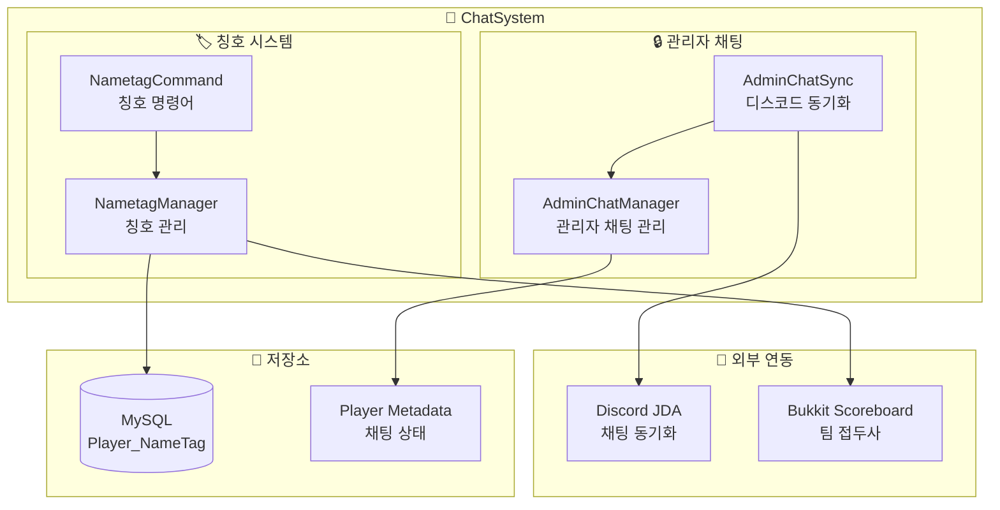
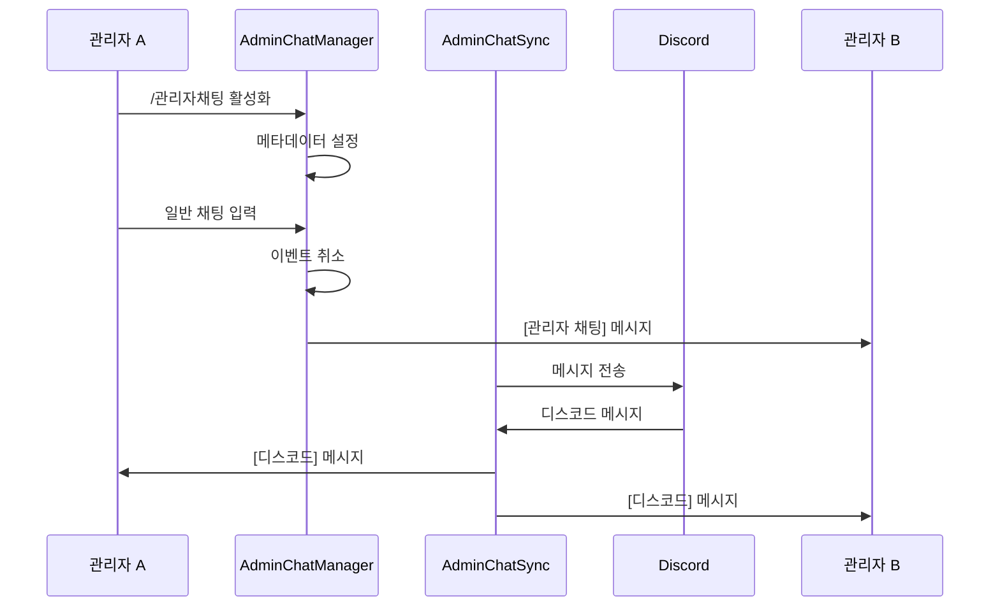
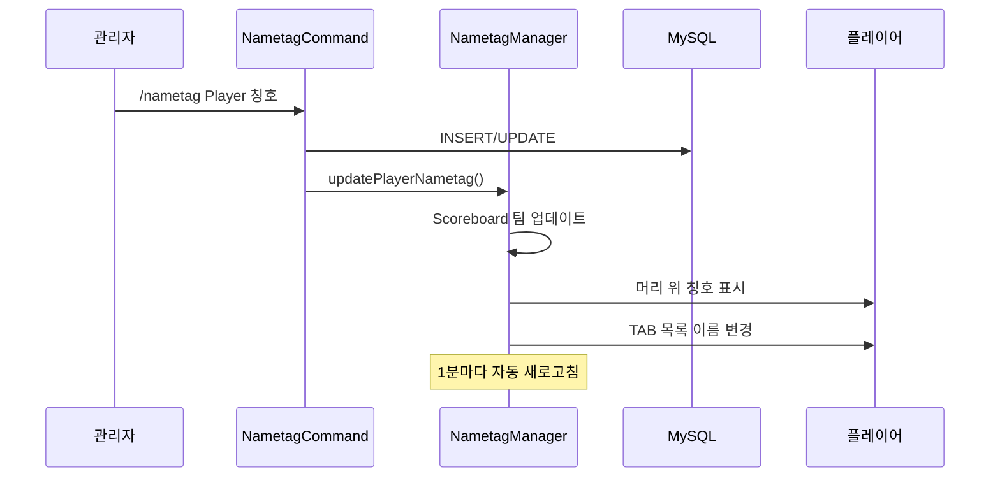

# 💬 ChatSystem (채팅 시스템)

## 📋 개요

ChatSystem은 관리자 채팅과 플레이어 칭호(네임태그)를 관리하는 시스템입니다. 관리자 간 비밀 채팅, 디스코드-게임 연동, 플레이어 칭호 표시 기능을 제공합니다.

## 🏗️ 시스템 구조


<details>
<summary>📊 다이어그램 소스 코드 (AI 참조용)</summary>



</details>

## 📁 핵심 컴포넌트

### 1. [AdminChatManager.kt](AdminChatManager.kt)
관리자 전용 비밀 채팅 기능을 관리합니다.

**주요 기능:**
- 관리자 채팅 모드 활성화/비활성화
- 일반 채팅을 관리자 전용으로 변환
- 플레이어 메타데이터를 통한 상태 관리

```kotlin
// 관리자 채팅 활성화 상태 저장 (메타데이터 사용)
player.setMetadata("adminChatEnabled", FixedMetadataValue(plugin, true))

// 관리자 채팅 메시지 형식
"[관리자 채팅] {칭호}{플레이어명}: {메시지}"
```

**작동 방식:**
1. 플레이어가 `/관리자채팅 활성화` 실행
2. 메타데이터에 `adminChatEnabled` 설정
3. 일반 채팅 시 `AsyncPlayerChatEvent` 가로채기
4. 원본 이벤트 취소 후 관리자들에게만 메시지 전송

### 2. [AdminChatSync.kt](AdminChatSync.kt)
관리자 채팅을 디스코드와 양방향으로 동기화합니다.

**주요 기능:**
- 게임 내 관리자 채팅 → 디스코드 전송
- 디스코드 메시지 → 게임 내 관리자에게 전송
- JDA ListenerAdapter 구현

```kotlin
// 디스코드 → 게임
override fun onMessageReceived(event: MessageReceivedEvent) {
    // AdminChatChannel 설정값으로 채널 확인
    val adminChatChannelId = plugin.database.getSettingValue("AdminChatChannel")
    // 관리자 권한 플레이어에게 전송
}

// 게임 → 디스코드
@EventHandler
fun onPlayerChat(event: AsyncPlayerChatEvent) {
    if (player.hasMetadata("adminChatEnabled")) {
        channel.sendMessage("[${player.name}] ${event.message}").queue()
    }
}
```

### 3. [NametagManager.kt](NametagManager.kt)
플레이어 칭호(네임태그) 시스템을 관리합니다.

**주요 기능:**
- 플레이어 머리 위 칭호 표시 (Scoreboard Team)
- 채팅 메시지에 칭호 표시
- 플레이어 목록(TAB)에 칭호 표시
- 1분마다 자동 새로고침

```kotlin
// Scoreboard 팀을 통한 칭호 표시
fun updatePlayerNametag(player: Player, nameTag: String) {
    val team = scoreboard.registerNewTeam(player.uniqueId.toString())
    team.prefix = "$translatedNameTag "
    player.setPlayerListName("$translatedNameTag ${player.name}")
}

// 채팅 형식 변경
event.format = "${nameTag.translateColorCodes()} ${player.name} : %2\$s"
```

**색상 코드 지원:**
- `&` 코드: `&a`, `&l` 등
- HEX 색상: `&#RRGGBB` 형식

### 4. [NametagCommand.kt](NametagCommand.kt)
칭호 관련 명령어를 처리합니다.

**명령어:**
| 명령어 | 설명 | 사용법 |
|--------|------|--------|
| `/nametag` | 플레이어 칭호 설정 | `/nametag <플레이어> <칭호>` |
| `/delnametag` | 플레이어 칭호 제거 | `/delnametag <플레이어>` |

## 💾 데이터 저장

### DB 테이블: `Player_NameTag`

```sql
CREATE TABLE Player_NameTag (
    UUID VARCHAR(36) PRIMARY KEY,
    Tag VARCHAR(255)
);
```

| 컬럼 | 타입 | 설명 |
|------|------|------|
| `UUID` | VARCHAR(36) | 플레이어 UUID (PK) |
| `Tag` | VARCHAR(255) | 칭호 문자열 (색상 코드 포함) |

### DB 설정: `settings`

| 키 | 값 | 설명 |
|----|-----|------|
| `AdminChatChannel` | 디스코드 채널 ID | 관리자 채팅 동기화 채널 |

## ⚙️ 작동 흐름

### 관리자 채팅 흐름


<details>
<summary>📊 다이어그램 소스 코드 (AI 참조용)</summary>



</details>

### 칭호 적용 흐름


<details>
<summary>📊 다이어그램 소스 코드 (AI 참조용)</summary>



</details>

## 🎨 색상 코드

### 기본 색상 코드

| 코드 | 색상 | 코드 | 스타일 |
|------|------|------|--------|
| `&0` | 검정 | `&l` | **굵게** |
| `&1` | 짙은 파랑 | `&m` | ~~취소선~~ |
| `&2` | 짙은 초록 | `&n` | <u>밑줄</u> |
| `&3` | 짙은 청록 | `&o` | *기울임* |
| `&4` | 짙은 빨강 | `&r` | 리셋 |
| `&a` | 연초록 | | |
| `&b` | 청록 | | |
| `&c` | 빨강 | | |
| `&d` | 분홍 | | |
| `&e` | 노랑 | | |
| `&f` | 흰색 | | |

### HEX 색상 코드

형식: `&#RRGGBB`

예시:
- `&#FF0000` - 빨강
- `&#00FF00` - 초록
- `&#0000FF` - 파랑
- `&#FFD700` - 금색

## 🔐 권한

| 권한 | 설명 | 기본값 |
|------|------|--------|
| `lukevanilla.adminchat` | 관리자 채팅 사용 | OP |
| `lukevanilla.nametag` | 칭호 명령어 사용 | OP |

## 🔗 의존성

### 내부 의존성
- **Database** - 칭호 데이터 저장
- **DiscordBot** - 관리자 채팅 동기화
- **ColorUtil** - 색상 코드 변환

### 외부 의존성
- **Bukkit Scoreboard API** - 팀 접두사
- **JDA** - 디스코드 연동
- **Adventure API** (일부 사용)

## 📝 사용 예시

### 관리자 채팅

```
# 활성화
/관리자채팅 활성화

# 일반 채팅이 관리자 채팅으로 변환됨
안녕하세요 -> [관리자 채팅] [칭호] 플레이어명: 안녕하세요

# 비활성화
/관리자채팅 비활성화
```

### 칭호 설정

```
# 칭호 설정
/nametag Steve &c[&6VIP&c]
# 결과: Steve의 머리 위에 빨강[금색VIP빨강] 표시

# HEX 색상 사용
/nametag Alex &#FFD700[★]
# 결과: 금색 별 표시

# 칭호 제거
/delnametag Steve
```

## ⚠️ 주의사항

1. **온라인 플레이어만**: 칭호 설정/제거는 온라인 플레이어만 대상으로 가능합니다
2. **색상 코드**: `&` 기호를 사용하며, 게임 내에서 자동 변환됩니다
3. **새로고침**: 1분마다 자동으로 칭호가 새로고침됩니다
4. **디스코드 채널**: `AdminChatChannel` 설정이 필요합니다

## 🔄 자동 새로고침

칭호는 1분(1200 틱)마다 자동으로 새로고침됩니다:

```kotlin
plugin.server.scheduler.runTaskTimer(plugin, Runnable {
    refreshNametags()
}, 0L, 1200L)
```

이를 통해:
- DB에서 직접 수정된 칭호도 반영
- 새로 접속한 플레이어의 칭호 표시
- 스코어보드 동기화 유지