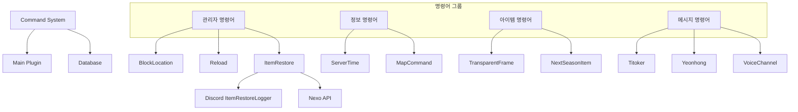
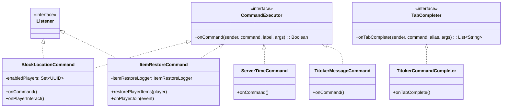
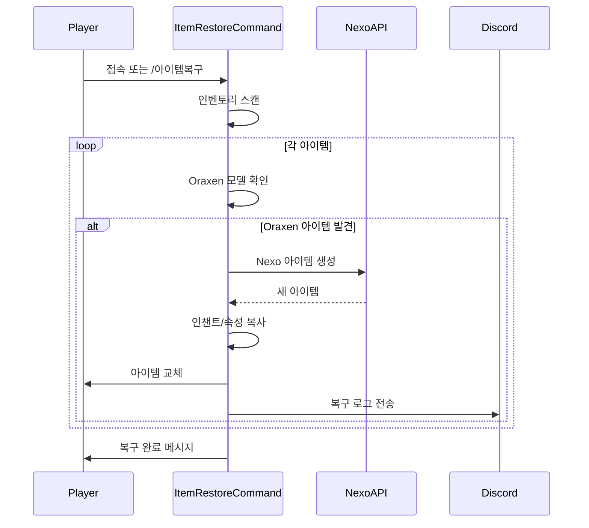

# ⚡ Command 시스템

다양한 유틸리티 명령어를 제공하는 시스템입니다.

## 📋 개요

Command 시스템은 서버 운영에 필요한 다양한 유틸리티 명령어를 제공합니다. 블록 위치 확인, 아이템 복구, 서버 시간 조회 등의 기능을 포함합니다.

## 🗂️ 파일 구조

```
Command/
├── BlockLocationCommand.kt            # 블록 위치 확인
├── CraftAllowCommand.kt              # 제작 허용 명령어
├── infomessage.kt                    # 정보 메시지
├── ItemRestoreCommand.kt             # 아이템 복구
├── mapcommand.kt                     # 지도 사이트 링크
├── NextSeasonItemGUI.kt              # 다음 시즌 아이템 GUI
├── plcommandcancel.kt                # PL 명령어 취소
├── RefreshMessagesCommand.kt         # 메시지 갱신
├── ReloadCommand.kt                  # 플러그인 리로드
├── ServerConnectionCommand.kt        # 서버 연결 정보
├── ServerTimeCommand.kt              # 서버 시간 조회
├── TitokerMessageCommand.kt          # 티토커 메시지
├── TitokerCommandCompleter.kt        # 티토커 탭 완성
├── TransparentFrameCommand.kt        # 투명 액자 지급
├── VoiceChannelMessageCommand.kt     # 음성 채널 메시지
├── VoiceChannelMessageCommandCompleter.kt
├── YeonhongMessageCommand.kt         # 연홍 메시지
└── YeonhongCommandCompleter.kt       # 연홍 탭 완성
```

## 🔧 핵심 컴포넌트

### 관리자 명령어

#### [`BlockLocationCommand.kt`](./BlockLocationCommand.kt)
블록 위치 확인 모드
- 활성화 시 블록 우클릭으로 좌표 확인
- 클릭 가능한 좌표 텍스트 (클립보드 복사)
- **권한**: `lukevanilla.admin.getblocklocation`

```kotlin
// 사용 예시
/블록위치  // 토글 모드 활성화/비활성화
// 이후 블록 우클릭 → "world 100 64 200" 형태로 표시
```

#### [`ReloadCommand.kt`](./ReloadCommand.kt)
플러그인 리로드
- 플러그인 비활성화 후 재활성화
- **권한**: `lukevanilla.reload`

#### [`ItemRestoreCommand.kt`](./ItemRestoreCommand.kt)
아이템 복구 시스템
- Oraxen → Nexo 아이템 자동 변환
- 아이템 ID 불일치 복구
- 플레이어 접속 시 자동 실행
- Discord 로그 연동

### 정보 명령어

#### [`ServerTimeCommand.kt`](./ServerTimeCommand.kt)
서버 시간대 정보 조회
- 시스템 기본 시간대 표시
- UTC, KST 참고 시간 제공
- 서버 설정 확인용

#### [`mapcommand.kt`](./mapcommand.kt)
지도 사이트 링크
- 클릭 가능한 지도 URL 제공
- **명령어**: `/지도`, `/wleh`

### 커스텀 메시지 명령어

#### [`TitokerMessageCommand.kt`](./TitokerMessageCommand.kt)
티토커 전용 채팅 메시지
- 커스텀 포맷 메시지 전송
- **탭 완성**: [`TitokerCommandCompleter.kt`](./TitokerCommandCompleter.kt)

#### [`YeonhongMessageCommand.kt`](./YeonhongMessageCommand.kt)
연홍 전용 채팅 메시지
- 커스텀 포맷 메시지 전송
- **탭 완성**: [`YeonhongCommandCompleter.kt`](./YeonhongCommandCompleter.kt)

#### [`VoiceChannelMessageCommand.kt`](./VoiceChannelMessageCommand.kt)
음성 채널 메시지 전송
- Discord 음성 채널 연동 메시지
- **탭 완성**: [`VoiceChannelMessageCommandCompleter.kt`](./VoiceChannelMessageCommandCompleter.kt)

### 아이템 관련 명령어

#### [`TransparentFrameCommand.kt`](./TransparentFrameCommand.kt)
투명 액자 지급 명령어
- CustomItemSystem의 투명 액자 아이템 지급

#### [`NextSeasonItemGUI.kt`](./NextSeasonItemGUI.kt)
다음 시즌 아이템 GUI
- 예정된 시즌 아이템 미리보기

### 기타 명령어

#### [`CraftAllowCommand.kt`](./CraftAllowCommand.kt)
제작 허용 명령어
- 특정 아이템 제작 허용/차단 설정

#### [`RefreshMessagesCommand.kt`](./RefreshMessagesCommand.kt)
메시지 갱신 명령어
- 캐시된 메시지 리로드

#### [`ServerConnectionCommand.kt`](./ServerConnectionCommand.kt)
서버 연결 정보
- 현재 서버 연결 상태 확인

#### [`plcommandcancel.kt`](./plcommandcancel.kt)
PL 명령어 취소
- 특정 명령어 실행 차단

#### [`infomessage.kt`](./infomessage.kt)
정보 메시지 표시
- 서버 안내 메시지

## 📝 명령어 목록

| 명령어 | 설명 | 권한 |
|--------|------|------|
| `/블록위치` | 블록 좌표 확인 모드 토글 | `lukevanilla.admin.getblocklocation` |
| `/lukereload` | 플러그인 리로드 | `lukevanilla.reload` |
| `/아이템복구` | 손상된 아이템 복구 | 없음 |
| `/서버시간` | 서버 시간대 정보 | 없음 |
| `/지도`, `/wleh` | 지도 사이트 링크 | 없음 |
| `/투명액자` | 투명 액자 지급 | 관리자 |
| `/음성채널메시지` | 음성 채널 메시지 전송 | 해당 권한 |

## 🔗 의존성



## 🏗️ 시스템 아키텍처



## 📊 아이템 복구 흐름



## 💡 사용 예시

### 블록 위치 확인
```
1. /블록위치 입력 → 모드 활성화
2. 원하는 블록 우클릭
3. "블록 좌표: world 100 64 200" 표시
4. 클릭하여 클립보드 복사
5. /블록위치 입력 → 모드 비활성화
```

### 아이템 복구
```
1. 플레이어 접속 시 자동 실행
2. 또는 /아이템복구 명령어 실행
3. Oraxen 아이템 → Nexo 아이템 자동 변환
4. "총 N개의 아이템이 복구되었습니다" 메시지
```

## ⚙️ 새 명령어 추가

### 1. 명령어 클래스 생성
```kotlin
class NewCommand : CommandExecutor {
    override fun onCommand(sender: CommandSender, command: Command, label: String, args: Array<out String>): Boolean {
        // 명령어 로직
        return true
    }
}
```

### 2. plugin.yml에 등록
```yaml
commands:
  newcommand:
    description: "새 명령어 설명"
    permission: lukevanilla.newcommand
```

### 3. Main.kt에서 등록
```kotlin
getCommand("newcommand")?.setExecutor(NewCommand())
```

## 🔍 주의사항

1. **권한 확인**: 관리자 명령어는 반드시 권한 체크
2. **비동기 처리**: 무거운 작업은 비동기로 처리
3. **탭 완성**: 사용자 편의를 위해 TabCompleter 구현 권장
4. **로깅**: 중요 명령어는 Discord 또는 콘솔에 로그 기록