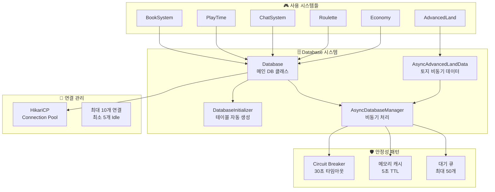
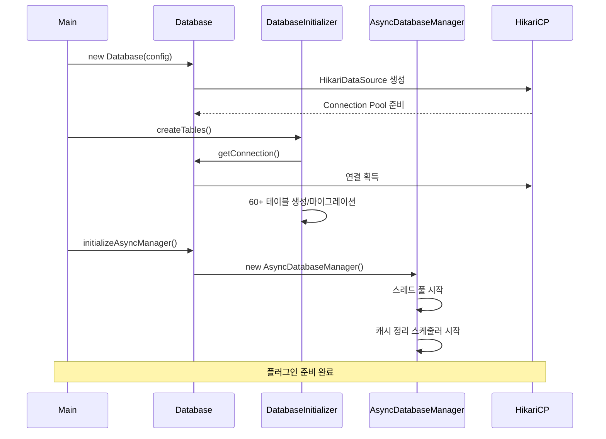
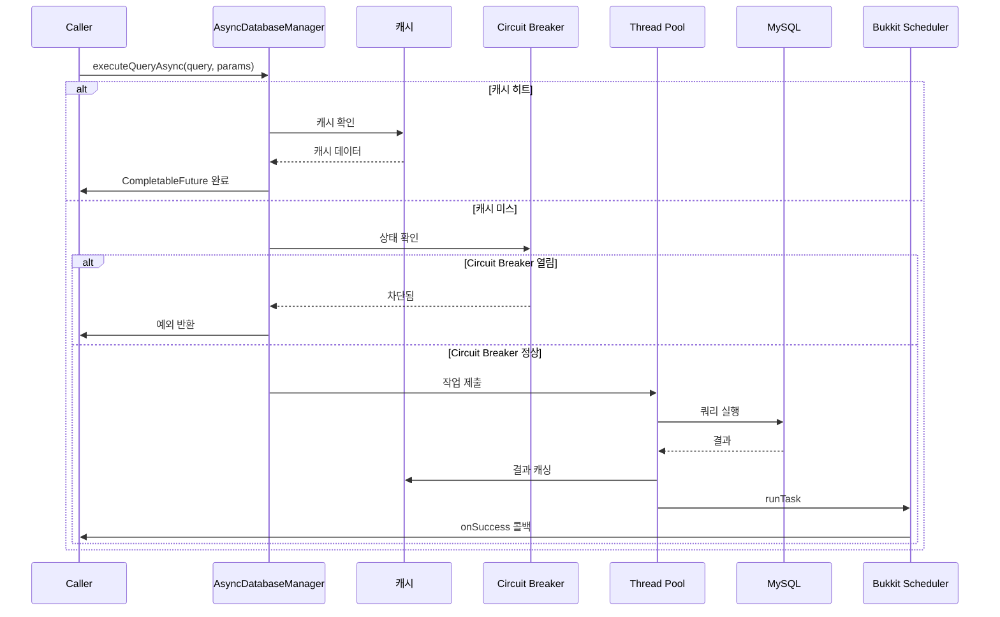

# 🗄️ Database 시스템

## 📋 개요

Database 시스템은 플러그인 전체에서 사용하는 핵심 데이터베이스 인프라입니다. MySQL 데이터베이스 연결 관리, 테이블 자동 생성, 비동기 쿼리 처리, 연결 풀 관리 등의 기능을 제공합니다.

## 🏗️ 시스템 구조



## 📁 핵심 컴포넌트

### 1. [Database.kt](Database.kt)
메인 데이터베이스 클래스로, HikariCP를 사용한 연결 풀 관리와 다양한 쿼리 메서드를 제공합니다.

**주요 기능:**
- HikariCP 연결 풀 관리
- 동기 쿼리 메서드
- 데이터 클래스 정의
- 비동기 매니저 초기화

```kotlin
// HikariCP 설정
hikariConfig.maximumPoolSize = 10     // 최대 연결 수
hikariConfig.minimumIdle = 5          // 최소 Idle 연결
hikariConfig.idleTimeout = 30000      // Idle 타임아웃 (30초)
hikariConfig.maxLifetime = 1800000    // 최대 수명 (30분)
hikariConfig.connectionTimeout = 5000L // 연결 타임아웃 (5초)
hikariConfig.leakDetectionThreshold = 60000L // 누수 감지 (1분)

// 연결 가져오기
fun getConnection(): Connection = dataSource.connection
```

**제공 데이터 클래스:**
| 클래스 | 설명 |
|--------|------|
| `AuthRecord` | 플레이어 인증 정보 |
| `PlayerData` | 플레이어 기본 정보 |
| `AccountLinkInfo` | 계정 연동 정보 |
| `PlayerInfo` | 플레이어 상세 정보 |
| `ServerHeartbeat` | 서버 상태 정보 |
| `OnlinePlayerInfo` | 온라인 플레이어 정보 |
| `CrossServerCommand` | 서버 간 명령어 |
| `SupportCase` | 지원 케이스 |

### 2. [DatabaseInitializer.kt](DatabaseInitializer.kt)
플러그인 시작 시 필요한 모든 테이블을 자동으로 생성하고 마이그레이션을 처리합니다.

**자동 생성 테이블 (60개 이상):**

| 카테고리 | 테이블 |
|----------|--------|
| 플레이어 | `Player_Data`, `Player_Auth`, `Player_NameTag`, `Connection_IP` |
| 설정 | `Settings`, `Secret_Key`, `Join_Quit_Message` |
| 시즌 아이템 | `Halloween_*`, `Christmas_*`, `Valentine_*`, `Spring_*` |
| 메시지 | `Titoker_Message_Setting`, `Yeonhong_Message_Setting`, `Voice_Channel_Message_Setting` |
| 디스코드 | `Dynamic_Voice_Channel`, `SupportChatLink`, `Discord_Account_Link` |
| 토지 | `myland_claims`, `myland_members`, `myland_claim_history` |
| 마을 | `villages`, `village_members`, `village_permissions` |
| 농사 | `farmvillage_plots`, `farmvillage_package_items`, `farmvillage_shops` |
| 서버 동기화 | `server_heartbeat`, `server_online_players`, `cross_server_commands` |
| 책 | `books`, `book_sessions` |
| 플레이타임 | `playtime_data` |
| 낚시 상인 | `fish_merchant_npc`, `fish_prices`, `fish_sell_history` |
| 룰렛 | `roulette_config`, `roulette_items`, `roulette_history`, `roulette_trigger_mapping` |
| 랜덤 스크롤 | `random_scroll_config`, `random_scroll_rewards`, `random_scroll_history` |
| 빼빼로 이벤트 | `pepero_event_*` |
| 경고 | `warnings_players`, `warnings_records`, `warnings_pardons` |
| 상점 | `shops`, `shop_items`, `villagemerchant_npcs` |

### 3. [AsyncDatabaseManager.kt](AsyncDatabaseManager.kt)
비동기 데이터베이스 작업을 관리하여 서버 멈춤과 DB 과부하를 방지합니다.

**핵심 기능:**

```kotlin
// 스레드 풀 (4개 워커)
private val executorService = Executors.newFixedThreadPool(4)

// 비동기 쿼리 실행
fun <T> executeQueryAsync(
    query: String,
    params: List<Any?>,
    cacheKey: String?,
    mapper: (ResultSet) -> T?,
    onSuccess: (T?) -> Unit,
    onFailure: (Exception) -> Unit
): CompletableFuture<T?>

// 비동기 업데이트 실행
fun executeUpdateAsync(
    query: String,
    params: List<Any?>,
    onSuccess: (Boolean) -> Unit,
    onFailure: (Exception) -> Unit
): CompletableFuture<Boolean>

// 배치 업데이트 (트랜잭션)
fun executeBatchAsync(
    queries: List<Pair<String, List<Any?>>>,
    onSuccess: (List<Boolean>) -> Unit,
    onFailure: (Exception) -> Unit
): CompletableFuture<List<Boolean>>
```

**안정성 패턴:**

| 패턴 | 설명 | 설정 |
|------|------|------|
| Circuit Breaker | 연속 실패 시 DB 차단 | 30초 타임아웃, 50% 실패율 |
| 캐시 | 자주 조회되는 데이터 캐싱 | 5초 TTL |
| 대기 큐 제한 | 과부하 방지 | 최대 50개 대기 작업 |
| 쿼리 타임아웃 | 느린 쿼리 방지 | 5초 |

### 4. [AsyncAdvancedLandData.kt](AsyncAdvancedLandData.kt)
토지 시스템 전용 비동기 데이터 처리 클래스입니다.

**주요 기능:**
- 마을 해체 시 토지 일괄 변환
- 동적 배치 크기 최적화
- 마을/플레이어 정보 조회

```kotlin
// 마을 토지를 개인 토지로 변환 (비동기 배치)
fun convertVillageToPersonalLandsAsync(
    villageId: Int,
    newOwnerUuid: UUID,
    newOwnerName: String,
    onProgress: (Int, Int) -> Unit,
    onComplete: (Boolean) -> Unit,
    onError: (Exception) -> Unit
): CompletableFuture<Boolean>

// 동적 배치 크기 계산
private fun calculateOptimalBatchSize(totalItems: Int): Int = when {
    totalItems <= 50 -> 10    // 적음: 작은 배치
    totalItems <= 200 -> 50   // 보통: 기본 배치
    totalItems <= 500 -> 75   // 많음: 큰 배치
    else -> 100               // 대량: 최대 배치
}
```

### 5. [DatabaseIntegrationExample.kt](DatabaseIntegrationExample.kt)
다른 시스템에서 Database를 사용하는 예시 코드를 제공합니다.

## ⚙️ 작동 흐름

### 플러그인 시작 시



### 비동기 쿼리 실행



## 💾 주요 테이블 구조

### 플레이어 데이터

```sql
-- 플레이어 기본 정보
CREATE TABLE Player_Data (
    UUID VARCHAR(36) PRIMARY KEY,
    NickName VARCHAR(30) NOT NULL,
    DiscordID VARCHAR(30),
    Lastest_IP VARCHAR(45),
    IsBanned TINYINT(1) DEFAULT 0
);

-- 플레이어 인증
CREATE TABLE Player_Auth (
    UUID VARCHAR(36) PRIMARY KEY,
    IsAuth TINYINT(1) DEFAULT 0,
    AuthCode VARCHAR(6),
    IsFirst TINYINT(1) DEFAULT 1
);

-- 플레이어 칭호
CREATE TABLE Player_NameTag (
    UUID VARCHAR(36) PRIMARY KEY,
    Tag VARCHAR(255)
);
```

### 서버 동기화

```sql
-- 서버 상태 (heartbeat)
CREATE TABLE server_heartbeat (
    server_name VARCHAR(20) PRIMARY KEY,
    tps DECIMAL(5,2),
    mspt DECIMAL(6,2),
    online_players INT,
    max_players INT,
    server_status ENUM('online', 'offline', 'restarting'),
    last_update TIMESTAMP
);

-- 온라인 플레이어
CREATE TABLE server_online_players (
    id INT AUTO_INCREMENT PRIMARY KEY,
    server_name VARCHAR(20),
    player_uuid VARCHAR(36),
    player_name VARCHAR(16),
    location_world VARCHAR(50),
    location_x DOUBLE,
    location_y DOUBLE,
    location_z DOUBLE,
    join_time TIMESTAMP,
    last_update TIMESTAMP,
    UNIQUE KEY (server_name, player_uuid)
);

-- 서버 간 명령어
CREATE TABLE cross_server_commands (
    id INT AUTO_INCREMENT PRIMARY KEY,
    command_type ENUM('ban', 'unban', 'kick', 'warning', 'custom'),
    target_player_uuid VARCHAR(36),
    source_server VARCHAR(20),
    target_server VARCHAR(20),
    command_data JSON,
    status ENUM('pending', 'executed', 'failed', 'cancelled'),
    created_at TIMESTAMP,
    executed_at TIMESTAMP
);
```

## 🔐 설정

### config.yml 설정

```yaml
database:
  host: localhost
  port: 3306
  name: lukevanilla
  user: root
  password: password
```

## 🔗 의존성

### 내부 의존성
- 모든 시스템에서 사용

### 외부 의존성
- **HikariCP** - 고성능 연결 풀
- **MySQL Connector/J** - MySQL 드라이버
- **Gson** - JSON 직렬화

## 📊 모니터링

### 통계 정보 조회

```kotlin
val stats = asyncDatabaseManager.getStats()
// {
//   "pendingOperations": 5,
//   "totalOperations": 1234,
//   "failedOperations": 2,
//   "circuitBreakerOpen": false,
//   "cacheSize": 50,
//   "activeThreads": 3,
//   "queueSize": 2
// }
```

## 📝 사용 예시

### 동기 쿼리

```kotlin
// 플레이어 데이터 조회
val playerData = database.getPlayerDataByUuid(uuid)

// 설정 값 조회
val setting = database.getSettingValue("AdminChatChannel")

// 플레이어 인증 상태 업데이트
database.updateAuthStatus(authCode, true)
```

### 비동기 쿼리

```kotlin
// 비동기 조회
asyncManager.executeQueryAsync(
    query = "SELECT * FROM Player_Data WHERE UUID = ?",
    params = listOf(uuid),
    cacheKey = "player_$uuid",
    mapper = { rs -> rs.getString("NickName") },
    onSuccess = { name -> 
        player.sendMessage("환영합니다, $name!")
    },
    onFailure = { e ->
        plugin.logger.warning("DB 오류: ${e.message}")
    }
)

// 비동기 업데이트
asyncManager.executeUpdateAsync(
    query = "UPDATE Player_Data SET NickName = ? WHERE UUID = ?",
    params = listOf(newName, uuid),
    onSuccess = { success ->
        if (success) player.sendMessage("닉네임 변경 완료!")
    }
)

// 배치 업데이트 (트랜잭션)
asyncManager.executeBatchAsync(
    queries = listOf(
        "UPDATE balance SET amount = amount - 100 WHERE uuid = ?" to listOf(senderUuid),
        "UPDATE balance SET amount = amount + 100 WHERE uuid = ?" to listOf(receiverUuid)
    ),
    onSuccess = { results ->
        if (results.all { it }) {
            sender.sendMessage("송금 완료!")
        }
    }
)
```

## ⚠️ 주의사항

1. **연결 반환**: `getConnection().use { }` 패턴을 사용하여 연결을 반드시 반환하세요
2. **비동기 우선**: 메인 스레드에서는 반드시 비동기 메서드를 사용하세요
3. **캐시 키**: 캐시 키는 고유하게 설정하고, 데이터 변경 시 캐시 무효화를 고려하세요
4. **Circuit Breaker**: DB 오류가 반복되면 30초간 모든 작업이 차단됩니다
5. **대기 큐**: 50개 이상의 대기 작업은 즉시 거부됩니다

## 🛡️ 안정성 기능

| 기능 | 설명 | 효과 |
|------|------|------|
| 연결 풀 | HikariCP 10개 연결 | 연결 오버헤드 감소 |
| 비동기 처리 | 4개 워커 스레드 | 메인 스레드 블로킹 방지 |
| Circuit Breaker | 연속 실패 시 차단 | DB 과부하 방지 |
| 캐시 | 5초 TTL 메모리 캐시 | 반복 쿼리 감소 |
| 쿼리 타임아웃 | 5초 제한 | 느린 쿼리 방지 |
| 누수 감지 | 1분 임계값 | 연결 누수 탐지 |