# 💰 Economy 시스템

## 📋 개요

Economy 시스템은 서버의 **기본 경제 시스템**으로, 플레이어의 화폐를 관리합니다. 입금, 출금, 송금 등의 기본적인 경제 기능을 제공하며, 다른 시스템(플리마켓, 낚시 상인 등)과 연동하여 거래를 처리합니다.

---

## 🏗️ 시스템 구조


---

## 📁 핵심 컴포넌트

| 파일 | 역할 |
|------|------|
| [`EconomyManager.kt`](./EconomyManager.kt) | 🎯 경제 시스템 진입점, 외부 시스템에서 호출하는 API 제공 |
| [`EconomyService.kt`](./EconomyService.kt) | ⚙️ 비즈니스 로직 처리, 캐시 관리, 입출금 및 송금 처리 |
| [`EconomyRepository.kt`](./EconomyRepository.kt) | 💾 데이터베이스 CRUD 작업, 테이블 초기화 |
| [`EconomyListener.kt`](./EconomyListener.kt) | 👂 플레이어 접속/종료 이벤트 처리 |
| [`MoneyCommand.kt`](./MoneyCommand.kt) | 🎮 `/돈`, `/ehs`, `/money` 명령어 처리 |
| [`TransactionType.kt`](./TransactionType.kt) | 📝 거래 유형 열거형 정의 |

---

## 🎮 명령어

### `/돈` (별칭: `/ehs`, `/money`)

| 명령어 | 설명 |
|--------|------|
| `/돈` | 현재 소지금 확인 |
| `/돈 보내기 <플레이어> <금액>` | 다른 플레이어에게 송금 |
| `/돈 내역` 또는 `/돈 로그` | 최근 거래 내역 확인 |
| `/돈 도움말` | 도움말 표시 |

---

## 💾 데이터 저장

### 테이블 구조

#### `player_balance` - 플레이어 잔액

| 컬럼 | 타입 | 설명 |
|------|------|------|
| `uuid` | VARCHAR(36) | 플레이어 UUID (PK) |
| `balance` | DECIMAL(20,2) | 잔액 |
| `last_updated` | TIMESTAMP | 마지막 갱신 시간 |

#### `economy_logs` - 거래 내역

| 컬럼 | 타입 | 설명 |
|------|------|------|
| `id` | BIGINT | 로그 ID (PK, AUTO_INCREMENT) |
| `player_uuid` | VARCHAR(36) | 플레이어 UUID |
| `transaction_type` | VARCHAR(32) | 거래 유형 |
| `amount` | DECIMAL(20,2) | 거래 금액 |
| `balance_after` | DECIMAL(20,2) | 거래 후 잔액 |
| `related_uuid` | VARCHAR(36) | 관련 플레이어 UUID (송금 시) |
| `description` | TEXT | 거래 설명 |
| `created_at` | TIMESTAMP | 생성 시간 |

---

## 📝 거래 유형 (TransactionType)

| 유형 | 설명 |
|------|------|
| `SEND` | 송금 (보냄) |
| `RECEIVE` | 송금 (받음) |
| `SHOP_BUY` | 상점 구매 |
| `SHOP_SELL` | 상점 판매 |
| `ROULETTE` | 룰렛 |
| `MARKET_BUY` | 플리마켓 구매 |
| `MARKET_SELL` | 플리마켓 판매 |
| `ADMIN` | 관리자 조작 |
| `UNKNOWN` | 알 수 없음 |

---

## 🔗 의존성

### 내부 의존성
- **Database**: 데이터베이스 연결 관리

### 연동 시스템
- **FleaMarket**: 플리마켓 거래 시 Economy API 호출
- **FishMerchant**: 물고기 판매 시 Economy API 호출
- **VillageMerchant**: 마을 상인 거래 시 Economy API 호출
- **Roulette**: 룰렛 시스템 연동

---

## ⚙️ 기술적 특징

### 1. 메모리 캐싱
```kotlin
// 메모리 캐시로 빠른 잔액 조회
private val balanceCache = ConcurrentHashMap<UUID, Double>()
```
- 접속 시 DB에서 데이터 로드 → 캐시 저장
- 거래 발생 시 캐시 업데이트 → 비동기 DB 저장
- 접속 종료 시 캐시에서 제거

### 2. 비동기 처리
- 모든 DB 작업은 `CompletableFuture`로 비동기 처리
- 메인 스레드 블로킹 방지

### 3. 트랜잭션 안전성
```kotlin
// 송금 시 synchronized 블록으로 동시성 제어
synchronized(senderUuid) {
    // 송금 처리
}
```

### 4. 하위 호환성
- 레거시 API(`addBalance`, `removeBalance`) 유지
- 새로운 API는 거래 유형과 설명을 포함한 상세 로깅 지원

---

## 📊 흐름도

### 입금 (Deposit) 흐름

```mermaid
sequenceDiagram
    participant External as 외부 시스템
    participant EM as EconomyManager
    participant ES as EconomyService
    participant Cache as 메모리 캐시
    participant ER as EconomyRepository
    participant DB as Database

    External->>EM: deposit(player, amount, type, desc)
    EM->>ES: deposit()
    ES->>Cache: 캐시 업데이트
    ES->>ER: updateBalance() (비동기)
    ER->>DB: UPDATE
    ES->>ER: insertLog() (비동기)
    ER->>DB: INSERT
```


### 송금 (Transfer) 흐름

```mermaid
sequenceDiagram
    participant Player as 송신자
    participant MC as MoneyCommand
    participant ES as EconomyService
    participant ER as EconomyRepository

    Player->>MC: /돈 보내기 수신자 금액
    MC->>ES: transfer()
    Note over ES: synchronized 블록
    ES->>ES: 잔액 확인
    ES->>ES: 양쪽 캐시 업데이트
    ES->>ER: 양쪽 DB 업데이트
    ES->>ER: 양쪽 로그 기록
```


---

## 🔧 API 사용 예시

```kotlin
// EconomyManager 인스턴스 획득
val economyManager = plugin.economyManager

// 잔액 조회
val balance = economyManager.getBalance(player)

// 입금 (새 API - 권장)
economyManager.deposit(player, 1000.0, TransactionType.SHOP_SELL, "물고기 판매")

// 출금 (새 API - 권장)
val success = economyManager.withdraw(player, 500.0, TransactionType.SHOP_BUY, "아이템 구매")

// 송금
economyManager.service.transfer(sender, receiver, 1000.0, "선물")

// 오프라인 플레이어 입금
economyManager.service.depositOffline(uuid, 1000.0, TransactionType.MARKET_SELL, buyerUuid, "플리마켓 판매")