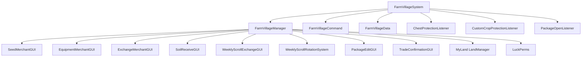
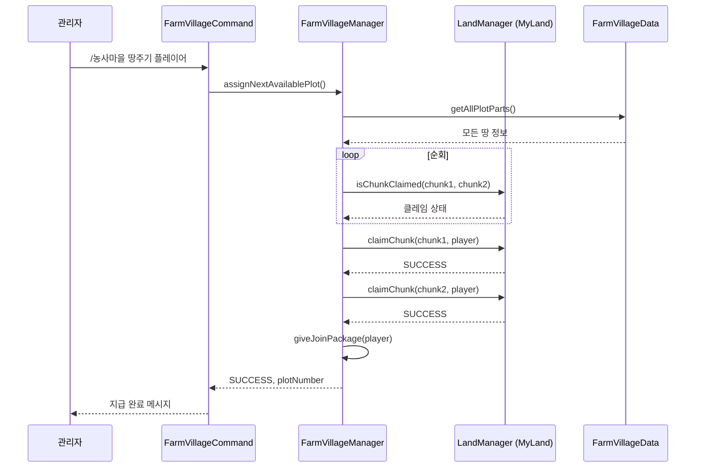

# 🌾 FarmVillage (농사마을) 시스템

## 📋 개요

FarmVillage는 관리자가 운영하는 **특수 농업 구역 시스템**입니다. 관리자가 지정한 청크 기반 농사마을에서 플레이어들이 농사를 짓고, 상인과 거래하며, 주차별 스크롤 교환 등 다양한 경제 활동을 할 수 있습니다.

### 🎯 주요 특징

| 특징 | 설명 |
|------|------|
| 🏘️ 관리자 중심 | 마을 생성/삭제/할당은 관리자만 가능 |
| 📦 청크 기반 | 각 땅은 2개의 청크로 구성 |
| 🛡️ MyLand 연동 | 기본 토지 보호 시스템 위에 구축 |
| 🏪 NPC 상인 | 씨앗/장비/교환/토양 상인 시스템 |
| 📜 주차별 스크롤 | 매주 로테이션되는 시즌별 스크롤 교환 |
| 🎁 입주 패키지 | 땅 지급 시 자동 패키지 지급 |

---

## 🏗️ 아키텍처



---

## 📁 핵심 컴포넌트

### 시스템 진입점

| 파일 | 역할 |
|------|------|
| [`FarmVillageSystem.kt`](./FarmVillageSystem.kt:1) | 시스템 초기화 및 라이프사이클 관리 |
| [`FarmVillageManager.kt`](./FarmVillageManager.kt:1) | 핵심 비즈니스 로직 (땅 관리, 상인, 스크롤) |
| [`FarmVillageCommand.kt`](./FarmVillageCommand.kt:1) | `/농사마을` 명령어 처리 |
| [`FarmVillageData.kt`](./FarmVillageData.kt:1) | 데이터베이스 접근 계층 |
| [`FarmVillagePermissions.kt`](./FarmVillagePermissions.kt:1) | 권한 상수 정의 |

### 보호 리스너

| 파일 | 역할 |
|------|------|
| [`ChestProtectionListener.kt`](./ChestProtectionListener.kt:1) | 농사마을 내 보관함 보호 (소유자만 접근 가능) |
| [`CustomCropProtectionListener.kt`](./CustomCropProtectionListener.kt:1) | CustomCrops 작물 보호 (소유자만 수확 가능) |
| [`PackageOpenListener.kt`](./PackageOpenListener.kt:1) | 입주 패키지 우클릭 시 내용물 지급 |

### 상인 GUI 시스템

| 파일 | 역할 |
|------|------|
| [`SeedMerchantGUI.kt`](./SeedMerchantGUI.kt:1) | 씨앗 구매/판매 GUI |
| [`EquipmentMerchantGUI.kt`](./EquipmentMerchantGUI.kt:1) | 농사 장비 구매 GUI |
| [`ExchangeMerchantGUI.kt`](./ExchangeMerchantGUI.kt:1) | 아이템 교환 GUI |
| [`SoilReceiveGUI.kt`](./SoilReceiveGUI.kt:1) | 토양 수령 GUI |
| [`TradeConfirmationGUI.kt`](./TradeConfirmationGUI.kt:1) | 거래 확인 GUI |
| [`PackageEditGUI.kt`](./PackageEditGUI.kt:1) | 입주 패키지 편집 GUI (관리자용) |

### 주차별 스크롤 시스템

| 파일 | 역할 |
|------|------|
| [`WeeklyScrollRotationSystem.kt`](./WeeklyScrollRotationSystem.kt:1) | ISO 8601 기반 주차 계산 및 로테이션 관리 |
| [`WeeklyScrollExchangeGUI.kt`](./WeeklyScrollExchangeGUI.kt:1) | 주차별 스크롤 교환 GUI |
| [`WeeklyScrollCommand.kt`](./WeeklyScrollCommand.kt:1) | (비활성화 - `/농사마을 시스템 주차스크롤`로 통합) |

### 기타 리스너

| 파일 | 역할 |
|------|------|
| [`NPCMerchantListener.kt`](./NPCMerchantListener.kt:1) | NPC 클릭 시 상인 GUI 연결 (VillageMerchant로 이전) |
| [`FarmItemRestrictionListener.kt`](./FarmItemRestrictionListener.kt:1) | (비활성화 - 농사 아이템 지역 제한 해제) |

---

## 🔐 권한 시스템

```kotlin
// FarmVillagePermissions.kt
object FarmVillagePermissions {
    const val ADMIN_ASSIGN = "farmvillage.admin.assign"
    const val ADMIN_CONFISCATE = "farmvillage.admin.confiscate"
    const val ADMIN_GRANT = "farmvillage.admin.grant"
    const val SHOP_USE = "farmvillage.shop.use"
}
```

| 권한 | 설명 | 기본값 |
|------|------|--------|
| `farmvillage.admin` | 모든 관리 명령어 | OP |
| `farmvillage.admin.assign` | 땅 지급 권한 | OP |
| `farmvillage.admin.confiscate` | 땅 회수 권한 | OP |
| `farmvillage.admin.grant` | 상점 권한 부여 | OP |
| `farmvillage.shop.use` | 상점 이용 권한 | 부여 필요 |
| `farmvillage.admin.bypassharvest` | 타인 작물 수확 가능 | OP |
| `lukevanilla.admin.weeklyscroll` | 주차 스크롤 관리 | OP |

---

## 💬 명령어

### `/농사마을` (farmvillage.admin)

#### 일반 관리

| 명령어 | 설명 |
|--------|------|
| `/농사마을 땅주기 <플레이어>` | 순차적으로 빈 땅 자동 지급 + 입주 패키지 |
| `/농사마을 땅뺏기 <땅번호>` | 특정 땅 번호의 모든 클레임 회수 |
| `/농사마을 상점이용권한지급 <플레이어>` | LuckPerms로 상점 이용 권한 부여 |

#### 시스템 설정 (`/농사마을 시스템`)

| 명령어 | 설명 |
|--------|------|
| `/농사마을 시스템 땅설정 <땅번호> <청크번호>` | 현재 위치를 땅으로 지정 |
| `/농사마을 시스템 땅주기 <닉네임> <땅번호>` | 특정 땅 번호를 특정 플레이어에게 지급 |
| `/농사마을 시스템 땅뺏기 <닉네임> <땅번호>` | 특정 플레이어의 특정 땅 회수 |
| `/농사마을 시스템 입주패키지수정` | 입주 패키지 내용 편집 GUI |
| `/농사마을 시스템 씨앗상인지정` | 바라보는 NPC를 씨앗 상인으로 지정 |
| `/농사마을 시스템 교환상인지정` | 바라보는 NPC를 교환 상인으로 지정 |
| `/농사마을 시스템 장비상인지정` | 바라보는 NPC를 장비 상인으로 지정 |
| `/농사마을 시스템 토양받기상인지정` | 바라보는 NPC를 토양받기 상인으로 지정 |
| `/농사마을 시스템 농사마을구역지정 <시작\|취소>` | 농사마을 허용 구역 설정 |

#### 주차별 스크롤 관리 (`/농사마을 시스템 주차스크롤`)

| 명령어 | 설명 |
|--------|------|
| `상태` | 현재 주차 및 시즌 정보 확인 |
| `다음주` | 강제로 다음 주차로 변경 |
| `이전주` | 강제로 이전 주차로 변경 |
| `설정 <주차>` | 특정 주차로 강제 설정 (예: 2025-W30) |
| `해제` | 강제 설정 해제, 자동 계산 복귀 |
| `gui` | 스크롤 교환 GUI 테스트 |

---

## 🗃️ 데이터베이스 구조

### farmvillage_plots
```sql
CREATE TABLE farmvillage_plots (
    plot_number INT NOT NULL,          -- 땅 번호
    plot_part INT NOT NULL,            -- 청크 번호 (1 또는 2)
    world VARCHAR(255) NOT NULL,       -- 월드 이름
    chunk_x INT NOT NULL,              -- 청크 X 좌표
    chunk_z INT NOT NULL,              -- 청크 Z 좌표
    PRIMARY KEY (plot_number, plot_part)
);
```

### farmvillage_npc_merchants
```sql
CREATE TABLE farmvillage_npc_merchants (
    shop_id VARCHAR(255) NOT NULL PRIMARY KEY,  -- 상점 ID
    npc_id INT NOT NULL                         -- Citizens NPC ID
);
```

### farmvillage_package_items
```sql
CREATE TABLE farmvillage_package_items (
    slot INT NOT NULL PRIMARY KEY,         -- 슬롯 번호
    item_type VARCHAR(255) NOT NULL,       -- NEXO 또는 VANILLA
    item_identifier VARCHAR(255) NOT NULL, -- 아이템 ID
    item_data TEXT                         -- JSON 직렬화 데이터
);
```

### farmvillage_seed_trades
```sql
CREATE TABLE farmvillage_seed_trades (
    player_uuid VARCHAR(36) NOT NULL,
    seed_id VARCHAR(255) NOT NULL,
    traded_amount INT NOT NULL DEFAULT 0,
    trade_date DATE NOT NULL,              -- KST 기준
    PRIMARY KEY (player_uuid, seed_id)
);
```

### farmvillage_purchase_history
```sql
CREATE TABLE farmvillage_purchase_history (
    player_uuid VARCHAR(36) NOT NULL,
    item_id VARCHAR(100) NOT NULL,
    purchase_date DATE NOT NULL,
    purchase_count INT NOT NULL DEFAULT 1,
    INDEX idx_player_date (player_uuid, purchase_date)
);
```

### farmvillage_weekly_scroll_purchases
```sql
CREATE TABLE farmvillage_weekly_scroll_purchases (
    player_uuid VARCHAR(36) NOT NULL,
    purchase_week VARCHAR(10) NOT NULL,    -- YYYY-WXX 형식
    scroll_id VARCHAR(100) NOT NULL,
    season_name VARCHAR(50) NOT NULL,
    purchase_date DATE NOT NULL,
    purchase_timestamp TIMESTAMP DEFAULT CURRENT_TIMESTAMP,
    PRIMARY KEY (player_uuid, purchase_week)
);
```

### farmvillage_weekly_scroll_config
```sql
CREATE TABLE farmvillage_weekly_scroll_config (
    id INT PRIMARY KEY DEFAULT 1,
    current_week_override VARCHAR(10) NULL,  -- 강제 설정된 주차
    override_enabled BOOLEAN DEFAULT FALSE,
    last_updated TIMESTAMP DEFAULT CURRENT_TIMESTAMP ON UPDATE CURRENT_TIMESTAMP
);
```

---

## 📜 주차별 스크롤 로테이션 시스템

### 로테이션 순서

| 인덱스 | 시즌 | 색상 | 스크롤 수 |
|--------|------|------|-----------|
| 0 | 🎃 할로윈 | ORANGE | 11개 |
| 1 | 🎄 크리스마스 | GREEN | 15개 |
| 2 | 💝 발렌타인 | PINK | 15개 |

### 로테이션 규칙
- **ISO 8601 표준** 주차 시스템 사용
- **KST (Asia/Seoul)** 기준으로 주차 계산
- **매주 월요일** 자동 로테이션
- `주차 번호 % 3`으로 현재 시즌 결정

### 스크롤 ID 목록

```kotlin
// 할로윈 (h_*_scroll)
"h_sword_scroll", "h_pickaxe_scroll", "h_axe_scroll", "h_shovel_scroll", 
"h_hoe_scroll", "h_bow_scroll", "h_rod_scroll", "h_hammer_scroll", 
"h_hat_scroll", "h_scythe_scroll", "h_spear_scroll"

// 크리스마스 (c_*_scroll)
"c_sword_scroll", "c_pickaxe_scroll", "c_axe_scroll", "c_shovel_scroll",
"c_hoe_scroll", "c_bow_scroll", "c_crossbow_scroll", "c_fishing_rod_scroll",
"c_hammer_scroll", "c_shield_scroll", "c_head_scroll", "c_helmet_scroll",
"c_chestplate_scroll", "c_leggings_scroll", "c_boots_scroll"

// 발렌타인 (v_*_scroll)
"v_sword_scroll", "v_pickaxe_scroll", "v_axe_scroll", "v_shovel_scroll",
"v_hoe_scroll", "v_bow_scroll", "v_crossbow_scroll", "v_fishing_rod_scroll",
"v_hammer_scroll", "v_helmet_scroll", "v_chestplate_scroll", "v_leggings_scroll",
"v_boots_scroll", "v_head_scroll", "v_shield_scroll"
```

---

## 🏘️ 땅 관리 시스템

### 땅 구조
- 각 **땅 번호**는 **2개의 청크**로 구성
- 청크는 **plot_part** 1, 2로 구분
- 순차적으로 빈 땅을 찾아 자동 지급

### 땅 지급 흐름



### 땅 회수 흐름
- 땅 번호로 회수: 해당 번호의 모든 청크 언클레임
- 플레이어 지정 회수: 특정 플레이어 소유의 해당 땅만 회수
- 롤백 지원: 첫 청크 클레임 성공 후 두 번째 실패 시 자동 롤백

---

## 🛡️ 보호 시스템

### 보관함 보호 ([`ChestProtectionListener.kt`](./ChestProtectionListener.kt:13))
- 농사마을 부지 내 Container 블록 보호
- 소유자만 상자, 통, 용광로 등 접근 가능
- 소유자가 없는 땅은 보호 없음

### 작물 보호 ([`CustomCropProtectionListener.kt`](./CustomCropProtectionListener.kt:15))
- CustomCrops 플러그인 연동
- `CropBreakEvent` 가로채기
- 소유자 또는 `farmvillage.admin.bypassharvest` 권한자만 수확 가능

---

## 🏪 상인 시스템

### NPC 상인 유형

| 상인 ID | 기능 |
|---------|------|
| `seed_merchant` | 씨앗 구매/판매 |
| `exchange_merchant` | 아이템 교환 |
| `equipment_merchant` | 농사 장비 구매 |
| `soil_receive_merchant` | 토양 수령 |

### GUI 특징
- **페이지네이션** 지원 (8개 아이템/페이지)
- **좌클릭**: 구매 (Shift: 64개)
- **우클릭**: 판매 (Shift: 64개)
- **Nexo/바닐라** 아이템 모두 지원
- **경제 시스템** 연동 (EconomyManager)

### 거래 제한
- **일일 거래량 제한**: 씨앗별 64개/일 (KST 기준 리셋)
- **평생 구매량 제한**: 장비별 설정 가능

---

## 🎁 입주 패키지 시스템

### 구성
1. **farmvillage_storage_chest** (Nexo 아이템) 지급
2. 우클릭 시 DB에 저장된 패키지 내용물 지급
3. 인벤토리 가득 차면 땅에 드롭

### 패키지 편집
- `/농사마을 시스템 입주패키지수정` 명령어
- GUI에서 아이템 배치
- Nexo/바닐라 아이템 모두 지원
- JSON 직렬화로 인챈트, 로어 등 보존

---

## 📍 구역 지정 시스템

### 구역 선택 도구
- **황금 도끼** 아이템 지급
- **좌클릭**: 첫 번째 모서리
- **우클릭**: 두 번째 모서리
- 설정 완료 시 자동 회수

### config.yml 설정
```yaml
myland:
  use-area-restriction: true
  area:
    world: "world"
    x1: 100
    z1: 100
    x2: 500
    z2: 500
```

---

## 🔗 의존성

### 필수 의존성
- **MyLand (PrivateLandSystem)**: 기본 토지 클레이밍
- **Database**: MySQL/MariaDB 연결
- **DebugManager**: 로깅 시스템

### 선택적 의존성
- **LuckPerms**: 권한 관리 (권장)
- **Citizens**: NPC 상인 연동
- **Nexo**: 커스텀 아이템 지원
- **CustomCrops**: 작물 보호 연동
- **EconomyManager**: 상점 거래

---

## ⚡ 성능 최적화

### 청크 캐시 시스템
```kotlin
// O(N) -> O(1) 최적화
private val farmPlotChunkCache = ConcurrentHashMap<Pair<Int, Int>, PlotPartInfo>()
```
- 서버 시작 시 모든 농사마을 청크 캐시 로드
- `isLocationWithinAnyClaimedFarmPlot()` O(1) 조회
- 땅 추가/삭제 시 `reloadFarmPlotCache()` 호출

### 비동기 처리
- 상인 GUI 아이템 로드: 비동기
- 거래 처리: 비동기 데이터 조회 → 동기 실행
- 권한 부여: LuckPerms CompletableFuture

---

## 🐛 문제 해결

### 땅 지급 실패
1. 설정된 땅이 있는지 확인 (`/농사마을 시스템 땅설정`)
2. 빈 땅이 있는지 확인
3. MyLand 시스템 활성화 여부

### 상인 GUI 안 열림
1. NPC가 Citizens NPC인지 확인
2. 상인 지정 여부 확인 (DB `farmvillage_npc_merchants`)
3. VillageMerchantData 초기화 여부

### 권한 부여 안 됨
1. LuckPerms 활성화 여부
2. 관리자의 `farmvillage.admin.grant` 권한
3. 서버 로그에서 오류 확인

### 주차 스크롤 시즌 이상
1. `/농사마을 시스템 주차스크롤 상태`로 현재 상태 확인
2. 강제 설정 모드인지 확인
3. 서버 시간(KST) 확인

---

## 📚 관련 문서

- [LandSystems 통합 가이드](../../../../Docs/Develop_Docs/LandSystems/System_Integration_Guide.md)
- [FarmVillage 관리자 가이드](../../../../Docs/Develop_Docs/LandSystems/FarmVillage/Admin_Guide.md)
- [MyLand 시스템](../MyLand/README.md)