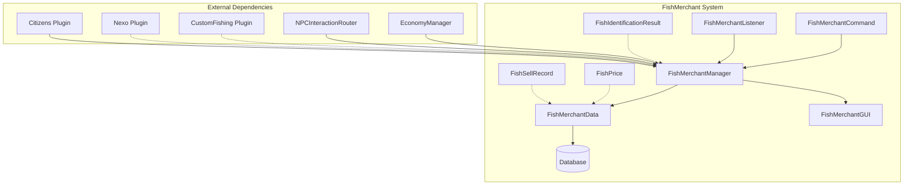
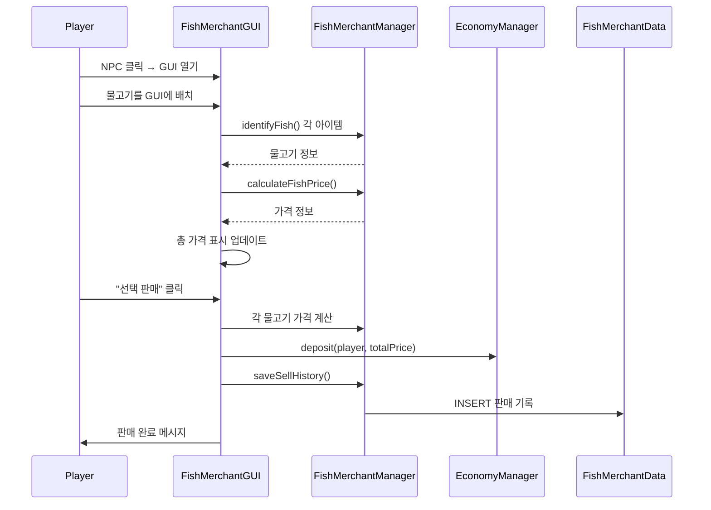
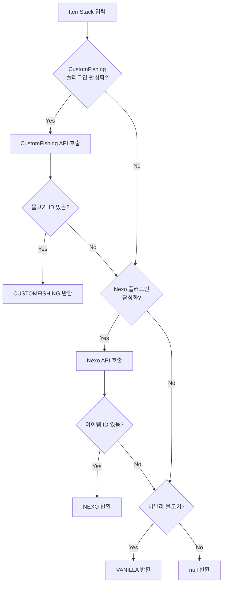

# 🐟 낚시 상인 (FishMerchant) 시스템

## 📋 개요

낚시 상인 시스템은 플레이어가 낚은 **물고기를 NPC 상인에게 판매**할 수 있는 시스템입니다. 바닐라 물고기뿐만 아니라 CustomFishing, Nexo 플러그인의 커스텀 물고기도 지원하며, 물고기 크기에 따른 가격 책정이 가능합니다.

---

## 🏗️ 시스템 구조



---

## 📁 핵심 컴포넌트

| 파일 | 역할 |
|------|------|
| [`FishMerchantManager.kt`](./FishMerchantManager.kt) | 🎯 시스템 핵심 관리자, 물고기 식별/판매/가격 설정 |
| [`FishMerchantGUI.kt`](./FishMerchantGUI.kt) | 🖼️ 낚시 상인 GUI (선택 판매, 전체 판매) |
| [`FishMerchantCommand.kt`](./FishMerchantCommand.kt) | 🎮 `/낚시상인` 명령어 처리 |
| [`FishMerchantData.kt`](./FishMerchantData.kt) | 💾 데이터베이스 CRUD, 가격 정보 관리 |
| [`FishMerchantListener.kt`](./FishMerchantListener.kt) | 👂 이벤트 리스너 (레거시) |

---

## 🎮 명령어

### `/낚시상인`

| 명령어 | 설명 | 권한 |
|--------|------|------|
| `/낚시상인 설정 [NPC아이디]` | NPC를 낚시 상인으로 설정 | `lukevanilla.fishmerchant` |
| `/낚시상인 제거` | 낚시 상인 설정 제거 | `lukevanilla.fishmerchant` |
| `/낚시상인 가격설정 <제공자> <물고기ID> <기본가격> [cm당가격]` | 물고기 가격 설정 | `lukevanilla.fishmerchant` |
| `/낚시상인 가격목록` | 모든 물고기 가격 조회 | `lukevanilla.fishmerchant` |
| `/낚시상인 정보` | 낚시 상인 정보 조회 | `lukevanilla.fishmerchant` |

#### 가격 설정 예시
```
/낚시상인 가격설정 VANILLA COD 10.0
  → 바닐라 대구 기본 10원

/낚시상인 가격설정 CUSTOMFISHING tuna 100.0 2.0
  → 참치 기본 100원 + cm당 2원 (150cm = 100 + 150×2 = 400원)

/낚시상인 가격설정 NEXO custom_fish 500.0
  → Nexo 커스텀 물고기 500원
```

---

## 💾 데이터 저장

### 테이블 구조

#### `fish_merchant_npc` - 낚시 상인 NPC

| 컬럼 | 타입 | 설명 |
|------|------|------|
| `npc_id` | INT | NPC ID (단일 레코드) |

> 💡 낚시 상인은 서버에 **1개만** 존재할 수 있습니다.

#### `fish_prices` - 물고기 가격

| 컬럼 | 타입 | 설명 |
|------|------|------|
| `item_provider` | VARCHAR | 제공자 (VANILLA/CUSTOMFISHING/NEXO) |
| `fish_type` | VARCHAR | 물고기 ID |
| `base_price` | DOUBLE | 기본 가격 |
| `price_per_cm` | DOUBLE | cm당 추가 가격 |

#### `fish_sell_history` - 판매 기록

| 컬럼 | 타입 | 설명 |
|------|------|------|
| `player_uuid` | VARCHAR(36) | 판매자 UUID |
| `player_name` | VARCHAR | 판매자 이름 |
| `items_sold` | TEXT | 판매 아이템 (JSON) |
| `total_amount` | DOUBLE | 총 판매 금액 |

---

## 🐠 물고기 제공자 (Provider)

| 제공자 | 설명 | 크기 지원 |
|--------|------|----------|
| `VANILLA` | 마인크래프트 기본 물고기 (COD, SALMON, TROPICAL_FISH, PUFFERFISH) | ❌ |
| `CUSTOMFISHING` | CustomFishing 플러그인 물고기 | ✅ |
| `NEXO` | Nexo 플러그인 커스텀 아이템 | ❌ |

### 물고기 식별 우선순위
1. **CustomFishing** - 리플렉션으로 API 호출
2. **Nexo** - NexoItems API 사용
3. **Vanilla** - Material 타입 확인

---

## 🔗 의존성

### 내부 의존성
- **Database**: 데이터베이스 연결 관리
- **EconomyManager**: 물고기 판매 시 돈 지급
- **NPCInteractionRouter**: NPC 클릭 시 GUI 라우팅

### 외부 의존성 (선택적)
- **Citizens**: NPC 관리 플러그인
- **CustomFishing**: 커스텀 낚시 플러그인
- **Nexo**: 커스텀 아이템 플러그인

---

## ⚙️ 기술적 특징

### 1. 크기 기반 가격 계산
```kotlin
// 가격 = 기본가격 + (크기 × cm당가격)
val price = if (fishInfo.size != null && priceInfo.pricePerCm > 0) {
    priceInfo.basePrice + (fishInfo.size * priceInfo.pricePerCm)
} else {
    priceInfo.basePrice
}
```

### 2. 크기 정보 추출
아이템의 displayName 또는 lore에서 크기 정보를 자동 추출:
```kotlin
// 지원 패턴
"크기: 150.5cm"      // lore
"(150.5cm)"          // displayName
"150.5cm"            // 일반
```

### 3. 리플렉션을 통한 플러그인 연동
```kotlin
// CustomFishing API 리플렉션 호출
val pluginClass = Class.forName("net.momirealms.customfishing.api.BukkitCustomFishingPlugin")
val getInstanceMethod = pluginClass.getMethod("getInstance")
// ...
```

### 4. NPC 자동 감지
```kotlin
// 플레이어 시선 방향 5블록 이내 NPC 감지
private fun getTargetNPC(player: Player): NPC? {
    val maxDistance = 5.0
    // Ray tracing으로 NPC 검색
}
```

---

## 📊 흐름도

### 물고기 판매 흐름 (GUI)


### 물고기 식별 흐름


---

## 🖼️ GUI 구조

```
┌─────────────────────────────────────────────────┐
│  낚시 상인                                       │
├─────────────────────────────────────────────────┤
│                                                 │
│  [물고기 배치 영역 - 45칸]                       │
│                                                 │
│  플레이어가 판매할 물고기를 여기에 배치          │
│                                                 │
├─────────────────────────────────────────────────┤
│ [     ] [📜가격정보] [     ] [🟢선택판매] [     ] [🟡모두판매] [     ] │
└─────────────────────────────────────────────────┘

📜 가격정보: 물고기 수량, 예상 금액 표시
🟢 선택 판매: GUI에 올린 물고기만 판매
🟡 모두 판매: 인벤토리 전체 물고기 판매 (GUI 닫힘)
```

---

## 🔧 API 사용 예시

```kotlin
// FishMerchantManager 인스턴스 획득 (Main.kt에서)
val fishMerchantManager = FishMerchantManager(plugin, database, economyManager, npcRouter)

// 물고기 식별
val fishInfo = fishMerchantManager.identifyFish(itemStack)
// FishIdentificationResult(provider="CUSTOMFISHING", fishId="tuna", displayName="참치", size=150.5)

// 가격 계산
val price = fishMerchantManager.calculateFishPrice(fishInfo)

// 가격 설정
fishMerchantManager.setFishPrice("VANILLA", "COD", 10.0)
fishMerchantManager.setFishPriceWithSize("CUSTOMFISHING", "tuna", 100.0, 2.0)

// 모든 가격 조회
val allPrices = fishMerchantManager.getAllFishPrices()

// NPC 설정
val (success, previousNpcId) = fishMerchantManager.setFishMerchant(npcId)

// GUI 열기
fishMerchantManager.openFishMerchantGUI(player)
```

---

## 📝 데이터 클래스

### FishIdentificationResult
```kotlin
data class FishIdentificationResult(
    val provider: String,     // VANILLA, CUSTOMFISHING, NEXO
    val fishId: String,       // 물고기 ID
    val displayName: String,  // 표시 이름
    val size: Double? = null  // 크기 (cm) - CustomFishing만
)
```

### FishPrice
```kotlin
data class FishPrice(
    val itemProvider: String,  // 제공자
    val fishType: String,      // 물고기 ID
    val basePrice: Double,     // 기본 가격
    val pricePerCm: Double     // cm당 가격
)
```

### FishSellRecord
```kotlin
data class FishSellRecord(
    val playerUuid: UUID,
    val playerName: String,
    val itemsSold: Map<String, Int>,  // "VANILLA:COD" -> 개수
    val totalAmount: Double
)