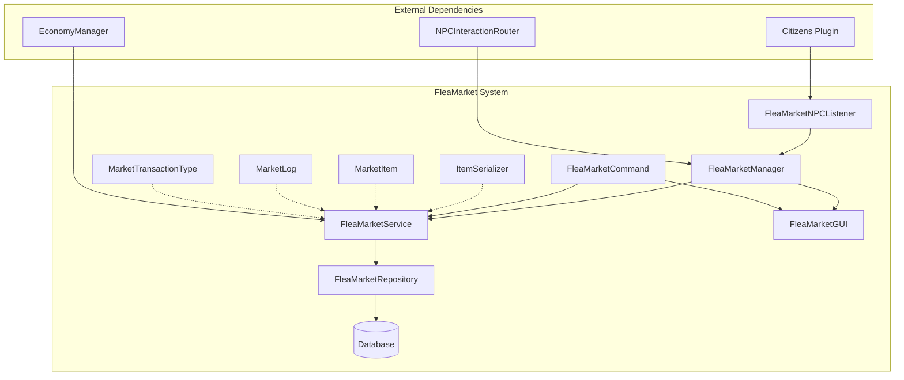
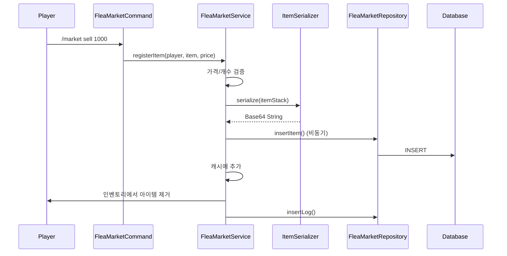
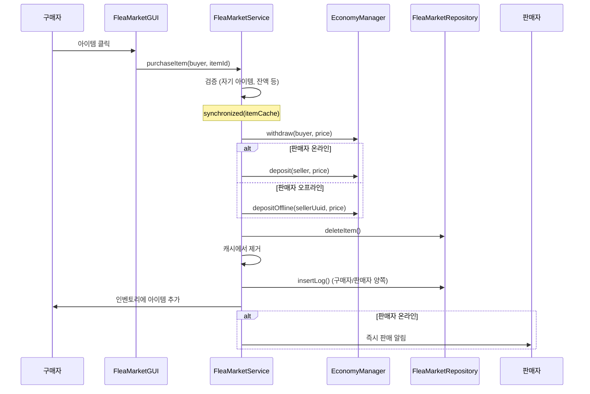
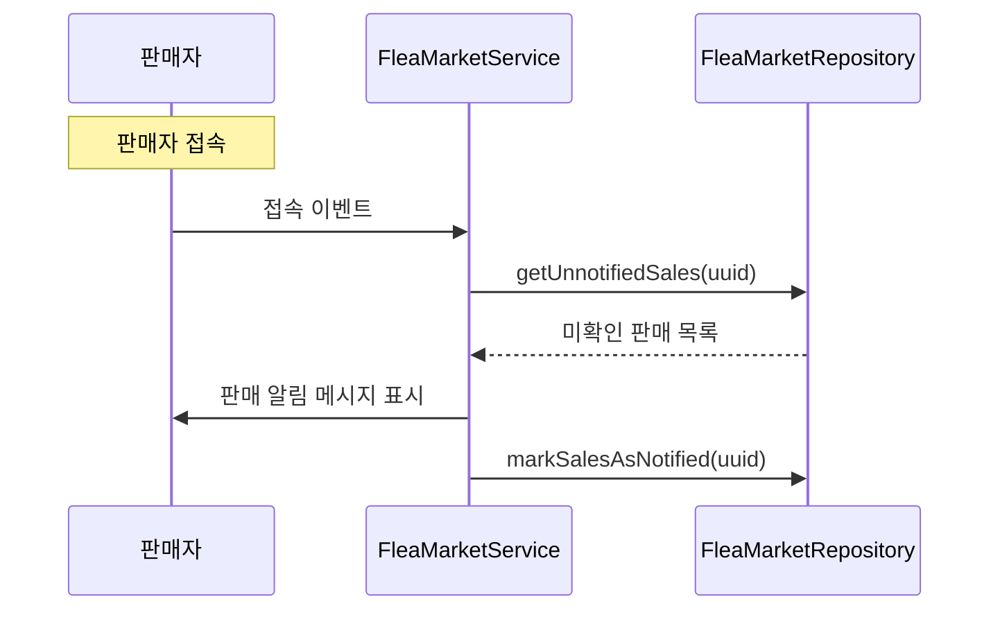

# 🏪 플리마켓 (FleaMarket) 시스템

## 📋 개요

플리마켓 시스템은 플레이어 간 **중고 아이템 거래**를 지원하는 마켓 시스템입니다. 플레이어가 아이템을 등록하면 다른 플레이어가 구매할 수 있으며, NPC를 통해 마켓에 접근합니다. 오프라인 플레이어도 판매 수익을 받을 수 있습니다.

---

## 🏗️ 시스템 구조



---

## 📁 핵심 컴포넌트

| 파일 | 역할 |
|------|------|
| [`FleaMarketManager.kt`](./FleaMarketManager.kt) | 🎯 시스템 진입점, 초기화 및 NPC 라우터 관리 |
| [`FleaMarketService.kt`](./FleaMarketService.kt) | ⚙️ 비즈니스 로직 (등록/구매/회수), 캐시 관리 |
| [`FleaMarketGUI.kt`](./FleaMarketGUI.kt) | 🖼️ 마켓 GUI 인터페이스 |
| [`FleaMarketRepository.kt`](./FleaMarketRepository.kt) | 💾 데이터베이스 CRUD, 테이블 초기화 |
| [`FleaMarketCommand.kt`](./FleaMarketCommand.kt) | 🎮 `/market`, `/플마` 명령어 처리 |
| [`FleaMarketNPCListener.kt`](./FleaMarketNPCListener.kt) | 👂 NPC 상호작용 리스너 (레거시) |
| [`ItemSerializer.kt`](./ItemSerializer.kt) | 🔄 아이템 직렬화/역직렬화 (Base64) |
| [`MarketItem.kt`](./MarketItem.kt) | 📦 등록 아이템 데이터 모델 |
| [`MarketLog.kt`](./MarketLog.kt) | 📝 거래 로그 데이터 모델 |
| [`MarketTransactionType.kt`](./MarketTransactionType.kt) | 📊 거래 유형 열거형 |

---

## 🎮 명령어

### `/market` (별칭: `/플마`)

| 명령어 | 설명 | 권한 |
|--------|------|------|
| `/market` | 마켓 GUI 열기 | `fleamarket.open` 또는 OP |
| `/market sell <가격>` | 손에 든 아이템 등록 | - |
| `/market history` | 전체 거래 내역 조회 | - |
| `/market history <유형>` | 유형별 거래 내역 (sell/buy/withdraw/register) | - |
| `/market npc add [ID]` | NPC를 플리마켓 상인으로 등록 | OP |
| `/market npc remove [ID]` | NPC 등록 해제 | OP |
| `/market help` | 도움말 표시 | - |

> 💡 **참고**: 일반 유저는 명령어로 마켓을 열 수 없고, NPC를 통해서만 접근 가능합니다.

---

## 💾 데이터 저장

### 테이블 구조

#### `flea_market` - 등록된 아이템

| 컬럼 | 타입 | 설명 |
|------|------|------|
| `id` | INT | 아이템 ID (PK, AUTO_INCREMENT) |
| `seller_uuid` | VARCHAR(36) | 판매자 UUID |
| `seller_name` | VARCHAR(16) | 판매자 이름 |
| `item_data` | TEXT | 아이템 직렬화 데이터 (Base64) |
| `price` | DOUBLE | 판매 가격 |
| `registered_at` | BIGINT | 등록 시간 |

#### `market_logs` - 거래 기록

| 컬럼 | 타입 | 설명 |
|------|------|------|
| `id` | INT | 로그 ID (PK, AUTO_INCREMENT) |
| `player_uuid` | VARCHAR(36) | 플레이어 UUID |
| `player_name` | VARCHAR(16) | 플레이어 이름 |
| `transaction_type` | VARCHAR(20) | 거래 유형 |
| `item_name` | VARCHAR(255) | 아이템 이름 |
| `item_data` | TEXT | 아이템 직렬화 데이터 |
| `price` | DOUBLE | 거래 가격 |
| `counterpart_uuid` | VARCHAR(36) | 거래 상대방 UUID |
| `counterpart_name` | VARCHAR(16) | 거래 상대방 이름 |
| `transaction_at` | BIGINT | 거래 시간 |
| `is_notified` | TINYINT(1) | 알림 확인 여부 |

#### `flea_market_npcs` - 등록된 NPC

| 컬럼 | 타입 | 설명 |
|------|------|------|
| `npc_id` | INT | NPC ID (PK) |
| `created_at` | BIGINT | 등록 시간 |

---

## 📝 거래 유형 (MarketTransactionType)

| 유형 | 설명 |
|------|------|
| `REGISTER` | 아이템 등록 |
| `SELL` | 판매 완료 (판매자 입장) |
| `BUY` | 구매 완료 (구매자 입장) |
| `WITHDRAW` | 아이템 회수 |

---

## 🔗 의존성

### 내부 의존성
- **Database**: 데이터베이스 연결 관리
- **EconomyManager**: 거래 시 돈 입출금 처리
- **NPCInteractionRouter**: NPC 클릭 시 GUI 열기 라우팅

### 외부 의존성
- **Citizens**: NPC 관리 플러그인

---

## ⚙️ 기술적 특징

### 1. 설정 상수
```kotlin
companion object {
    const val MAX_ITEMS_PER_PLAYER = 10  // 플레이어당 최대 등록 개수
    const val MIN_PRICE = 1.0            // 최소 가격
    const val MAX_PRICE = 1000000000.0   // 최대 가격 (10억)
}
```

### 2. 메모리 캐싱
```kotlin
// 등록된 아이템 캐시 (ID -> MarketItem)
private val itemCache = ConcurrentHashMap<Int, MarketItem>()

// NPC ID 캐시
private val npcCache = ConcurrentHashMap.newKeySet<Int>()
```

### 3. 동시성 제어
```kotlin
// 구매 시 동시성 문제 방지
synchronized(itemCache) {
    // 구매 처리
}
```

### 4. 오프라인 판매 지원
- 판매자가 오프라인일 때도 구매 가능
- `depositOffline()` 메서드로 오프라인 플레이어에게 돈 지급
- 다음 접속 시 미확인 판매 알림 표시

### 5. 아이템 직렬화
```kotlin
// ItemSerializer를 통한 아이템 직렬화
val itemData = ItemSerializer.serialize(itemStack)  // ItemStack → Base64 String
val itemStack = ItemSerializer.deserialize(itemData) // Base64 String → ItemStack
```

---

## 📊 흐름도

### 아이템 등록 흐름


### 아이템 구매 흐름


### 오프라인 판매 알림 흐름


---

## 🖼️ GUI 구조

```
┌─────────────────────────────────────────────────┐
│  플리마켓 (Flea Market)                          │
├─────────────────────────────────────────────────┤
│ [아이템1] [아이템2] [아이템3] ...                │
│                                                 │
│ (등록된 아이템들이 페이지별로 표시됨)            │
│                                                 │
├─────────────────────────────────────────────────┤
│ [◀ 이전] [내 아이템] [다음 ▶] [내역] [닫기]    │
└─────────────────────────────────────────────────┘
```

- 좌클릭: 아이템 구매
- 자신의 아이템 클릭: 회수 옵션

---

## 🔧 API 사용 예시

```kotlin
// FleaMarketManager 인스턴스 획득
val fleaMarketManager = plugin.fleaMarketManager

// 마켓 GUI 열기
fleaMarketManager.gui.openMarket(player)

// NPC가 마켓 NPC인지 확인
val isMarket = fleaMarketManager.isMarketNPC(npcId)

// NPC 추가/제거
fleaMarketManager.addNPC(npcId)
fleaMarketManager.removeNPC(npcId)

// 서비스 레이어 직접 접근
val service = fleaMarketManager.service
val allItems = service.getAllItems()
val myItems = service.getItemsBySeller(player.uniqueId)