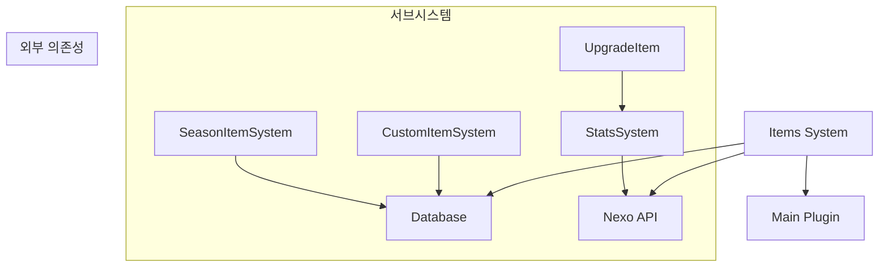
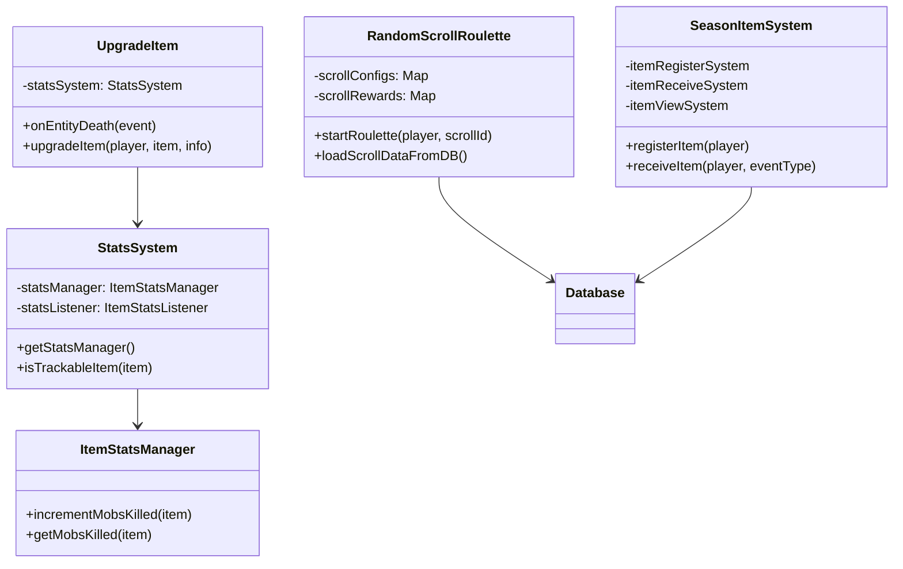

# 🎁 Items 시스템

아이템 관련 기능을 통합 관리하는 시스템입니다. 아이템 업그레이드, 커스텀 아이템, 아이템 통계 등의 서브시스템을 포함합니다.

## 📋 개요

Items 시스템은 마인크래프트 서버에서 다양한 아이템 관련 기능을 제공합니다:
- **아이템 업그레이드**: 킬 카운트에 따른 자동 업그레이드
- **커스텀 아이템**: 스크롤, 경험치 막대기, 투명 액자 등 특수 아이템
- **아이템 통계**: 아이템별 킬 카운트 추적
- **시즌 아이템**: 할로윈, 크리스마스 등 이벤트 아이템 관리

## 🗂️ 디렉토리 구조

```
Items/
├── DurabilityListener.kt      # 내구도 경고 시스템
├── ItemCommand.kt             # 아이템 명령어 (/item)
├── UpgradeItem.kt             # 아이템 자동 업그레이드
├── CustomItemSystem/          # 커스텀 아이템 서브시스템
│   ├── EnchantmentLimitListener.kt
│   ├── LevelStick.kt
│   ├── OraxenItem_Placecancel.kt
│   ├── RandomScrollRoulette.kt
│   ├── Scroll.kt
│   ├── TransparentFrame.kt
│   └── ValentineShieldCommand.kt
├── ItemSeasonSystem/          # 시즌 아이템 서브시스템
│   ├── ItemCommand.kt
│   ├── ItemReceiveSystem.kt
│   ├── ItemRegisterSystem.kt
│   ├── ItemScrollTransformSystem.kt
│   ├── ItemViewSystem.kt
│   └── SeasonItemSystem.kt
└── StatsSystem/               # 아이템 통계 서브시스템
    ├── ItemStatsCommand.kt
    ├── ItemStatsListener.kt
    ├── ItemStatsManager.kt
    └── StatsSystem.kt
```

## 🔧 핵심 컴포넌트

### 루트 레벨

#### [`UpgradeItem.kt`](./UpgradeItem.kt)
킬 카운트 기반 아이템 자동 업그레이드 시스템
- 특정 킬 수 달성 시 아이템을 상위 아이템으로 업그레이드
- 크리스마스 검 → 대검 (5,000킬)
- 발렌타인 검 → 대검 (15,000킬)
- 폭죽 검 → 대검 (5,000킬)
- 할로윈 검 → 대검 (10,000킬)

#### [`ItemCommand.kt`](./ItemCommand.kt)
아이템 메타데이터 조작 명령어
- 아이템 이름 설정, 설명 추가/제거 등

#### [`DurabilityListener.kt`](./DurabilityListener.kt)
아이템 내구도 경고 시스템
- 10%, 5%, 2% 이하 시 경고 메시지 및 사운드

### CustomItemSystem

#### [`Scroll.kt`](./CustomItemSystem/Scroll.kt)
아이템 수리 스크롤
- Nexo 아이템 `scroll`로 아이템 내구도 완전 회복

#### [`LevelStick.kt`](./CustomItemSystem/LevelStick.kt)
경험치 막대기
- 플레이어의 경험치를 경험치 병으로 변환

#### [`RandomScrollRoulette.kt`](./CustomItemSystem/RandomScrollRoulette.kt)
랜덤 스크롤 룰렛 시스템
- DB 기반 보상 테이블
- GUI 룰렛 애니메이션
- 확률 및 히스토리 조회

#### [`TransparentFrame.kt`](./CustomItemSystem/TransparentFrame.kt)
투명 아이템 액자
- 아이템을 넣으면 액자가 투명해지는 특수 액자

#### [`EnchantmentLimitListener.kt`](./CustomItemSystem/EnchantmentLimitListener.kt)
인챈트 레벨 제한
- 인챈트 레벨 10 초과 아이템 사용 제한

### ItemSeasonSystem

#### [`SeasonItemSystem.kt`](./ItemSeasonSystem/SeasonItemSystem.kt)
시즌 아이템 통합 관리
- 할로윈, 크리스마스, 발렌타인 등 이벤트 아이템
- 시즌 아이템 설치 제한

#### [`ItemRegisterSystem.kt`](./ItemSeasonSystem/ItemRegisterSystem.kt)
시즌 아이템 등록 시스템

#### [`ItemReceiveSystem.kt`](./ItemSeasonSystem/ItemReceiveSystem.kt)
시즌 아이템 수령 시스템

#### [`ItemViewSystem.kt`](./ItemSeasonSystem/ItemViewSystem.kt)
시즌 아이템 조회 시스템

### StatsSystem

#### [`StatsSystem.kt`](./StatsSystem/StatsSystem.kt)
아이템 통계 시스템 메인 클래스
- 킬 카운트 추적 (몹, 플레이어)
- 모루 수리 시 통계 유지
- Nexo 아이템 지원

#### [`ItemStatsManager.kt`](./StatsSystem/ItemStatsManager.kt)
통계 데이터 관리
- NBT 데이터를 통한 통계 저장

#### [`ItemStatsListener.kt`](./StatsSystem/ItemStatsListener.kt)
이벤트 기반 통계 업데이트

#### [`ItemStatsCommand.kt`](./StatsSystem/ItemStatsCommand.kt)
아이템 통계 조회 명령어

## 📝 명령어

| 명령어 | 설명 | 권한 |
|--------|------|------|
| `/item setname <이름>` | 아이템 이름 설정 | 없음 |
| `/item adddesc <설명>` | 아이템 설명 추가 | 없음 |
| `/item removedesc <줄>` | 아이템 설명 제거 | 없음 |
| `/item cleardesc` | 아이템 설명 초기화 | 없음 |
| `/item info` | 아이템 정보 조회 | 없음 |
| `/자동성장켜기` | 자동 업그레이드 활성화 | 없음 |
| `/자동성장끄기` | 자동 업그레이드 비활성화 | 없음 |
| `/아이템정보` | 아이템 킬 통계 조회 | 없음 |
| `/랜덤스크롤 확률 <ID>` | 스크롤 확률표 조회 | 없음 |
| `/랜덤스크롤 내기록 [ID]` | 플레이 기록 조회 | 없음 |
| `/랜덤스크롤 리로드` | 데이터 리로드 | `lukevanilla.randomscroll.reload` |

## 🔗 의존성


<details>
<summary>📊 다이어그램 소스 코드 (AI 참조용)</summary>



</details>

## 🏗️ 시스템 아키텍처


<details>
<summary>📊 다이어그램 소스 코드 (AI 참조용)</summary>



</details>

## 📊 데이터 흐름

### 아이템 업그레이드 흐름
```
1. 몬스터 처치 → EntityDeathEvent
2. UpgradeItem.onEntityDeath() 호출
3. StatsSystem을 통해 킬 카운트 증가
4. 목표 킬 수 달성 시 업그레이드 실행
5. NBT 데이터 복사 및 아이템 교체
```

### 랜덤 스크롤 흐름
```
1. 스크롤 아이템 우클릭
2. RandomScrollRoulette.startRoulette() 호출
3. GUI 생성 및 룰렛 애니메이션 시작
4. 확률 기반 보상 선택
5. 히스토리 DB 저장 및 보상 지급
```

## ⚙️ 설정

### 업그레이드 아이템 추가
[`UpgradeItem.kt`](./UpgradeItem.kt:53)의 `upgradeMap`에 새 아이템 추가:
```kotlin
"new_sword" to UpgradeInfo(
    "new_sword", 
    "new_greatsword", 
    10000,
    "§a새 검이 대검으로 바뀌었어요!"
)
```

### 랜덤 스크롤 보상 테이블
DB 테이블 `random_scroll_config`, `random_scroll_rewards` 사용