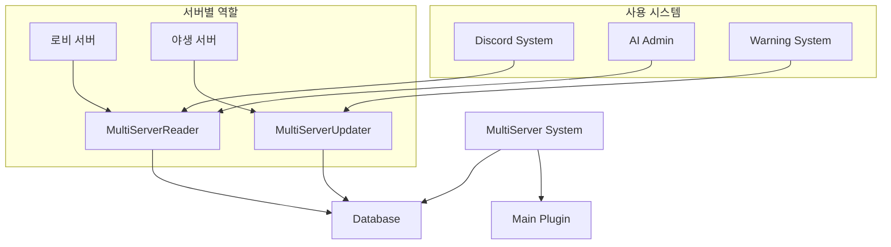
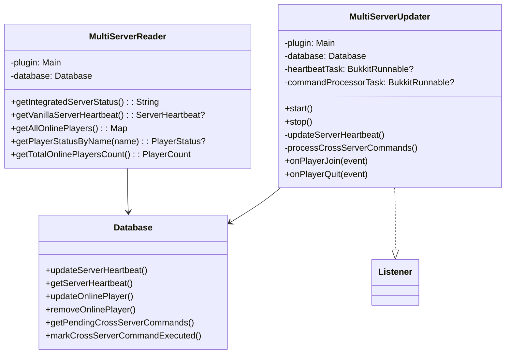
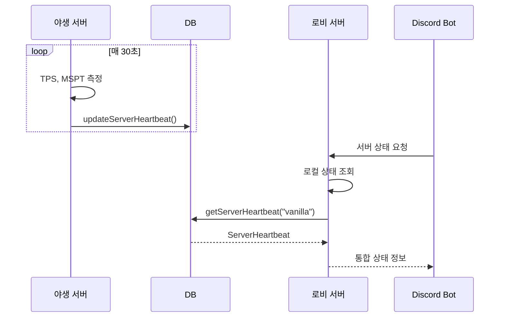
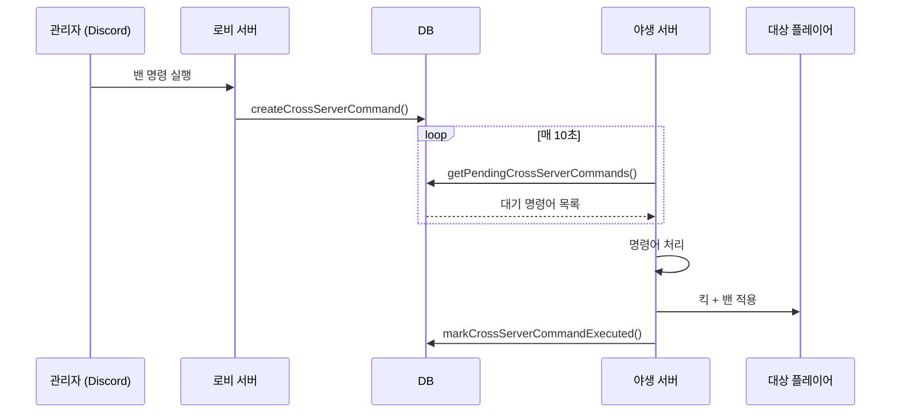
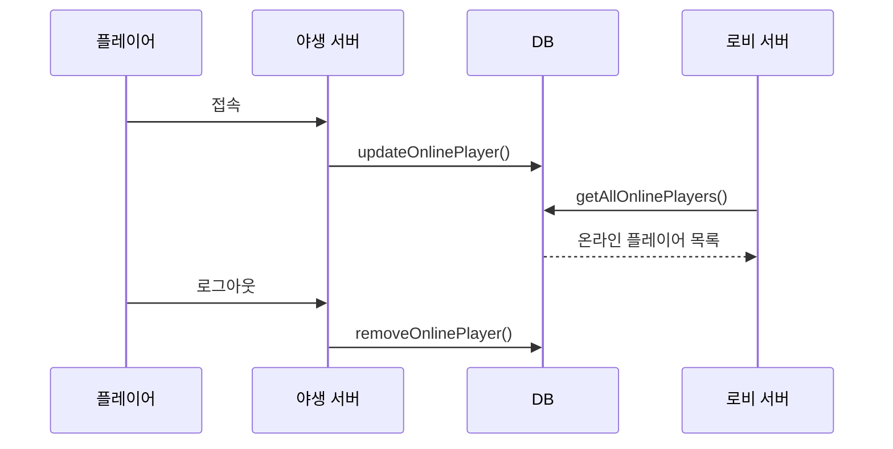

# 🌐 MultiServer 시스템

멀티서버 환경에서 서버 간 동기화를 관리하는 시스템입니다.

## 📋 개요

MultiServer 시스템은 로비 서버와 야생 서버 간의 실시간 정보 동기화를 담당합니다. DB 기반으로 서버 상태, 온라인 플레이어 목록, 교차 서버 명령어를 관리합니다.

## 🗂️ 파일 구조

```
MultiServer/
├── MultiServerReader.kt     # 서버 정보 조회 (로비 서버용)
└── MultiServerUpdater.kt    # 서버 정보 업데이트 (야생 서버용)
```

## 🔧 핵심 컴포넌트

### [`MultiServerReader.kt`](./MultiServerReader.kt)

로비 서버에서 멀티서버 정보를 조회하는 시스템입니다.

#### 주요 기능
- **통합 서버 상태 조회**: 로비 + 야생 서버 상태 통합 표시
- **온라인 플레이어 조회**: 전체 서버의 온라인 플레이어 목록
- **플레이어 위치 추적**: 특정 플레이어가 어느 서버에 있는지 확인

#### 주요 메서드

| 메서드 | 설명 |
|--------|------|
| `getIntegratedServerStatus()` | 통합 서버 상태 문자열 반환 |
| `getVanillaServerHeartbeat()` | 야생 서버 상세 상태 조회 |
| `getOnlinePlayersFromServer(serverName)` | 특정 서버의 온라인 플레이어 목록 |
| `getAllOnlinePlayers()` | 전체 서버의 온라인 플레이어 맵 |
| `getPlayerCurrentServer(uuid)` | 플레이어의 현재 서버 조회 |
| `isPlayerOnlineAnywhere(uuid)` | 플레이어 온라인 여부 확인 |
| `getPlayerStatusByName(name)` | 플레이어 이름으로 상태 조회 |
| `getTotalOnlinePlayersCount()` | 총 온라인 플레이어 수 |
| `getServerStatusSummary()` | 서버 상태 요약 정보 |

#### 데이터 클래스

```kotlin
data class PlayerStatus(
    val playerName: String,
    val playerUuid: String,
    val isOnline: Boolean,
    val currentServer: String?,
    val locationInfo: LocationInfo?
)

data class LocationInfo(
    val world: String,
    val x: Double,
    val y: Double,
    val z: Double
)

data class PlayerCount(
    val lobby: Int,
    val vanilla: Int,
    val total: Int
)

data class ServerStatusSummary(
    val lobbyStatus: ServerHeartbeat?,
    val vanillaStatus: ServerHeartbeat?,
    val totalPlayers: PlayerCount
)
```

### [`MultiServerUpdater.kt`](./MultiServerUpdater.kt)

야생 서버에서 실행되는 서버 정보 업데이트 시스템입니다.

#### 주요 기능
- **서버 상태 업데이트**: 30초마다 TPS, MSPT, 플레이어 수 업데이트
- **온라인 플레이어 동기화**: 접속/로그아웃 시 DB 동기화
- **교차 서버 명령어 처리**: 밴, 킥, 언밴, 공지 등

#### 작동 주기
- **Heartbeat 업데이트**: 30초 (600틱)
- **명령어 처리**: 10초 (200틱)

#### 주요 메서드

| 메서드 | 설명 |
|--------|------|
| `start()` | 동기화 시스템 시작 |
| `stop()` | 동기화 시스템 중단 |
| `updateServerHeartbeat()` | 서버 상태 DB 업데이트 |
| `processCrossServerCommands()` | 대기 중인 교차 서버 명령어 처리 |
| `addOnlinePlayer(player)` | 온라인 플레이어 DB 추가 |
| `removeOnlinePlayer(player)` | 온라인 플레이어 DB 제거 |

#### 지원 명령어 타입

| 타입 | 설명 |
|------|------|
| `ban` | 플레이어 밴 |
| `unban` | 플레이어 언밴 |
| `kick` | 플레이어 킥 |
| `warning` | 경고 처리 |
| `broadcast` | 전체 공지 |

## 🔗 의존성


<details>
<summary>📊 다이어그램 소스 코드 (AI 참조용)</summary>



</details>

## 🏗️ 시스템 아키텍처


<details>
<summary>📊 다이어그램 소스 코드 (AI 참조용)</summary>



</details>

## 📊 데이터 흐름

### 서버 상태 동기화 흐름


<details>
<summary>📊 다이어그램 소스 코드 (AI 참조용)</summary>



</details>

### 교차 서버 명령어 처리 흐름


<details>
<summary>📊 다이어그램 소스 코드 (AI 참조용)</summary>



</details>

### 플레이어 동기화 흐름


<details>
<summary>📊 다이어그램 소스 코드 (AI 참조용)</summary>



</details>

## 💡 사용 예시

### 서버 상태 조회 (Discord AI)
```kotlin
// AdminAssistant에서 사용
val serverStatus = multiServerReader.getIntegratedServerStatus()
// 결과: "로비: TPS: 20.00, MSPT: 5.00, Players: 10/100
//        야생: TPS: 19.85, MSPT: 12.50, Players: 45/100"
```

### 플레이어 상태 조회
```kotlin
val playerStatus = multiServerReader.getPlayerStatusByName("PlayerName")
if (playerStatus?.isOnline == true) {
    println("${playerStatus.playerName}는 ${playerStatus.currentServer}에 접속중")
}
```

### 교차 서버 밴 명령
```kotlin
// 로비 서버에서 야생 서버로 밴 명령 전송
database.createCrossServerCommand(
    targetServer = "vanilla",
    targetPlayerUuid = uuid,
    targetPlayerName = name,
    commandType = "ban",
    commandData = """{"reason": "규칙 위반", "duration": "7d"}""",
    issuedBy = "Admin"
)
```

## ⚙️ DB 테이블 구조

### server_heartbeat
```sql
CREATE TABLE server_heartbeat (
    server_name VARCHAR(50) PRIMARY KEY,
    tps DOUBLE,
    mspt DOUBLE,
    online_players INT,
    max_players INT,
    server_status VARCHAR(20),
    last_update BIGINT
);
```

### online_players
```sql
CREATE TABLE online_players (
    server_name VARCHAR(50),
    player_uuid VARCHAR(36),
    player_name VARCHAR(16),
    player_display_name VARCHAR(64),
    location_world VARCHAR(64),
    location_x DOUBLE,
    location_y DOUBLE,
    location_z DOUBLE,
    joined_at TIMESTAMP,
    PRIMARY KEY (server_name, player_uuid)
);
```

### cross_server_commands
```sql
CREATE TABLE cross_server_commands (
    id INT AUTO_INCREMENT PRIMARY KEY,
    target_server VARCHAR(50),
    target_player_uuid VARCHAR(36),
    target_player_name VARCHAR(16),
    command_type VARCHAR(20),
    command_data TEXT,
    issued_by VARCHAR(50),
    issued_at TIMESTAMP,
    executed BOOLEAN,
    executed_at TIMESTAMP,
    success BOOLEAN,
    error_message TEXT
);
```

## 🔍 주의사항

1. **DB 연결 필수**: 모든 기능이 DB 의존적
2. **시간 동기화**: 서버 간 시간 동기화 권장
3. **네트워크 지연**: 10-30초의 동기화 지연 존재
4. **서버 이름 일관성**: `lobby`, `vanilla` 상수 사용
5. **에러 처리**: 모든 DB 작업은 try-catch로 감싸져 있음

## 🚀 확장 방법

### 새 서버 추가
1. `companion object`에 새 서버 상수 추가
2. `getAllOnlinePlayers()`에 새 서버 조회 추가
3. 새 서버에 `MultiServerUpdater` 인스턴스 실행

### 새 명령어 타입 추가
1. `processCommand()`에 새 타입 분기 추가
2. `process[Type]Command()` 메서드 구현
3. 로비 서버에서 해당 타입 명령어 생성 로직 추가