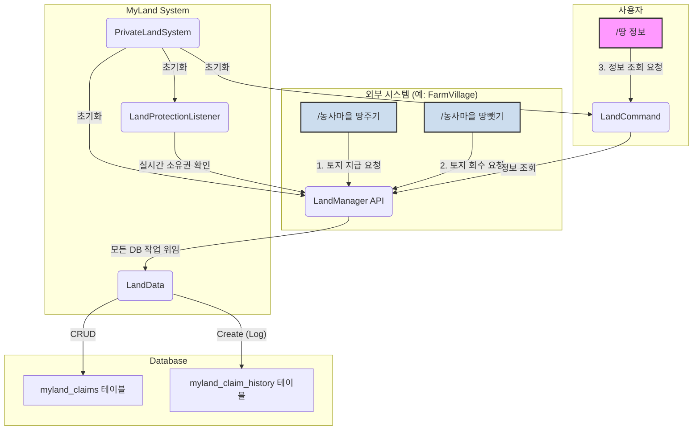

# MyLand 시스템 기술 문서

## 1. 개요

`MyLand` 시스템은 서버 내 플레이어의 토지를 청크 단위로 보호하고 관리하는 핵심 시스템입니다. 이 시스템은 토지 소유권 등록, 보호, 이력 추적 등 토지 관리에 대한 모든 근본적인 기능을 책임지는 **토지 등기소**와 같은 역할을 합니다.

다른 시스템(예: `@/FarmVillage`)은 `MyLand`가 제공하는 기능을 활용하여 특정 정책에 맞는 토지를 분배하거나 회수할 수 있습니다.

## 2. 시스템 아키텍처

`MyLand` 시스템은 각자의 역할이 명확한 여러 컴포넌트의 조합으로 이루어져 있으며, 외부 시스템은 `LandManager`의 공개된 기능을 통해서만 토지 관리를 요청할 수 있습니다.



### 컴포넌트 설명

-   **`PrivateLandSystem.kt` (시스템 초기화 담당)**
    -   `MyLand` 시스템의 진입점입니다.
    -   플러그인이 활성화될 때 `LandManager`, `LandProtectionListener` 등 모든 관련 컴포넌트를 초기화하고 활성화합니다.

-   **`LandManager.kt` (핵심 로직 및 캐시 관리)**
    -   시스템의 '두뇌' 역할을 합니다.
    -   토지 구매(`claimChunk`), 포기/회수(`unclaimChunk`), 소유자 확인(`getOwnerOfChunk`) 등 모든 핵심 로직을 처리합니다.
    -   DB에서 불러온 토지 정보를 메모리(in-memory cache)에 저장하여, 반복적인 DB 조회를 최소화하고 빠른 응답 속도를 보장합니다.

-   **`LandData.kt` (데이터베이스 통신)**
    -   데이터베이스와의 모든 통신을 전담하는 데이터 접근 계층(Data Access Layer)입니다.
    -   `myland_claims`와 `myland_claim_history` 테이블에 데이터를 저장, 조회, 삭제, 기록하는 메서드를 제공합니다.

-   **`LandProtectionListener.kt` (토지 보호 감시)**
    -   시스템의 '보안 요원' 역할을 합니다.
    -   플레이어의 블록 설치/파괴 이벤트를 실시간으로 감시(`listen`)합니다.
    -   이벤트가 발생한 청크의 소유권을 `LandManager`에 문의하고, 권한이 없는 플레이어의 행동을 막습니다.

-   **`LandCommand.kt` (사용자 인터페이스)**
    -   플레이어가 토지 정보를 확인할 수 있는 간단한 인터페이스를 제공합니다.
    -   현재는 `/땅 정보` 명령어를 통해 현재 위치한 청크의 소유자를 확인하는 기능을 수행합니다.

## 3. 데이터베이스 구조

### `myland_claims`
현재 청크의 소유권을 저장하는 테이블입니다.

| Column                | Type         | Description                |
| --------------------- | ------------ | -------------------------- |
| `world`               | VARCHAR(255) | 월드 이름                  |
| `chunk_x`             | INT          | 청크 X 좌표                |
| `chunk_z`             | INT          | 청크 Z 좌표                |
| `owner_uuid`          | VARCHAR(36)  | 소유자 플레이어의 UUID     |

### `myland_claim_history`
청크의 소유권이 해제될 때마다 그 이력을 기록하는 테이블입니다.

| Column                | Type         | Description                                        |
| --------------------- | ------------ | -------------------------------------------------- |
| `history_id`          | INT (PK)     | 기록 고유 ID                                       |
| `world`               | VARCHAR(255) | 월드 이름                                          |
| `chunk_x`             | INT          | 청크 X 좌표                                        |
| `chunk_z`             | INT          | 청크 Z 좌표                                        |
| `previous_owner_uuid` | VARCHAR(36)  | 이전 소유자의 UUID                                 |
| `actor_uuid`          | VARCHAR(36)  | 소유권 해제를 실행한 주체 (관리자, 플레이어). 시스템에 의한 경우 NULL |
| `reason`              | VARCHAR(255) | 소유권 해제 사유 (예: "관리자 회수", "자발적 포기") |
| `unclaimed_at`        | TIMESTAMP    | 해제된 시간                                        |

## 4. 설정 (`config.yml`)

```yaml
# MyLand System Configuration
myland:
  # 지역 제한 기능을 사용할지 여부를 결정합니다. (true: 사용, false: 미사용)
  # false로 설정하면 모든 지역에서 땅을 구매하고 보호받을 수 있습니다.
  use-area-restriction: true
  
  # 지역 제한을 사용할 경우, 적용될 영역을 설정합니다.
  area:
    world: "world"
    x1: -16
    z1: 0
    x2: 15
    z2: 95
```

## 5. 외부 시스템 연동

`MyLand` 시스템은 다른 시스템이 토지 관련 기능을 사용할 수 있도록 `LandManager`를 통해 API를 제공합니다. 예를 들어 `FarmVillage` 시스템은 이 API를 호출하여 농사 땅을 플레이어에게 지급(`claimChunk`)하거나 회수(`unclaimChunk`)합니다.

이러한 구조는 `MyLand`가 토지 관리의 유일한 책임자(Single Source of Truth)가 되게 하여 데이터의 일관성을 보장하고, 다른 시스템은 토지 관리의 복잡한 내부 로직을 알 필요 없이 필요한 기능만 요청하면 되므로 시스템 전체의 유지보수성을 크게 향상시킵니다. 