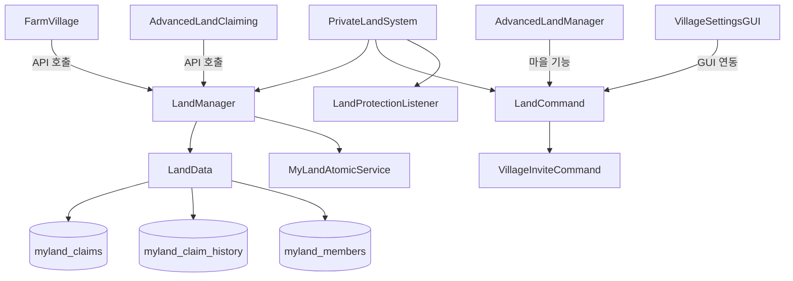

# 🏠 MyLand (개인 토지) 시스템

## 📋 개요

MyLand는 서버의 **기본 토지 관리 시스템**입니다. 청크 단위로 토지를 보호하고 관리하며, 다른 토지 시스템(FarmVillage, AdvancedLandClaiming)의 기반이 되는 **토지 등기소** 역할을 합니다.

### 🎯 주요 특징

| 특징 | 설명 |
|------|------|
| 📦 청크 기반 | 16x16 블록 단위의 청크별 소유권 관리 |
| 🛡️ 보호 시스템 | 소유자/멤버 외 블록 설치/파괴 방지 |
| 📜 이력 추적 | 모든 소유권 변경 기록 보관 |
| 🤝 멤버 시스템 | 청크별 친구 추가로 권한 공유 |
| 🏘️ 마을 연동 | AdvancedLandClaiming과 통합된 마을 기능 |
| ⚡ 원자적 클레이밍 | Race Condition 방지 (SELECT FOR UPDATE) |

---

## 🏗️ 아키텍처



---

## 📁 핵심 컴포넌트

| 파일 | 역할 |
|------|------|
| [`PrivateLandSystem.kt`](./PrivateLandSystem.kt:1) | 시스템 진입점 및 라이프사이클 관리 |
| [`LandManager.kt`](./LandManager.kt:1) | 핵심 비즈니스 로직 (클레이밍, 언클레이밍, 소유자 확인) |
| [`LandCommand.kt`](./LandCommand.kt:1) | `/땅`, `/land`, `/myland` 명령어 처리 (마을 기능 포함) |
| [`LandData.kt`](./LandData.kt:1) | 데이터베이스 접근 계층 |
| [`LandProtectionListener.kt`](./LandProtectionListener.kt:1) | 블록 보호 이벤트 처리 |
| [`LandPermissions.kt`](./LandPermissions.kt:1) | 권한 상수 정의 |
| [`MyLandAtomicService.kt`](./MyLandAtomicService.kt:1) | 원자적 클레이밍 서비스 (Race Condition 방지) |
| [`VillageInviteCommand.kt`](./VillageInviteCommand.kt:1) | `/마을초대` 명령어 처리 |

---

## 🔐 권한 시스템

```kotlin
// LandPermissions.kt
object LandPermissions {
    const val ADMIN_UNCLAIM = "myland.admin.unclaim"
    // 추가 권한들...
}
```

| 권한 | 설명 | 기본값 |
|------|------|--------|
| `myland.admin.unclaim` | 타인의 땅 언클레이밍 | OP |

---

## 💬 명령어

### 기본 명령어 (`/땅`, `/land`, `/myland`)

| 명령어 | 설명 |
|--------|------|
| `/땅 정보` | 현재 청크의 소유 정보 확인 |
| `/땅 기록 [페이지]` | 현재 청크의 소유권 변경 이력 |
| `/땅 친구추가 <플레이어>` | 현재 청크에 친구 추가 |
| `/땅 친구삭제 <플레이어>` | 현재 청크에서 친구 제거 |
| `/땅 친구목록` | 현재 청크의 친구 목록 |

### 고급 토지 클레이밍 (AdvancedLandClaiming 연동)

| 명령어 | 설명 |
|--------|------|
| `/땅 클레임 [자원타입]` | 현재 청크 클레이밍 (철/다이아/네더라이트) |
| `/땅 반환` | 현재 청크 반환 (50% 환불) |
| `/땅 목록` | 소유한 토지 목록 |
| `/땅 비용` | 클레이밍 비용 확인 |
| `/땅 상태` | 토지 요약 정보 |
| `/땅 환불정보` | 환불 정책 안내 |
| `/땅 환불내역` | 환불 이력 조회 |

### 마을 시스템 (AdvancedLandClaiming 연동)

| 명령어 | 설명 |
|--------|------|
| `/땅 마을생성 <이름>` | 개인 토지를 마을로 전환 |
| `/땅 마을초대 <플레이어>` | 마을에 플레이어 초대 |
| `/땅 마을추방 <플레이어>` | 마을에서 플레이어 추방 |
| `/땅 마을정보` | 현재 마을 정보 확인 |
| `/땅 마을클레임 [자원타입]` | 마을 토지 확장 |
| `/땅 마을반환` | 마을 토지 반환 |
| `/땅 마을설정` | 마을 설정 GUI |
| `/땅 마을권한 [목록\|플레이어] [부이장\|구성원]` | 마을 권한 관리 |
| `/땅 마을해체확정` | 마을 해체 |
| `/땅 이장양도 <플레이어>` | 이장 양도 요청 |
| `/땅 이장양도수락` | 이장 양도 수락 |
| `/땅 이장양도거절` | 이장 양도 거절 |

### 마을 초대 응답 (`/마을초대`)

| 명령어 | 설명 |
|--------|------|
| `/마을초대 수락` | 받은 초대 수락 |
| `/마을초대 거절` | 받은 초대 거절 |

---

## 🗃️ 데이터베이스 구조

### myland_claims
```sql
CREATE TABLE myland_claims (
    world VARCHAR(255) NOT NULL,
    chunk_x INT NOT NULL,
    chunk_z INT NOT NULL,
    owner_uuid VARCHAR(36) NOT NULL,
    claim_type VARCHAR(50) DEFAULT 'GENERAL',
    claimed_at TIMESTAMP DEFAULT CURRENT_TIMESTAMP,
    PRIMARY KEY (world, chunk_x, chunk_z)
);
```

### myland_claim_history
```sql
CREATE TABLE myland_claim_history (
    history_id INT AUTO_INCREMENT PRIMARY KEY,
    world VARCHAR(255) NOT NULL,
    chunk_x INT NOT NULL,
    chunk_z INT NOT NULL,
    previous_owner_uuid VARCHAR(36) NOT NULL,
    actor_uuid VARCHAR(36),              -- NULL = 시스템
    reason VARCHAR(255) NOT NULL,
    unclaimed_at TIMESTAMP DEFAULT CURRENT_TIMESTAMP
);
```

### myland_members
```sql
CREATE TABLE myland_members (
    world VARCHAR(255) NOT NULL,
    chunk_x INT NOT NULL,
    chunk_z INT NOT NULL,
    member_uuid VARCHAR(36) NOT NULL,
    added_at TIMESTAMP DEFAULT CURRENT_TIMESTAMP,
    PRIMARY KEY (world, chunk_x, chunk_z, member_uuid)
);
```

---

## ⚙️ 구성 (config.yml)

```yaml
myland:
  # 지역 제한 기능 사용 여부
  # false = 모든 지역에서 땅 구매 가능
  use-area-restriction: true
  
  # 허용 영역 설정 (use-area-restriction: true인 경우)
  area:
    world: "world"
    x1: -16
    z1: 0
    x2: 15
    z2: 95
```

---

## 🛡️ 보호 시스템

### 보호 범위 ([`LandProtectionListener.kt`](./LandProtectionListener.kt:1))

| 이벤트 | 보호 내용 |
|--------|----------|
| `BlockBreakEvent` | 블록 파괴 방지 |
| `BlockPlaceEvent` | 블록 설치 방지 |
| `PlayerInteractEvent` | 상호작용 방지 |
| 기타 | 엔티티 관련 보호 |

### 권한 확인 순서
1. **소유자 확인**: `owner_uuid == player.uniqueId`
2. **멤버 확인**: `myland_members` 테이블에 등록 여부
3. **관리자 권한**: `myland.admin.unclaim` 등

---

## ⚡ 원자적 클레이밍 서비스

### Race Condition 방지 ([`MyLandAtomicService.kt`](./MyLandAtomicService.kt:1))

```kotlin
class MyLandAtomicService(
    private val database: Database,
    private val debugManager: DebugManager
) {
    /**
     * SELECT FOR UPDATE를 사용한 원자적 클레이밍
     * 동시에 여러 플레이어가 같은 청크를 클레이밍할 때 Race Condition 방지
     */
    fun atomicClaimChunk(
        chunk: Chunk, 
        player: Player, 
        claimType: String,
        claimedChunks: MutableMap<String, MutableMap<Pair<Int, Int>, UUID>>,
        ownedChunks: MutableMap<UUID, MutableMap<String, MutableList<Pair<Int, Int>>>>
    ): ClaimResult
}
```

### 동작 원리
```sql
-- 1. 트랜잭션 시작
START TRANSACTION;

-- 2. 행 잠금 (다른 트랜잭션 대기)
SELECT * FROM myland_claims 
WHERE world = ? AND chunk_x = ? AND chunk_z = ?
FOR UPDATE;

-- 3. 클레임 여부 확인 후 삽입
INSERT INTO myland_claims (world, chunk_x, chunk_z, owner_uuid, claim_type)
VALUES (?, ?, ?, ?, ?);

-- 4. 커밋
COMMIT;
```

---

## 🔗 외부 시스템 연동

### API 제공 (LandManager)

```kotlin
class LandManager {
    // === 클레이밍 ===
    fun claimChunk(chunk: Chunk, player: Player, claimType: String = "GENERAL"): ClaimResult
    fun unclaimChunk(chunk: Chunk, actor: Player?, reason: String): UnclaimResult
    
    // === 소유권 확인 ===
    fun isChunkClaimed(chunk: Chunk): Boolean
    fun getOwnerOfChunk(chunk: Chunk): UUID?
    fun getClaimInfo(chunk: Chunk): ClaimInfo?
    fun getClaimType(chunk: Chunk): String?
    
    // === 멤버 관리 ===
    fun addMember(chunk: Chunk, owner: Player, member: OfflinePlayer): Boolean
    fun removeMember(chunk: Chunk, owner: Player, member: OfflinePlayer): Boolean
    fun addMemberBypass(chunk: Chunk, member: OfflinePlayer): Boolean  // 마을 시스템용
    fun removeMemberBypass(chunk: Chunk, member: OfflinePlayer): Boolean
    fun getMembers(chunk: Chunk): List<UUID>
    fun isMember(chunk: Chunk, player: Player): Boolean
    
    // === 영역 확인 ===
    fun isChunkInClaimableArea(chunk: Chunk): Boolean
    
    // === 이력 조회 ===
    fun getClaimHistory(chunk: Chunk): List<ClaimHistory>
}
```

### 클레임 타입 (claim_type)

| 값 | 설명 | 사용처 |
|----|------|--------|
| `GENERAL` | 일반 개인 토지 | 기본값, AdvancedLandClaiming |
| `FARM_VILLAGE` | 농사마을 토지 | FarmVillage 시스템 |

### 연동 예시 (FarmVillage)

```kotlin
// FarmVillageManager.kt
fun assignNextAvailablePlot(player: Player): Pair<AssignResult, Int?> {
    // ...
    val result1 = landManager.claimChunk(chunk1, player, "FARM_VILLAGE")
    if (result1 == ClaimResult.SUCCESS) {
        val result2 = landManager.claimChunk(chunk2, player, "FARM_VILLAGE")
        // ...
    }
}
```

---

## 🏘️ 마을 기능 (AdvancedLandClaiming 연동)

### 마을 초대 시스템

```kotlin
// LandCommand.kt
data class VillageInvitation(
    val villageId: Int,
    val villageName: String,
    val inviterUuid: UUID,
    val inviterName: String,
    val inviteeUuid: UUID,
    val inviteTime: Long,
    val expiresAt: Long = inviteTime + 300000  // 5분 후 만료
)

// 진행 중인 초대 관리
private val pendingInvitations = ConcurrentHashMap<UUID, VillageInvitation>()
```

### 이장 양도 시스템

```kotlin
data class MayorTransferInvitation(
    val villageId: Int,
    val villageName: String,
    val currentMayorUuid: UUID,
    val currentMayorName: String,
    val newMayorUuid: UUID,
    val transferTime: Long,
    val expiresAt: Long = transferTime + 300000  // 5분 후 만료
)

private val pendingMayorTransfers = ConcurrentHashMap<UUID, MayorTransferInvitation>()
```

### 환불 정책

```kotlin
enum class RefundPolicy(
    val displayName: String,
    val refundRate: Double,
    val description: String
) {
    FULL("100% 환불", 1.0, "처음 24시간 내 반환 시"),
    HALF("50% 환불", 0.5, "일반적인 경우"),
    QUARTER("25% 환불", 0.25, "장기간 사용 후 반환"),
    NONE("환불 없음", 0.0, "특수 상황 또는 무료 토지")
}
```

---

## ⚡ 성능 최적화

### 인메모리 캐시

```kotlin
class LandManager {
    // 청크별 소유자 캐시: O(1) 조회
    private var claimedChunks = mutableMapOf<String, MutableMap<Pair<Int, Int>, UUID>>()
    
    // 플레이어별 소유 청크 캐시: 빠른 소유 목록 조회
    private val ownedChunks = mutableMapOf<UUID, MutableMap<String, MutableList<Pair<Int, Int>>>>()
    
    fun loadClaimsFromDatabase() {
        claimedChunks = landData.loadAllClaims()
        // ownedChunks 동기화...
    }
}
```

### 캐시 동기화
- 서버 시작 시 DB에서 전체 로드
- 클레이밍/언클레이밍 시 캐시 즉시 업데이트
- DB 작업과 캐시 작업 트랜잭션 내 동시 수행

---

## 🔗 의존성

### 필수 의존성
- **Database**: MySQL/MariaDB 연결
- **DebugManager**: 로깅 시스템

### 선택적 의존성 (연동 시스템)
- **FarmVillageManager**: 농사마을 기능 연동
- **AdvancedLandManager**: 고급 토지/마을 기능 연동
- **VillageSettingsGUI**: 마을 설정 GUI

---

## 🐛 문제 해결

### 클레이밍 실패
1. 영역 제한 확인 (`use-area-restriction`, `area` 설정)
2. 이미 클레이밍된 청크인지 확인
3. DB 연결 상태 확인

### 보호가 작동하지 않음
1. `LandProtectionListener` 등록 여부 확인
2. 소유자/멤버 데이터 확인
3. 디버그 로그 활성화하여 확인

### 마을 기능 오류
1. `AdvancedLandManager` 초기화 여부 (`setAdvancedLandManager`)
2. `VillageSettingsGUI` 초기화 여부 (`setVillageSettingsGUI`)
3. 마을 ID와 청크 연결 상태 확인

---

## 📚 관련 문서

- [LandSystems 통합 가이드](../../../../Docs/Develop_Docs/LandSystems/System_Integration_Guide.md)
- [MyLand 기술 문서](./MyLand_System_Documentation.md)
- [AdvancedLandClaiming 시스템](../AdvancedLandClaiming/README.md)
- [FarmVillage 시스템](../FarmVillage/README.md)