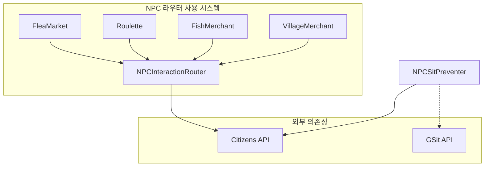
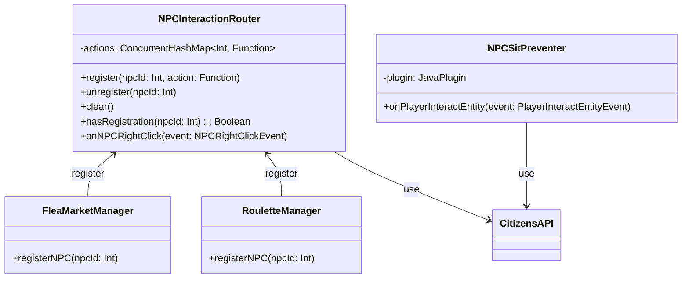

# 🤖 NPC 시스템

NPC(Non-Player Character) 상호작용을 중앙에서 관리하는 시스템입니다.

## 📋 개요

NPC 시스템은 Citizens 플러그인을 기반으로 NPC 클릭 이벤트를 중앙 집중화하여 관리합니다. 여러 시스템(벼룩시장, 룰렛, 물고기 상인 등)에서 공용으로 사용하는 NPC 클릭 이벤트를 동적으로 라우팅합니다.

## 🗂️ 파일 구조

```
NPC/
├── NPCInteractionRouter.kt    # NPC 이벤트 중앙 라우터
└── NPCSitPreventer.kt         # NPC 앉기 방지 리스너
```

## 🔧 핵심 컴포넌트

### [`NPCInteractionRouter.kt`](./NPCInteractionRouter.kt)

동적 NPC 이벤트 라우터로, 여러 시스템에서 공용으로 사용하는 NPC 클릭 이벤트를 중앙에서 관리합니다.

#### 주요 기능
- **중앙 집중화된 NPC 이벤트 처리**: 모든 NPC 클릭 이벤트를 단일 지점에서 관리
- **동적 핸들러 등록/해제**: 런타임에 NPC별 핸들러 추가/제거 가능
- **이벤트 충돌 방지**: 이벤트 취소를 통한 중복 실행 방지

#### 작동 원리
```
1. 이벤트 우선순위를 LOWEST로 설정하여 가장 먼저 이벤트 수신
2. 등록된 NPC ID인 경우 등록된 로직(action) 실행
3. 이벤트를 취소하여 다른 리스너들의 중복 실행 방지
```

#### 주요 메서드

| 메서드 | 설명 |
|--------|------|
| `register(npcId, action)` | NPC ID에 대한 상호작용 로직 등록 |
| `unregister(npcId)` | NPC ID의 등록 해제 |
| `clear()` | 모든 등록 초기화 |
| `hasRegistration(npcId)` | NPC 등록 여부 확인 |

### [`NPCSitPreventer.kt`](./NPCSitPreventer.kt)

Citizens NPC에 대한 앉기 동작을 방지하는 리스너입니다.

#### 주요 기능
- **NPC 앉기 방지**: NPC 클릭 시 GSit 플러그인의 앉기 동작 차단
- **이벤트 우선순위 HIGHEST**: 다른 리스너보다 늦게 실행되어 최종 처리

> ⚠️ **참고**: 현재 GSit API 변경으로 인해 앉기 방지 기능이 비활성화되어 있습니다.

## 🔗 의존성


<details>
<summary>📊 다이어그램 소스 코드 (AI 참조용)</summary>



</details>

## 🏗️ 시스템 아키텍처


<details>
<summary>📊 다이어그램 소스 코드 (AI 참조용)</summary>



</details>

## 📊 이벤트 흐름

### NPC 클릭 처리 흐름
```
1. 플레이어가 NPC 우클릭
2. Citizens NPCRightClickEvent 발생
3. NPCInteractionRouter.onNPCRightClick() 호출 (우선순위: LOWEST)
4. NPC ID로 등록된 핸들러 조회
5. 핸들러가 있으면 실행 후 이벤트 취소
6. 다른 리스너들은 이벤트가 취소되어 실행되지 않음
```

### NPC 등록 흐름
```
1. 시스템 초기화 시 NPCInteractionRouter 인스턴스 획득
2. router.register(npcId) { player -> ... } 호출
3. ConcurrentHashMap에 핸들러 저장
4. 이후 해당 NPC 클릭 시 등록된 로직 실행
```

## 💡 사용 예시

### NPC 핸들러 등록
```kotlin
// FleaMarketManager에서
private fun registerNPCHandler(npcId: Int) {
    npcRouter.register(npcId) { player ->
        openFleaMarketGUI(player)
    }
}
```

### NPC 핸들러 해제
```kotlin
// 플러그인 비활성화 시
fun onDisable() {
    npcRouter.unregister(fleaMarketNPCId)
}
```

## ⚙️ 설정

### NPC ID 확인
Citizens 명령어 `/npc select`로 NPC 선택 후 `/npc info`로 ID 확인

### 시스템별 NPC 등록
각 시스템(FleaMarket, Roulette 등)에서 초기화 시 NPC ID를 라우터에 등록

## 🔍 주의사항

1. **동시성 처리**: `ConcurrentHashMap` 사용으로 스레드 안전성 보장
2. **이벤트 순서**: LOWEST 우선순위로 가장 먼저 이벤트 처리
3. **중복 등록**: 같은 NPC ID에 새 핸들러 등록 시 이전 핸들러 덮어쓰기
4. **Citizens 의존성**: Citizens 플러그인 필수 설치 필요