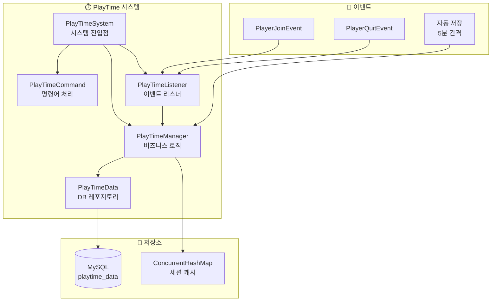
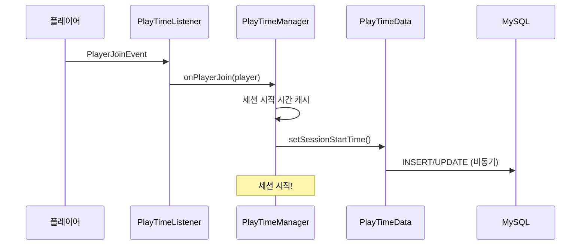
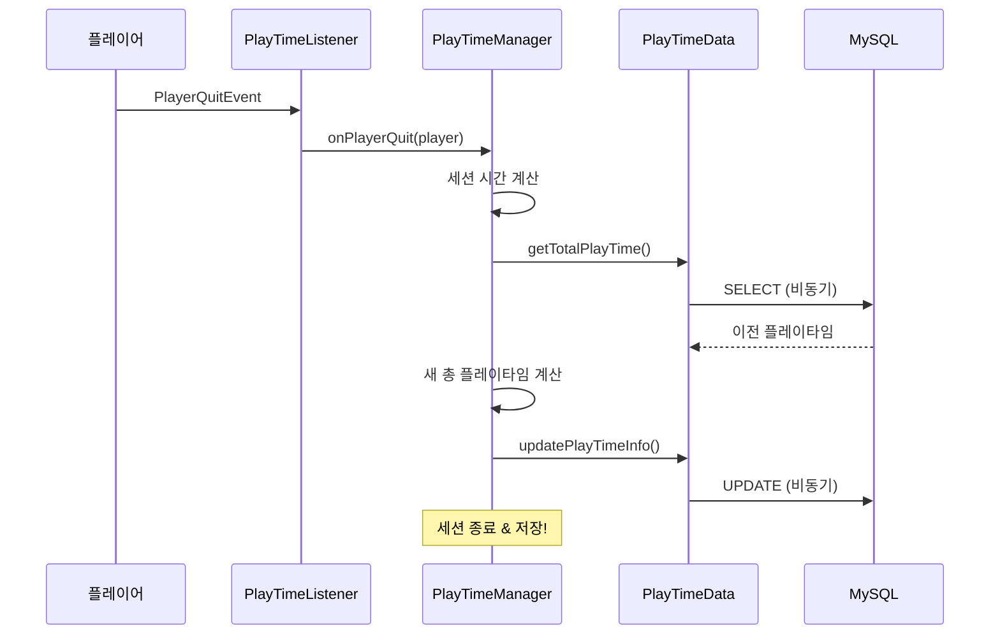
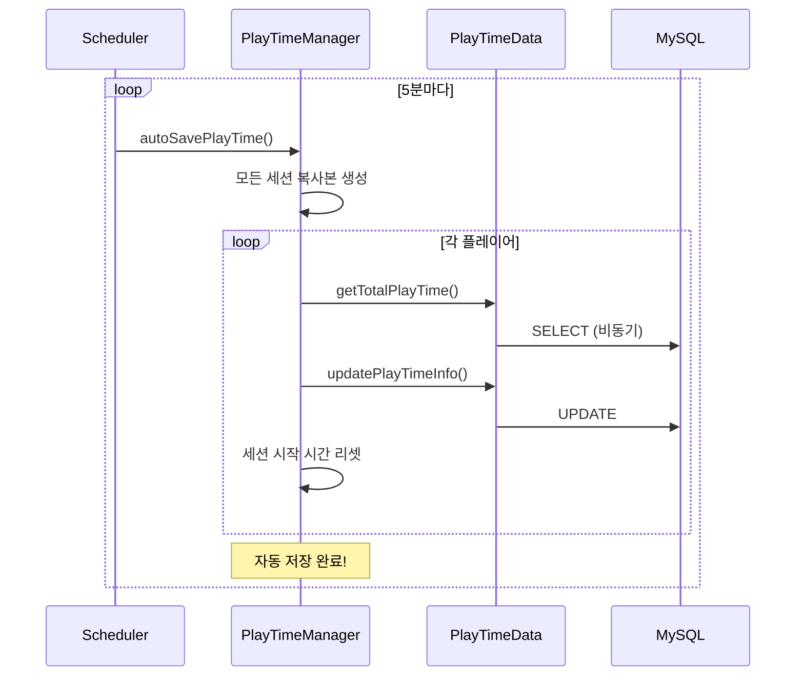

# ⏱️ PlayTime 시스템

## 📋 개요

PlayTime 시스템은 플레이어의 서버 접속 시간을 정확하게 추적하고 관리하는 시스템입니다. 세션 기반 추적, 자동 저장, 신규/베테랑 플레이어 분류 등의 기능을 제공합니다.

## 🏗️ 시스템 구조


<details>
<summary>📊 다이어그램 소스 코드 (AI 참조용)</summary>



</details>

## 📁 핵심 컴포넌트

### 1. [PlayTimeSystem.kt](PlayTimeSystem.kt)
시스템의 메인 진입점으로, 모든 컴포넌트를 초기화하고 관리합니다.

**주요 기능:**
- 데이터 계층(PlayTimeData) 초기화
- 매니저 계층(PlayTimeManager) 초기화
- 이벤트 리스너 및 명령어 등록
- 서버 재시작 시 온라인 플레이어 세션 복구
- 자동 저장 기능 시작/중단

```kotlin
fun enable() {
    playTimeData = PlayTimeData(database)
    playTimeManager = PlayTimeManager(plugin, playTimeData, debugManager)
    playTimeListener = PlayTimeListener(playTimeManager)
    // 기존 온라인 플레이어들의 세션 시작 시간 설정
    plugin.server.onlinePlayers.forEach { player ->
        playTimeManager.onPlayerJoin(player)
    }
    playTimeManager.startAutoSave()
}
```

### 2. [PlayTimeManager.kt](PlayTimeManager.kt)
플레이타임 시스템의 핵심 비즈니스 로직을 담당합니다.

**주요 기능:**
- 세션 시작/종료 처리
- 실시간 플레이타임 계산
- 자동 저장 (5분 간격)
- 신규/베테랑 플레이어 판별
- 시간 포맷팅

```kotlin
// 세션 캐시 (메모리)
private val sessionStartTimes = ConcurrentHashMap<UUID, Long>()

// 자동 저장 간격
private val autoSaveIntervalSeconds = 300L  // 5분

// 플레이타임 포맷팅
fun formatPlayTime(totalSeconds: Long): String {
    // "3일 5시간 30분 15초" 형태로 반환
}

// 신규 플레이어 확인 (7일 미만)
fun isNewPlayer(player: Player): Boolean {
    return !hasPlayedForDays(player, 7)
}
```

### 3. [PlayTimeCommand.kt](PlayTimeCommand.kt)
플레이타임 관련 명령어를 처리합니다.

**명령어:**
| 명령어 | 설명 | 권한 |
|--------|------|------|
| `/플레이타임` | 자신의 플레이타임 확인 | 없음 |
| `/플레이타임 확인 <플레이어>` | 특정 플레이어 플레이타임 확인 | 없음 |
| `/플레이타임 순위` | 상위 10명 플레이타임 순위 | `playtime.admin.ranking` |
| `/플레이타임 통계` | 서버 플레이타임 통계 | `playtime.admin.stats` |

**별칭:** `/playtime`, `/pt`

### 4. [PlayTimeData.kt](PlayTimeData.kt)
데이터베이스 작업을 담당하는 레포지토리 클래스입니다.

**주요 메서드:**
- `getPlayTimeInfo()` - 플레이타임 정보 조회
- `getTotalPlayTime()` - 총 플레이타임 조회
- `setSessionStartTime()` - 세션 시작 시간 설정
- `updatePlayTimeInfo()` - 플레이타임 정보 업데이트
- `getTopPlayTimeInfo()` - 상위 N명 조회
- `getPlayerCountAbovePlayTime()` - 특정 시간 이상 플레이어 수

### 5. [PlayTimeListener.kt](PlayTimeListener.kt)
플레이어 접속/퇴장 이벤트를 처리합니다.

**처리 이벤트:**
- `PlayerJoinEvent` - 세션 시작
- `PlayerQuitEvent` - 세션 종료 및 저장

## 💾 데이터 저장

### DB 테이블: `playtime_data`

```sql
CREATE TABLE playtime_data (
    player_uuid VARCHAR(36) PRIMARY KEY,
    total_playtime_seconds BIGINT DEFAULT 0,
    session_start_time BIGINT NULL,
    last_updated TIMESTAMP DEFAULT CURRENT_TIMESTAMP ON UPDATE CURRENT_TIMESTAMP,
    created_at TIMESTAMP DEFAULT CURRENT_TIMESTAMP
);
```

| 컬럼 | 타입 | 설명 |
|------|------|------|
| `player_uuid` | VARCHAR(36) | 플레이어 UUID (PK) |
| `total_playtime_seconds` | BIGINT | 총 플레이타임 (초) |
| `session_start_time` | BIGINT | 현재 세션 시작 시간 (밀리초) |
| `last_updated` | TIMESTAMP | 마지막 업데이트 시간 |
| `created_at` | TIMESTAMP | 최초 생성 시간 |

### 데이터 클래스: `PlayTimeInfo`

```kotlin
data class PlayTimeInfo(
    val playerUuid: UUID,
    val totalPlaytimeSeconds: Long,
    val sessionStartTime: Long?,
    val lastUpdated: Long,
    val createdAt: Long
)
```

## ⚙️ 작동 흐름

### 플레이어 접속 시


<details>
<summary>📊 다이어그램 소스 코드 (AI 참조용)</summary>



</details>

### 플레이어 퇴장 시


<details>
<summary>📊 다이어그램 소스 코드 (AI 참조용)</summary>



</details>

### 자동 저장 (5분 간격)


<details>
<summary>📊 다이어그램 소스 코드 (AI 참조용)</summary>



</details>

## 🔗 의존성

### 내부 의존성
- **Database** - 데이터베이스 연결
- **DebugManager** - 디버그 로깅

### 외부 의존성
- **Bukkit API** - 이벤트, 스케줄러, 명령어
- **Adventure API** - 텍스트 컴포넌트

## 📊 플레이어 분류

| 분류 | 조건 | 상태 |
|------|------|------|
| 🟡 신규 플레이어 | 플레이타임 7일 미만 | `isNewPlayer() = true` |
| 🟢 베테랑 플레이어 | 플레이타임 7일 이상 | `isNewPlayer() = false` |

## 🔐 권한

| 권한 | 설명 |
|------|------|
| `playtime.admin` | 관리자 명령어 접근 |
| `playtime.admin.ranking` | 플레이타임 순위 조회 |
| `playtime.admin.stats` | 플레이타임 통계 조회 |

## 🛡️ 특징

### 1. 비동기 처리
모든 DB 작업은 비동기로 처리되어 메인 스레드 블로킹을 방지합니다.

```kotlin
plugin.server.scheduler.runTaskAsynchronously(plugin, Runnable {
    // DB 작업
    plugin.server.scheduler.runTask(plugin, Runnable {
        // 결과 처리 (메인 스레드)
    })
})
```

### 2. 세션 캐싱
`ConcurrentHashMap`을 사용하여 스레드 안전한 세션 관리를 수행합니다.

### 3. 서버 재시작 대응
서버 재시작 시 기존 온라인 플레이어들의 세션을 자동으로 복구합니다.

### 4. 자동 저장
5분마다 모든 온라인 플레이어의 플레이타임을 저장하여 데이터 손실을 최소화합니다.

### 5. 시간 포맷팅
사용자 친화적인 형태로 시간을 표시합니다:
- `"3일 5시간 30분 15초"`
- `"2시간 45분"`
- `"30초"`

## 📝 사용 예시

### 다른 시스템에서 플레이타임 확인

```kotlin
val playTimeManager = playTimeSystem.getPlayTimeManager()

// 현재 세션 포함 총 플레이타임 (온라인 플레이어)
val totalTime = playTimeManager.getCurrentTotalPlayTime(player)

// 저장된 플레이타임만 (오프라인 가능)
val savedTime = playTimeManager.getSavedTotalPlayTime(playerUuid)

// 신규 플레이어 여부
if (playTimeManager.isNewPlayer(player)) {
    // 신규 플레이어 처리
}

// 특정 일수 이상 플레이 여부
if (playTimeManager.hasPlayedForDays(player, 30)) {
    // 30일 이상 플레이한 플레이어
}

// 포맷팅된 플레이타임
val formatted = playTimeManager.formatPlayTime(totalTime)
// "3일 5시간 30분 15초"
```

## ⚠️ 주의사항

1. **시간 단위**: 내부적으로 초(seconds) 단위로 저장됩니다
2. **세션 시작 시간**: 밀리초(milliseconds) 단위로 저장됩니다
3. **자동 저장**: 5분 간격으로 자동 저장되므로 최대 5분의 데이터 손실 가능
4. **서버 종료**: 정상 종료 시 모든 플레이타임이 저장됩니다