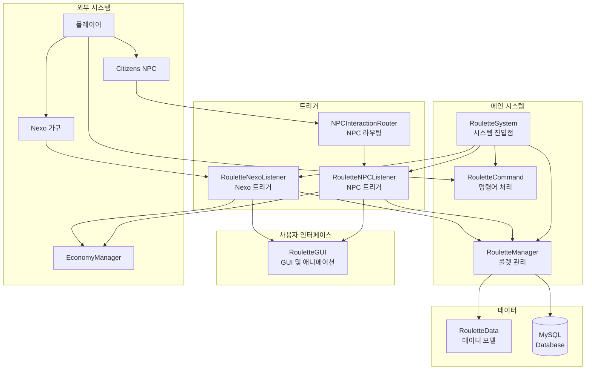

# 🎰 Roulette System - 룰렛 게임 시스템

## 📋 개요

Roulette System은 마인크래프트 서버에서 다양한 경품을 제공하는 룰렛 미니게임 시스템입니다. **다중 룰렛**을 지원하여 여러 개의 룰렛을 독립적으로 운영할 수 있으며, **NPC** 또는 **Nexo 가구**를 통해 룰렛을 실행할 수 있습니다.

### 주요 특징
- 🎲 **다중 룰렛**: 여러 개의 룰렛을 각각 다른 설정으로 운영
- 💰 **유연한 비용**: 돈, 아이템, 무료 등 다양한 비용 유형 지원
- 🔑 **열쇠 아이템**: 특수 아이템으로 무료 플레이 가능
- 👤 **NPC 트리거**: Citizens NPC 클릭으로 룰렛 실행
- 🪑 **Nexo 가구 트리거**: Nexo 가구 클릭으로 룰렛 실행
- 🎬 **애니메이션**: 점점 느려지는 시각적 룰렛 효과
- 📊 **기록 관리**: 플레이어별 플레이 기록 및 확률 표시

---

## 🏗️ 시스템 구조



---

## 📁 핵심 컴포넌트

### [RouletteSystem.kt](RouletteSystem.kt)
시스템 전체를 관리하는 메인 클래스입니다.

| 메서드 | 설명 |
|--------|------|
| `enable()` | 시스템 초기화 및 활성화 |
| `disable()` | 시스템 종료 및 정리 |
| `getManager()` | RouletteManager 인스턴스 반환 |

### [RouletteManager.kt](RouletteManager.kt)
룰렛의 핵심 로직을 담당하는 관리자 클래스입니다.

| 메서드 | 설명 |
|--------|------|
| `loadAllConfigs()` | 모든 룰렛 설정 로드 |
| `loadAllItems()` | 모든 룰렛 아이템 로드 |
| `createRoulette()` | 새 룰렛 생성 |
| `deleteRoulette()` | 룰렛 삭제 |
| `selectRandomItem()` | 가중치 기반 랜덤 아이템 선택 |
| `setNPCMapping()` | NPC에 룰렛 연결 |
| `setNexoMapping()` | Nexo 가구에 룰렛 연결 |
| `saveHistory()` | 플레이 기록 저장 |
| `startSession()` | 플레이어 세션 시작 |
| `endSession()` | 플레이어 세션 종료 |

### [RouletteGUI.kt](RouletteGUI.kt)
룰렛 GUI와 애니메이션을 담당합니다.

| 기능 | 설명 |
|------|------|
| 원형 슬롯 배치 | 12개 슬롯을 원형으로 배치 |
| 점점 느려지는 애니메이션 | 150틱 동안 점진적 감속 |
| 당첨 표시 | 12시 방향(슬롯 4)에 당첨 아이템 표시 |
| 사운드 및 파티클 | 효과음과 파티클 효과 |

### [RouletteCommand.kt](RouletteCommand.kt)
명령어 처리를 담당합니다.

### [RouletteData.kt](RouletteData.kt)
데이터 모델을 정의합니다.

| 클래스 | 설명 |
|--------|------|
| `RouletteConfig` | 룰렛 설정 (비용, 활성화 상태 등) |
| `RouletteItem` | 룰렛 아이템 (아이템, 가중치 등) |
| `RouletteHistory` | 플레이 기록 |
| `RouletteTriggerMapping` | 트리거 매핑 (NPC/Nexo) |

### [RouletteNPCListener.kt](RouletteNPCListener.kt)
Citizens NPC 클릭 이벤트를 처리합니다.

### [RouletteNexoListener.kt](RouletteNexoListener.kt)
Nexo 가구 클릭 이벤트를 처리합니다.

---

## 💻 명령어

### 일반 명령어 (권한 불필요)
| 명령어 | 설명 |
|--------|------|
| `/룰렛 확률 <룰렛이름>` | 해당 룰렛의 확률표 표시 |
| `/룰렛 내기록 [룰렛이름]` | 내 플레이 기록 확인 |

### 관리자 명령어
| 명령어 | 설명 |
|--------|------|
| `/룰렛 생성 <이름> [비용]` | 새 룰렛 생성 |
| `/룰렛 삭제 <이름>` | 룰렛 삭제 |
| `/룰렛 목록` | 모든 룰렛 목록 표시 |
| `/룰렛 정보 <이름>` | 룰렛 상세 정보 표시 |
| `/룰렛 아이템 목록 <룰렛>` | 아이템 목록 |
| `/룰렛 아이템 추가 <룰렛> <제공자> <식별자> [개수] [가중치]` | 아이템 추가 |
| `/룰렛 아이템 수정 <룰렛> <아이템ID> <가중치>` | 가중치 수정 |
| `/룰렛 아이템 삭제 <룰렛> <아이템ID>` | 아이템 삭제 |
| `/룰렛 npc지정 <룰렛이름>` | NPC에 룰렛 연결 (바라보기) |
| `/룰렛 npc제거 <NPC_ID>` | NPC 연결 제거 |
| `/룰렛 npc목록` | NPC 매핑 목록 |
| `/룰렛 nexo지정 <룰렛이름> <NexoID>` | Nexo 가구에 룰렛 연결 |
| `/룰렛 nexo제거 <NexoID>` | Nexo 연결 제거 |
| `/룰렛 nexo목록` | Nexo 매핑 목록 |
| `/룰렛 설정 비용 <룰렛> <금액>` | 비용 설정 |
| `/룰렛 설정 활성화 <룰렛>` | 룰렛 활성화 |
| `/룰렛 설정 비활성화 <룰렛>` | 룰렛 비활성화 |
| `/룰렛 설정 열쇠 <룰렛> <VANILLA\|NEXO> <아이템ID>` | 열쇠 아이템 설정 |
| `/룰렛 설정 열쇠제거 <룰렛>` | 열쇠 아이템 제거 |
| `/룰렛 리로드` | 설정 리로드 |

---

## 🔐 권한

| 권한 | 설명 |
|------|------|
| `lukevanilla.roulette.admin` | 관리자 명령어 사용 권한 |

---

## 💾 데이터 저장

### roulette_config 테이블
| 컬럼 | 타입 | 설명 |
|------|------|------|
| `id` | INT | 룰렛 ID (PK) |
| `roulette_name` | VARCHAR(50) | 룰렛 이름 |
| `cost_type` | ENUM | 비용 타입 (MONEY, ITEM, FREE) |
| `cost_amount` | DOUBLE | 비용 금액 |
| `cost_item_provider` | VARCHAR(20) | 비용 아이템 제공자 |
| `cost_item_type` | VARCHAR(100) | 비용 아이템 타입 |
| `cost_item_amount` | INT | 비용 아이템 개수 |
| `key_item_provider` | VARCHAR(20) | 열쇠 아이템 제공자 |
| `key_item_type` | VARCHAR(100) | 열쇠 아이템 타입 |
| `animation_duration` | INT | 애니메이션 시간 (틱) |
| `enabled` | BOOLEAN | 활성화 여부 |
| `created_at` | TIMESTAMP | 생성 시간 |
| `updated_at` | TIMESTAMP | 수정 시간 |

### roulette_items 테이블
| 컬럼 | 타입 | 설명 |
|------|------|------|
| `id` | INT | 아이템 ID (PK) |
| `roulette_id` | INT | 룰렛 ID (FK) |
| `item_provider` | ENUM | 아이템 제공자 |
| `item_identifier` | VARCHAR(100) | 아이템 식별자 |
| `item_display_name` | VARCHAR(100) | 표시 이름 |
| `item_amount` | INT | 아이템 개수 |
| `item_data` | TEXT | 추가 데이터 (JSON) |
| `weight` | DOUBLE | 가중치 (확률) |
| `enabled` | BOOLEAN | 활성화 여부 |
| `created_at` | TIMESTAMP | 생성 시간 |
| `updated_at` | TIMESTAMP | 수정 시간 |

### roulette_trigger_mapping 테이블
| 컬럼 | 타입 | 설명 |
|------|------|------|
| `id` | INT | 매핑 ID (PK) |
| `type` | ENUM | 트리거 타입 (NPC, NEXO) |
| `identifier` | VARCHAR(100) | 트리거 식별자 |
| `roulette_id` | INT | 룰렛 ID (FK) |
| `created_at` | TIMESTAMP | 생성 시간 |

### roulette_history 테이블
| 컬럼 | 타입 | 설명 |
|------|------|------|
| `id` | BIGINT | 기록 ID (PK) |
| `roulette_id` | INT | 룰렛 ID |
| `player_uuid` | VARCHAR(36) | 플레이어 UUID |
| `player_name` | VARCHAR(16) | 플레이어 이름 |
| `item_id` | INT | 당첨 아이템 ID |
| `item_provider` | VARCHAR(20) | 아이템 제공자 |
| `item_identifier` | VARCHAR(100) | 아이템 식별자 |
| `cost_paid` | DOUBLE | 지불 비용 |
| `probability` | DOUBLE | 당첨 확률 |
| `played_at` | TIMESTAMP | 플레이 시간 |

---

## 🔗 의존성

### 내부 의존성
| 시스템 | 용도 |
|--------|------|
| [Database](../Database/README.md) | MySQL 데이터베이스 연결 |
| [Economy](../Economy/README.md) | 돈 차감 처리 |
| [NPCInteractionRouter](../NPC/) | NPC 클릭 이벤트 라우팅 |

### 외부 의존성
| 플러그인 | 용도 |
|----------|------|
| Citizens | NPC 클릭 감지 |
| Nexo | 커스텀 아이템 및 가구 지원 |
| (선택) Oraxen | Oraxen 아이템 지원 |
| (선택) ItemsAdder | ItemsAdder 아이템 지원 |

---

## 📊 아이템 제공자

시스템은 다양한 아이템 플러그인을 지원합니다:

| 제공자 | 설명 |
|--------|------|
| `VANILLA` | 바닐라 마인크래프트 아이템 (Material 이름 사용) |
| `NEXO` | Nexo 커스텀 아이템 |
| `ORAXEN` | Oraxen 커스텀 아이템 |
| `ITEMSADDER` | ItemsAdder 커스텀 아이템 |

---

## 🎲 확률 시스템

룰렛은 **가중치 기반 확률 시스템**을 사용합니다:

```
확률(%) = (아이템 가중치 / 전체 가중치 합) × 100
```

### 예시
| 아이템 | 가중치 | 확률 |
|--------|--------|------|
| 다이아몬드 | 1 | 1% |
| 에메랄드 | 9 | 9% |
| 철괴 | 30 | 30% |
| 꽝 | 60 | 60% |
| **합계** | **100** | **100%** |

---

## 🎬 GUI 애니메이션

### 슬롯 배치 (원형)
```
        [4] ← 당첨 포인트 (12시)
    [3]     [5]
  [11]        [15]
 [20]          [24]
  [29]        [33]
    [39]    [41]
        [40]
```

### 애니메이션 속도
| 진행률 | 이동 간격 |
|--------|----------|
| 0~30% | 매 틱 |
| 30~50% | 2틱마다 |
| 50~70% | 3틱마다 |
| 70~85% | 5틱마다 |
| 85~95% | 8틱마다 |
| 95~100% | 12틱마다 |

---

## 📝 사용 예시

### 룰렛 생성 및 설정
```bash
# 1. 룰렛 생성
/룰렛 생성 할로윈룰렛 5000

# 2. 아이템 추가
/룰렛 아이템 추가 할로윈룰렛 NEXO halloween_sword 1 5
/룰렛 아이템 추가 할로윈룰렛 VANILLA DIAMOND 3 10
/룰렛 아이템 추가 할로윈룰렛 VANILLA BARRIER 1 85

# 3. NPC 연결 (NPC를 바라본 상태에서)
/룰렛 npc지정 할로윈룰렛

# 또는 Nexo 가구 연결
/룰렛 nexo지정 할로윈룰렛 halloween_chest

# 4. 열쇠 아이템 설정 (선택)
/룰렛 설정 열쇠 할로윈룰렛 NEXO halloween_key
```

### 플레이어 이용
1. NPC 또는 Nexo 가구 우클릭
2. 네더별(시작 버튼) 클릭
3. 비용 차감 후 애니메이션 시작
4. 당첨 아이템 지급

---

## ⚠️ 주의사항

1. **아이템 개수**: 정확히 12개의 아이템을 등록해야 원형 GUI가 올바르게 표시됩니다
2. **꽝 설정**: `VANILLA`의 `BARRIER` 아이템은 "꽝"으로 처리됩니다
3. **중복 실행 방지**: 플레이어는 동시에 하나의 룰렛만 진행할 수 있습니다
4. **세션 유지**: GUI를 닫아도 애니메이션이 백그라운드에서 계속 진행됩니다
5. **열쇠 우선**: 열쇠 아이템을 들고 있으면 비용 없이 플레이 가능합니다

---

## 🔧 문제 해결

### 룰렛이 작동하지 않는 경우
- 룰렛이 활성화 상태인지 확인 (`/룰렛 정보 <이름>`)
- 아이템이 등록되어 있는지 확인 (`/룰렛 아이템 목록 <이름>`)
- NPC/Nexo 매핑이 설정되어 있는지 확인

### NPC 연결이 안 되는 경우
- Citizens 플러그인이 설치되어 있는지 확인
- NPC를 5블록 이내에서 바라보고 명령어 입력

### 비용이 차감되지 않는 경우
- Economy 시스템이 활성화되어 있는지 확인
- 플레이어 잔액 확인
- 비용 타입이 `MONEY`로 설정되어 있는지 확인

### 아이템이 지급되지 않는 경우
- 인벤토리에 빈 공간이 있는지 확인 (없으면 바닥에 드롭)
- 커스텀 아이템 플러그인(Nexo 등)이 설치되어 있는지 확인