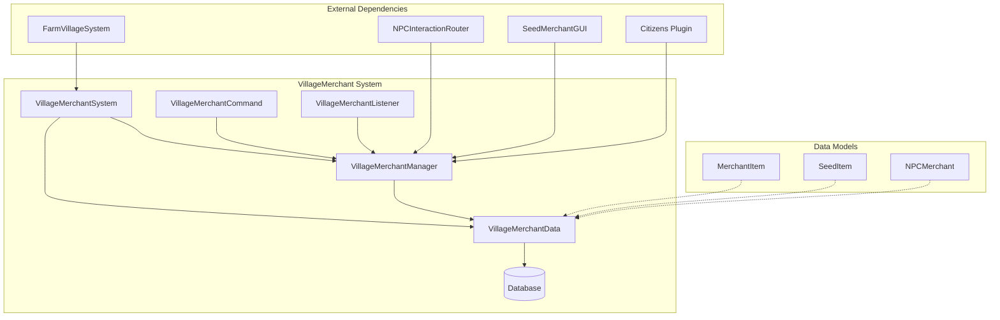
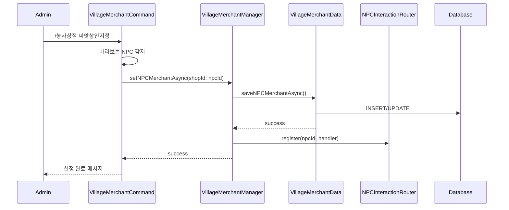
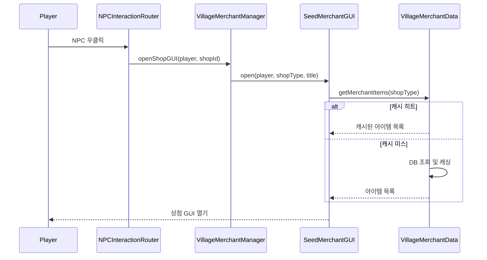
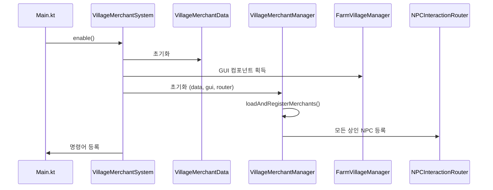
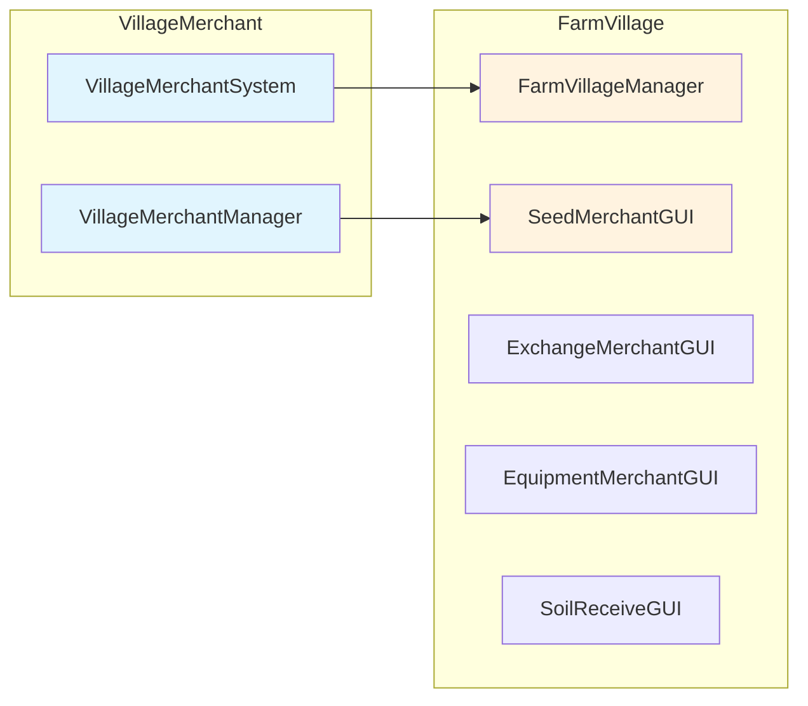

# 🏘️ 마을 상인 (VillageMerchant) 시스템

## 📋 개요

마을 상인 시스템은 **농사마을 시스템과 연동되는 NPC 상인** 시스템입니다. 씨앗 구매, 농산물 판매, 비료 구매, 토양 및 물품 구매 등 농사 관련 거래를 지원합니다. 농사마을에서 독립되어 어디서든 사용 가능하며, 지역 제한 없이 돈으로만 거래하는 단순한 시스템입니다.

---

## 🏗️ 시스템 구조



---

## 📁 핵심 컴포넌트

| 파일 | 역할 |
|------|------|
| [`VillageMerchantSystem.kt`](./VillageMerchantSystem.kt) | 🎯 시스템 진입점, 초기화 및 종료 관리 |
| [`VillageMerchantManager.kt`](./VillageMerchantManager.kt) | ⚙️ 상인 관리, 상점 GUI 열기, NPC 라우터 등록 |
| [`VillageMerchantCommand.kt`](./VillageMerchantCommand.kt) | 🎮 `/농사상점`, `/마을상인` 명령어 처리 |
| [`VillageMerchantData.kt`](./VillageMerchantData.kt) | 💾 데이터베이스 CRUD, 아이템 캐싱 |
| [`VillageMerchantListener.kt`](./VillageMerchantListener.kt) | 👂 이벤트 리스너 (레거시 - NPCInteractionRouter로 대체됨) |

---

## 🎮 명령어

### `/농사상점` (별칭: `/마을상인`)

| 명령어 | 설명 | 권한 |
|--------|------|------|
| `/농사상점 씨앗상인지정` | 바라보는 NPC를 씨앗 상인으로 지정 | `villagemerchant.admin` |
| `/농사상점 농산물판매상인지정` | 바라보는 NPC를 농산물 판매 상인으로 지정 | `villagemerchant.admin` |
| `/농사상점 비료상인지정` | 바라보는 NPC를 비료 상인으로 지정 | `villagemerchant.admin` |
| `/농사상점 토양및물품상인지정` | 바라보는 NPC를 토양 및 물품 상인으로 지정 | `villagemerchant.admin` |
| `/농사상점 상인삭제 <타입>` | 등록된 상인 삭제 | `villagemerchant.admin` |
| `/농사상점 목록` | 등록된 상인 목록 보기 | `villagemerchant.admin` |
| `/농사상점 리로드` | 데이터 및 캐시 리로드 | `villagemerchant.admin` |

#### 상인 타입
- `seed` / `씨앗`
- `crop` / `농산물`
- `fertilizer` / `비료`
- `soil` / `토양` / `물품`

---

## 💾 데이터 저장

### 테이블 구조

#### `villagemerchant_npcs` - 상인 NPC 매핑

| 컬럼 | 타입 | 설명 |
|------|------|------|
| `shop_id` | VARCHAR(50) | 상점 타입 (PK) |
| `npc_id` | INT | Citizens NPC ID |

#### `villagemerchant_items` - 상점 아이템

| 컬럼 | 타입 | 설명 |
|------|------|------|
| `id` | INT | 아이템 ID (PK, AUTO_INCREMENT) |
| `shop_type` | VARCHAR(50) | 상점 타입 |
| `item_id` | VARCHAR(255) | 아이템 ID (Nexo/Vanilla) |
| `buy_price` | DOUBLE | 구매 가격 |
| `sell_price` | DOUBLE | 판매 가격 |
| `can_buy` | BOOLEAN | 구매 가능 여부 |
| `can_sell` | BOOLEAN | 판매 가능 여부 |

---

## 🏪 상점 타입

| 상점 ID | 이름 | 설명 |
|---------|------|------|
| `seed_merchant` | 씨앗 상인 | 농작물 씨앗 구매 |
| `crop_sell_merchant` | 농산물 판매 상인 | 수확한 농산물 판매 |
| `fertilizer_merchant` | 비료 상인 | 비료 구매 |
| `soil_goods_merchant` | 토양 및 물품 상인 | 토양, 도구 등 구매 |

---

## 🔗 의존성

### 내부 의존성
- **Database**: 데이터베이스 연결 관리
- **NPCInteractionRouter**: NPC 클릭 시 상점 GUI 라우팅
- **FarmVillageManager**: 농사마을 GUI 컴포넌트 공유
  - `SeedMerchantGUI`: 씨앗/농산물/비료/토양 상인 GUI

### 외부 의존성
- **Citizens**: NPC 관리 플러그인

---

## ⚙️ 기술적 특징

### 1. 비동기 DB 호출
```kotlin
// 모든 DB 호출은 CompletableFuture로 비동기 처리
fun setNPCMerchantAsync(shopId: String, npcId: Int): CompletableFuture<Boolean>
fun removeNPCMerchantAsync(shopId: String): CompletableFuture<Boolean>
fun getAllNPCMerchantsAsync(): CompletableFuture<List<NPCMerchant>>
```

### 2. 아이템 캐싱
```kotlin
// 상점 타입별 아이템 캐시
private val itemCache = ConcurrentHashMap<String, List<MerchantItem>>()

// 캐시 히트 시 즉시 반환
if (itemCache.containsKey(shopType)) {
    return itemCache[shopType]!!
}
```

### 3. 농사마을 GUI 공유
```kotlin
// FarmVillage의 GUI 컴포넌트를 재사용
val seedMerchantGUI = farmVillageManager.seedMerchantGUI
seedMerchantGUI.setVillageMerchantData(data)
```

### 4. NPCInteractionRouter 통합
```kotlin
// 서버 시작 시 기존 상인들을 라우터에 등록
private fun loadAndRegisterMerchants() {
    getAllNPCMerchantsAsync().thenAccept { merchants ->
        merchants.forEach { merchant ->
            npcRouter.register(merchant.npcId) { player ->
                openShopGUI(player, merchant.shopId)
            }
        }
    }
}
```

### 5. 테이블 자동 마이그레이션
```kotlin
// 기존 price 컬럼에서 새 구조로 자동 마이그레이션
// price → buy_price, sell_price, can_buy, can_sell
```

---

## 📊 흐름도

### 상인 NPC 설정 흐름


### 상점 이용 흐름


### 시스템 초기화 흐름


---

## 🔧 API 사용 예시

```kotlin
// VillageMerchantSystem에서 Manager 획득
val manager = villageMerchantSystem.getManager()

// 상점 GUI 열기
manager.openShopGUI(player, "seed_merchant")
manager.openShopGUI(player, "crop_sell_merchant")
manager.openShopGUI(player, "fertilizer_merchant")
manager.openShopGUI(player, "soil_goods_merchant")

// 레거시 메서드 (호환성)
manager.openSeedMerchantGUI(player)

// NPC 상인 등록 (비동기)
manager.setNPCMerchantAsync("seed_merchant", npcId).thenAccept { success ->
    if (success) println("등록 성공")
}

// NPC 상인 삭제 (비동기)
manager.removeNPCMerchantAsync("seed_merchant")

// 모든 상인 조회 (비동기)
manager.getAllNPCMerchantsAsync().thenAccept { merchants ->
    merchants.forEach { println("${it.shopId}: NPC ${it.npcId}") }
}

// 시스템 리로드
manager.reload()
```

---

## 📝 데이터 클래스

### MerchantItem
```kotlin
data class MerchantItem(
    val id: Int,
    val itemId: String,      // Nexo 또는 Vanilla 아이템 ID
    val buyPrice: Double,    // 구매 가격
    val sellPrice: Double,   // 판매 가격
    val canBuy: Boolean,     // 구매 가능 여부
    val canSell: Boolean     // 판매 가능 여부
)
```

### SeedItem (레거시 호환)
```kotlin
data class SeedItem(
    val id: Int,
    val itemId: String,
    val price: Double
)
```

### NPCMerchant
```kotlin
data class NPCMerchant(
    val shopId: String,  // 상점 타입
    val npcId: Int       // Citizens NPC ID
)
```

---

## 🔗 농사마을(FarmVillage) 시스템과의 관계



- **독립적 운영**: VillageMerchant는 FarmVillage와 별개로 어디서든 사용 가능
- **GUI 공유**: FarmVillage의 SeedMerchantGUI를 재사용하여 일관된 UX 제공
- **지역 제한 없음**: 농사마을 내부가 아니어도 NPC 상인 이용 가능